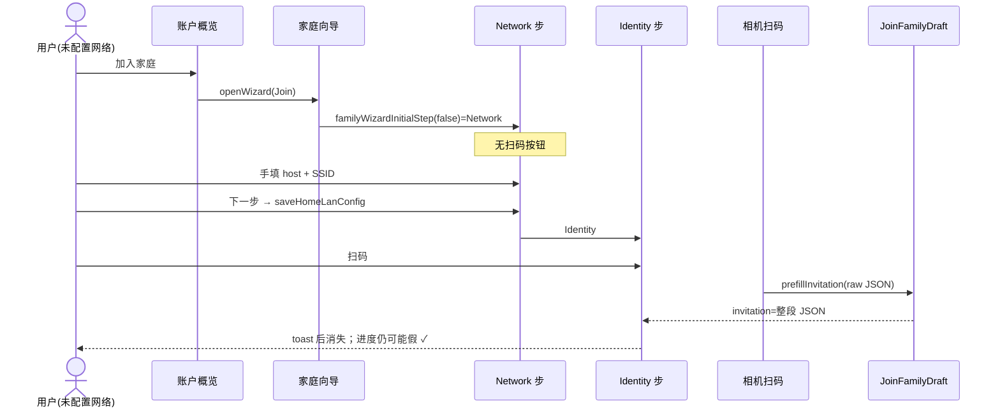

# 扫码加入一键预填家庭网络与邀请码

| 字段 | 值 |
|------|-----|
| **Title** | 扫码加入一键预填家庭网络与邀请码 |
| **Author** | (TBD) |
| **Date** | 2026-07-28 |
| **Status** | Draft（rev 3 — re-review minor/nit polish） |
| **Related PRD** | `docs/prd/sync-home-lan.md` §9.3 / §11；`docs/prd/ui.md` §5.7 |
| **Related ADR** | ADR-0009（账户概览与称呼）；ADR-0008（仅 fresh-current） |

---

## Overview

用户在 APK 账户路径扫邀请 QR 后，无法「一键」带上家庭服务器与 Wi‑Fi 白名单及邀请码，被迫在向导 Network 步手填 host/SSID，再进 Identity 扫码；扫完后邀请码框展示完整 JSON，网络是否已带入也不清晰。

**根因不是 codec / 域层缺失**：`InvitePayload` v=1、`JoinFamilyDraft.prefillInvitation`、`JoinFamilyUseCase` 与 `persistJoin` 的单元路径已可预填并在 join 成功时落盘。缺口在 **账户 UI 向导入口顺序、Identity 呈现与 draft 生命周期**——扫码被埋在 Network 之后，且预填结果不可见、易被 wipe。

**方案**：在不改 NAS join API / 邀请码密码学的前提下：

1. draft 存 **短邀请码**；网络字段与 invitation 分离  
2. Join **扫码入口前移到 Network 步**（及可选概览次级 CTA），完整 QR 预填后 **跳到 Identity**  
3. 冷启动 **手输加入** 仍从 Network 起（不把手动用户困在假「✓ 网络」的 Identity）  
4. 进度条 **✓ 家庭网络** 仅当 draft 真正具备 host+≥1 SSID，**绝不**因 `step == Identity` 而勾选  
5. Identity **耐久摘要** + **未就绪时禁用「加入」**  
6. 修 draft `remember(keys)` wipe；Join 主路径可不中途写 prefs  

---

## Background & Motivation

### 产品合同（已文档化 / 部分落地）

| 合同点 | 现状 |
|--------|------|
| 邀请 QR `v=1` JSON：`baseUrl`/`host`/`port`/`code`/可选 `ssids`≤2 | `InvitePayload` + `InvitePayloadCodec`（`sync/.../InvitePayloadCodec.kt`） |
| Owner 编码时写入本机 `session.allowedSsids` | `FamilyViewModel.createInvite` → `InvitePayload(..., ssids = session.allowedSsids)` |
| 扫码预填 invitation + host/port/scheme + ssids | `JoinFamilyDraft.prefillInvitation` |
| 统一 join | `JoinFamilyUseCase` + `JoinFamilyCommand`（draft → command.homeLanConfig） |
| join 成功落盘网络 | `FamilySessionCoordinator.persistJoin(..., joinedConfig = config)` |
| 邀请弹窗文案 | `FamilyInviteDialog`：`「扫码 · 自动填入 · 服务器与家庭 Wi-Fi」` |

### 当前用户痛点（账户 Tab，post-onboarding）

1. **扫码在 Network 之后**：`openWizard(Join)` 用 `familyWizardInitialStep(networkConfigured)`；prefs 无 host+≥1 SSID 时从 Network 起，且 `saveWizardNetworkThenAdvance` 要求 host + ≥1 SSID 保存后才到 Identity。扫码按钮只在 `JoinFamilyDialog`（Identity）。用户必须先手配网络才能扫——与 QR 设计目的相反。
2. **预填不可见**：`applyScannedInvite` 会 `prefillInvitation` 并跳到 Identity，但网络摘要仅短暂 `FamilyDialog.Message` toast；Identity 只有称呼 + 邀请码框 + 扫码，无耐久「网络已带入」。
3. **邀请码框塞满 JSON**：`prefillInvitation` 设 `invitation = raw`（整段 JSON）；单行 TextField 看起来坏掉，用户常改成 8 位码并怀疑是否还带了网络。
4. **Onboarding 更好**：`OnboardingScreen` 同 sheet 展示 host/SSID/邀请；顶栏有「扫码」；扫完字段全可见。报告的 APK 体验主要是 **账户拆分向导**。
5. **次要风险**：Owner `allowedSsids` 空 → QR 无 `ssids`；`joinDraft` 的 `remember(ui.serverHost, …)` 在 prefs 变更时重建并 **抹掉 invitation**；Ticket 09 相机扫码仍标 partial。
6. **进度 chrome 谎言（既有）**：`familyWizardProgress` 中 `networkDone = networkConfigured || step == FamilyWizardStep.Identity`，Identity 步即使无 SSID 也显示「✓ 家庭网络」。

### 验证过的代码锚点

```33:46:sync/src/main/kotlin/com/lezi/babylog/sync/JoinFamilyCommand.kt
    fun prefillInvitation(raw: String): JoinFamilyDraft {
        val invitation = raw.trim()
        if (invitation.isEmpty()) return this
        val decoded = InvitePayloadCodec.decode(invitation)
        val invitedConfig = decoded.homeLanConfig.withNormalized()
        return copy(
            invitation = invitation,  // ← 整段 raw，含 JSON
            host = invitedConfig.host.takeIf(String::isNotBlank) ?: host,
            // ...
        )
    }
```

```78:84:feature/family/src/main/kotlin/com/lezi/babylog/feature/family/FamilyUiPolicy.kt
internal fun familyWizardProgress(...): Pair<String, String> {
    val networkDone = networkConfigured || step == FamilyWizardStep.Identity
    // Identity 即勾选「✓ 家庭网络」——与 toCommand 的 SSID 校验脱节
}
```

```66:86:feature/family/src/main/kotlin/com/lezi/babylog/feature/family/FamilyScreen.kt
    var joinDraft by remember(
        ui.serverHost, ui.serverPort, ui.serverScheme, ui.baseUrl, ui.allowedSsids,
    ) {
        // prefs 任一变化 → 整 draft 从 saved 重建，invitation 丢失
        mutableStateOf(JoinFamilyDraft.fromConfig(saved))
    }
```

冷 draft 来源：`HomeLanServerConfig.noviceUiDefaults(currentSsid)` → host=`192.168.50.4`、port=8765、可选当前 SSID（`HomeLanServerConfig.kt` 165–170）。**预填 ≠ 已保存**（PRD §9b）。

---

## Goals & Non-Goals

### Goals（Must）

1. **完整邀请 QR（host + code + ≥1 ssid）**：扫码后用户 **只填家庭称呼** 即可在家网/门闩下成功加入；无需重输 host/port/SSID/邀请码。
2. Identity 清晰展示网络摘要（来源文案区分扫码 / 已保存 / 小白预填），可「上一步」改网络而不丢码。
3. 邀请码框展示 **短码**（8–32 位），不展示整段 QR JSON；粘贴非法 `{...}` 不崩溃、不长期塞满坏 JSON。
4. 扫码可在 **未保存 prefs 网络** 时执行（Network 步即可扫；不必先保存再进 Identity）。
5. QR **缺 ssids** 或 **纯短码且无可用网络** 时：引导 Network 补全，不静默在 Identity「假完成」。
6. 进度条 **不谎报**「✓ 家庭网络」；未就绪时 **禁用「加入」** 并给出去向。
7. draft 生命周期可实现、可测；prefs 变更 **永不 wipe invitation**。
8. 小步 PR，沿用 `JoinFamilyDraft` / wizard / 无新 NAS API；中文文案对齐 CONTEXT。

### Goals（Should）

9. 概览次级「扫码加入」（对齐 onboarding；非第三主 CTA 样式）。
10. Owner 发码时若本机 `allowedSsids` 为空，软提示建议先绑家庭 Wi‑Fi（不阻断发码）。

### Non-Goals

- 不改邀请码 crypto / TTL / `POST /v1/join` body
- 不做跨 WAN join
- 不改后台/前台同步策略
- 不重做整个账户概览（仅 join 入口与向导必要调整）
- 不强制 Owner 必须配置 SSID 才能发邀请

---

## Proposed Design

### 1. 目标用户流程（Current vs Target）

#### Current — 账户「加入家庭」（坏路径）



#### Target — 完整 QR 一键预填（扫码在 Network 或概览）

```mermaid
sequenceDiagram
    actor U as 用户
    participant OV as 账户概览
    participant N as Network 步
    participant Cam as 相机扫码
    participant D as JoinFamilyDraft
    participant I as Identity 步
    participant UC as JoinFamilyUseCase
    participant SC as FamilySessionCoordinator

    alt 概览次级「扫码加入」(Should)
        U->>OV: 扫码加入
        OV->>Cam: camera only
        Cam->>D: applyInvitationInput
        OV->>I: step=joinStepAfterInviteInput(draft)
    else 加入家庭（冷：prefs 未配置）
        U->>OV: 加入家庭
        OV->>N: openWizard → Network
        U->>N: 扫码填入邀请与家庭网络
        N->>Cam: camera only
        Cam->>D: applyInvitationInput
        N->>I: hasJoinNetwork → Identity
    else 加入家庭（prefs 已配置）
        U->>OV: 加入家庭
        OV->>I: openWizard → Identity
        U->>I: 可选再扫 / 手输码
    end

    Note over D: invitation=短码; host/port/ssids 来自 payload
    I-->>U: 摘要「网络已从邀请带入」; 加入 enabled
    U->>I: 仅填家庭称呼 → 加入
    I->>UC: withHomeWifiAccess → join(draft)
    UC->>SC: requireRemoteAllowed(command.homeLanConfig)
    SC->>SC: persistJoin(joinedConfig)
```

#### Target — 纯短码 / QR 无 ssid 且 draft 无可用 SSID

```mermaid
sequenceDiagram
    actor U as 用户
    participant Cam as 扫码或粘贴
    participant D as JoinFamilyDraft
    participant N as Network 步
    participant I as Identity 步

    U->>Cam: 短码 ABCD1234 或 host+code 无 ssids
    Cam->>D: applyInvitationInput
    Note over D: !hasJoinNetwork()
    Cam->>N: joinStepAfterInviteInput → Network
    Note over N: 进度「1 家庭网络」无假 ✓; 短码已在 draft
    U->>N: 填 SSID / 填入当前 Wi‑Fi
    U->>N: 下一步（Join：只校验 draft，不写 prefs）
    N->>I: Identity；邀请码仍在
```

---

### 2. 域层：邀请字段模型与安全输入

**K1：draft 存短码；网络在 host/port/ssids。**

#### 2.1 `prefillInvitation`（成功 decode 的完整路径）

```kotlin
fun prefillInvitation(raw: String): JoinFamilyDraft {
    val invitation = raw.trim()
    if (invitation.isEmpty()) return this
    val decoded = InvitePayloadCodec.decode(invitation) // 可抛
    val invitedConfig = decoded.homeLanConfig.withNormalized()
    return copy(
        invitation = decoded.code, // 短码
        host = invitedConfig.host.takeIf(String::isNotBlank) ?: host,
        portText = if (invitedConfig.host.isNotBlank()) invitedConfig.port.toString() else portText,
        scheme = if (invitedConfig.host.isNotBlank()) invitedConfig.scheme else scheme,
        ssid1 = decoded.ssids.getOrNull(0) ?: ssid1,
        ssid2 = decoded.ssids.getOrNull(1) ?: ssid2,
    )
}
```

#### 2.2 `applyInvitationInput` — 扫码 / 粘贴 / TextField 唯一入口（防崩溃）

**禁止** 在 `onValueChange` 里裸调 `prefillInvitation`。统一：

```kotlin
/**
 * Safe invite field / scan ingestion. Never throws.
 * - blank: unchanged
 * - successful decode of JSON or plain code: prefillInvitation semantics (short code + network merge)
 * - starts with '{' but decode fails (partial IME, bad v, missing host): keep prior network;
 *   do NOT store multi-line/raw JSON as invitation; return Result with user-visible error
 * - other garbage: set invitation to trimmed raw only if it looks like a short code attempt
 *   (no '{'); else keep invitation and return error
 */
data class InvitationInputResult(
    val draft: JoinFamilyDraft,
    val error: String? = null,              // inline under 邀请码
    val decodedHost: Boolean = false,       // payload carried non-blank host
    val decodedSsidsFromPayload: Boolean = false, // payload ssids non-empty (not local retain)
    val fromFullPayload: Boolean = false,   // JSON v=1 success
)

fun JoinFamilyDraft.applyInvitationInput(raw: String): InvitationInputResult {
    val value = raw.trim()
    if (value.isEmpty()) return InvitationInputResult(this)

    if (value.startsWith("{")) {
        return runCatching {
            val decoded = InvitePayloadCodec.decode(value)
            val next = prefillInvitation(value)
            InvitationInputResult(
                draft = next,
                decodedHost = decoded.host.isNotBlank() || decoded.baseUrl.isNotBlank(),
                decodedSsidsFromPayload = decoded.ssids.isNotEmpty(),
                fromFullPayload = true,
            )
        }.getOrElse {
            InvitationInputResult(
                draft = this, // 网络字段不动；invitation 也不改成半截 JSON
                error = it.message?.takeIf { m -> m.isNotBlank() }
                    ?: "邀请内容无效，请重新扫码或输入邀请码",
            )
        }
    }

    // Plain: try decode as code (normalize upper); never touch network
    return runCatching {
        val code = InvitePayloadCodec.decode(value).code
        InvitationInputResult(copy(invitation = code), decodedHost = false, fromFullPayload = false)
    }.getOrElse {
        // 允许用户打字中的中间态：先写入 raw，校验留给 toCommand / 失焦
        InvitationInputResult(copy(invitation = value), error = null)
    }
}
```

| 输入 | invitation | host/ssids | error |
|------|------------|------------|-------|
| 完整 v=1 JSON（含 ssids） | 短码 | 合并 payload | null |
| 完整 v=1 JSON（无 ssids） | 短码 | host 来自 payload；ssid **保留 draft** | null |
| 半截 `{...` / 坏 JSON | **不变** | **不变** | 有 |
| 短码 `ab12cd34` | `AB12CD34` | 不变 | null |
| 打字中间态 `AB` | `AB` | 不变 | null（失焦/join 再验） |

**调用点**：`applyScannedInvite`、Identity/Network `onJoinCodeChange`（仅当提交完整粘贴或 `startsWith("{")` 结束编辑时；对逐字输入 plain 可 `copy(invitation=it)` 而不走 JSON 分支）、onboarding 扫码/粘贴。

**Join 兼容**：`FamilySessionCoordinator.joinFamily` 已 `decode(command.invitation)` 取 `decoded.code`；短码即可，无需 re-encode JSON。

#### 2.3 就绪判定与来源（novice vs 真实配置）

```kotlin
/** Join 校验用：host + ≥1 SSID。novice 预填若含当前 SSID 也会为 true。 */
fun JoinFamilyDraft.hasJoinNetwork(): Boolean =
    host.isNotBlank() && ssids.isNotEmpty()

/** 本机会话 prefs 是否已保存可用网络（既有 isHomeLanNetworkConfigured）。 */
// prefsConfigured: Boolean

/**
 * 网络摘要 / 路由文案的**唯一**来源（wizard 会话内状态，见 §4 / §6）。
 * 不要用 host==DEFAULT 反推文案——真实 NAS 也可能是 192.168.50.4。
 *
 * - ScannedFull: JSON 同时贡献了 host（或 baseUrl）与 ≥1 ssid
 * - ScannedHost: JSON 贡献了 host，ssid 来自 draft 保留（novice/prefs/手填）
 * - PrefsSaved / UserEdited / NoviceHint / None: 见下表
 */
enum class JoinNetworkProvenance {
    None,
    NoviceHint,
    PrefsSaved,
    ScannedFull,
    ScannedHost,
    UserEdited,
}

/**
 * 仅用于「会话关闭后如何重算 provenance」的启发式；**文案与分支以 enum 为准**。
 * 真家庭 NAS 用默认 IP 时，若 prefs 已配置应已是 PrefsSaved；未配置则宁可偏 NoviceHint。
 */
fun initialProvenanceAfterDismiss(
    prefsConfigured: Boolean,
    draft: JoinFamilyDraft,
): JoinNetworkProvenance = when {
    prefsConfigured -> JoinNetworkProvenance.PrefsSaved
    !draft.hasJoinNetwork() -> JoinNetworkProvenance.None
    !prefsConfigured &&
        draft.host.trim() == DEFAULT_SERVER_HOST &&
        draft.portText.toIntOrNull() == DEFAULT_SERVER_PORT ->
        JoinNetworkProvenance.NoviceHint
    else -> JoinNetworkProvenance.UserEdited
}
```

| 条件 | provenance | 摘要文案前缀 |
|------|------------|--------------|
| `!hasJoinNetwork()` | None | （无摘要；见 missing hint） |
| JSON 带 host **且** payload `ssids` 非空 | **ScannedFull** | 「网络已从邀请带入」 |
| JSON 带 host、payload **无** ssids，draft 保留本地/novice SSID | **ScannedHost** | 「服务器已从邀请带入；Wi‑Fi 使用本机预填」 |
| `prefsConfigured` 且未扫 | PrefsSaved | 「家庭网络已就绪」 |
| 用户手改 host/ssid（含扫后编辑） | UserEdited | 「家庭网络已就绪」 |
| 仅 novice 预填、未保存 prefs、未扫码 | NoviceHint | 「已预填默认服务器与当前 Wi‑Fi（可改）」— **不**称「已就绪」 |

**注意**：`hasJoinNetwork()==true` 因 novice+当前 SSID 时：

- **允许** join（与今日 onboarding/账户空态一致）  
- **进度可 ✓**（具备 join 所需字段）  
- **文案不得**写「已就绪/已从邀请带入」除非 provenance 为 ScannedFull/PrefsSaved/UserEdited 等匹配项；**ScannedHost 不得暗示 Wi‑Fi 来自邀请**  
- 用户只贴短码时，会带着默认 `192.168.50.4` 尝试加入——这是 PRD 小白默认的既有行为；摘要用 NoviceHint 降低误导。QR 有 host 时覆盖 host。

---

### 3. 账户向导：起步、扫码、进度真相

#### 3.1 起步策略（Must 唯一合同）

**Must 合同（唯一实现规格）**：`openWizard` 的初始步与**今日**行为相同——仅看 **prefs 是否已配置网络**，**不**引入 `draftNetworkReady` / provenance 分支。

> **本特性不靠改 initial step 修扫码倒置。** 一键感来自 Network 步扫码 + `applyScannedInvite` → `joinStepAfterInviteInput` 跳步。

| Mode | 条件 | 起步步 |
|------|------|--------|
| **Join** | `isHomeLanNetworkConfigured(prefs)` | Identity |
| **Join** | 否则（含仅 novice 未保存） | **Network** |
| **Create** | prefs 已配置 | Identity |
| **Create** | 否则 | Network |

```kotlin
// FamilyUiPolicy — 可保留双参签名便于 Create/Join 共用；Join 与 Create 规则相同：
internal fun familyWizardInitialStep(
    mode: FamilyWizardMode, // 预留；Must 不因 mode 改变 prefs 判定
    networkConfigured: Boolean, // = isHomeLanNetworkConfigured(...)
): FamilyWizardStep =
    if (networkConfigured) FamilyWizardStep.Identity else FamilyWizardStep.Network

// openWizard — 与今日等价
dialog = FamilyDialog.Wizard(
    mode,
    familyWizardInitialStep(mode, isHomeLanNetworkConfigured(ui.serverHost, ui.baseUrl, ui.allowedSsids)),
)
```

**非 Must / 不做**：用 `draft.hasJoinNetwork()` 或排除 NoviceHint 的「进阶」起步表（rev2 曾草拟，已删除，避免双规格）。

手动加入者冷启动第一屏即 Network 表单；已保存网络用户直达 Identity。

#### 3.2 进度 chrome 真相（K9）

```kotlin
internal fun familyWizardProgress(
    mode: FamilyWizardMode,
    step: FamilyWizardStep,
    networkReady: Boolean, // ← 改为 draft.hasJoinNetwork()（账户向导传入），禁止 step==Identity 暗示完成
): Pair<String, String> {
    val step1 = if (networkReady) "✓ 家庭网络" else "1 家庭网络"
    // step2 文案同现逻辑
    return step1 to step2
}
```

**删除** `networkConfigured || step == FamilyWizardStep.Identity`。  
Create/Join 的 `FamilyWizardStepHeader` 一律传 `joinDraft.hasJoinNetwork()`（或 prefsConfigured∨hasJoinNetwork，二者任一真即可 ✓——字段已具备）。

#### 3.3 Network 步：Join 模式暴露扫码（修倒置的核心）

`FamilyWizardNetworkDialog` 在 `mode == Join` 时：

| UI 元素 | Must？ | 说明 |
|---------|--------|------|
| `OutlinedButton`「扫码填入邀请与家庭网络」 | **Must** | → `scanWithPermission` |
| **邀请码状态**（只读 chip 或紧凑字段） | **Must** | `invitation.isNotBlank()` 时展示「邀请码已填 · {code}」；允许紧凑可编辑字段替代 chip，粘贴走 `applyInvitationInput`。K10 纯短码落 Network 时用户必须立刻看到码已接受 |
| 部分预填 info 行 | **Must** | 见 §3.4 `wizardNetworkFeedback` / 中性 info（非 error 色） |
| Create 模式扫码 | 否 | Create **无** 扫码 |

参数建议：

```kotlin
internal fun FamilyWizardNetworkDialog(
    // 既有 host/port/ssid ...
    inviteCodeSummary: String? = null,     // 非空 → 展示「邀请码已填 · …」
    networkInfoHint: String? = null,       // 中性提示（部分预填）；与 error feedback 分离或同槽不同色
    feedback: String?,                     // 错误（红）
    onScan: (() -> Unit)? = null,          // Join 非 null
    // ...
)
```

#### 3.4 预填后落点：`joinStepAfterInviteInput`（K10）+ 部分预填提示（OQ3 接线）

```kotlin
/** Pure: after invite applied, which wizard step? */
fun joinStepAfterInviteInput(draft: JoinFamilyDraft): FamilyWizardStep =
    if (draft.hasJoinNetwork()) FamilyWizardStep.Identity
    else FamilyWizardStep.Network

/** Pure: Network 步中性提示；null = 不展示 info。 */
fun joinNetworkPartialPrefillHint(draft: JoinFamilyDraft): String? = when {
    draft.host.isNotBlank() && draft.ssids.isEmpty() ->
        "已带入服务器 ${draft.host.trim()}，请绑定家庭 Wi‑Fi"
    draft.invitation.isNotBlank() && !draft.hasJoinNetwork() && draft.host.isBlank() ->
        "邀请码已填入，请填写服务器与家庭 Wi‑Fi"
    else -> null
}
```

| 场景 | hasJoinNetwork | payload ssids | 落点 | provenance | Network info |
|------|----------------|---------------|------|------------|--------------|
| 完整 QR host+≥1 ssid | true | ≥1 | Identity | **ScannedFull** | — |
| QR host、无 ssid，draft 已有 ssid | true | 0 | Identity | **ScannedHost** | —（摘要诚实） |
| QR host、无 ssid，draft 无 ssid | false | 0 | **Network** | ScannedHost | **「已带入服务器…请绑定家庭 Wi‑Fi」** |
| 纯短码，draft 已有 host+ssid | true | — | Identity | 保持原 provenance | — |
| 纯短码，draft 无 ssid | false | — | **Network** | 不变（非 Scanned*） | 邀请码 chip + 可有「邀请码已填入，请填写…」 |
| 坏 JSON | 不变 | — | 当前步 | 不变 | error inline |

```kotlin
fun applyScannedInvite(raw: String) {
    val result = joinDraft.applyInvitationInput(raw)
    joinDraft = result.draft
    inviteInputError = result.error
    if (result.error != null) {
        wizardSessionActive = true
        dialog = FamilyDialog.Wizard(Join, currentStepOr(Network))
        return
    }
    // Provenance: never claim Wi‑Fi from invite unless payload carried ssids
    when {
        result.fromFullPayload && result.decodedHost && result.decodedSsidsFromPayload ->
            networkProvenance = JoinNetworkProvenance.ScannedFull
        result.fromFullPayload && result.decodedHost ->
            networkProvenance = JoinNetworkProvenance.ScannedHost
        // plain code: do not set Scanned*
    }
    val step = joinStepAfterInviteInput(joinDraft)
    wizardSessionActive = true
    if (step == FamilyWizardStep.Network) {
        wizardNetworkFeedback = null // 错误槽清空
        wizardNetworkInfoHint = joinNetworkPartialPrefillHint(joinDraft) // OQ3 接线
    } else {
        wizardNetworkInfoHint = null
    }
    dialog = FamilyDialog.Wizard(Join, step)
}
```

**不做** 成功路径的 `FamilyDialog.Message` 打断；部分预填用 **Network 步内中性 hint**，不用二级 Message。

#### 3.5 Join Network「下一步」：默认不写 prefs（K6 锁定）

```kotlin
fun advanceJoinNetwork() {
    // 仍要求能读 SSID 权限吗？手填 SSID 不需要；「填入当前 Wi‑Fi」才要 withHomeWifiAccess。
    // 下一步本身：只校验 draft
    if (joinDraft.host.isBlank() || joinDraft.ssids.isEmpty()) {
        wizardNetworkFeedback = "请填写服务器主机并至少绑定一个家庭 Wi‑Fi 名称"
        return
    }
    // 用户点下一步 = 确认当前 draft。ScannedFull 保持（整网来自邀请）；
    // ScannedHost / NoviceHint / None → UserEdited（含手补 SSID 或确认本机预填）。
    if (networkProvenance != JoinNetworkProvenance.ScannedFull &&
        networkProvenance != JoinNetworkProvenance.PrefsSaved
    ) {
        networkProvenance = JoinNetworkProvenance.UserEdited
    }
    dialog = FamilyDialog.Wizard(Join, Identity)
    // 不调用 saveHomeLanConfig
}
```

| 动作 | 写 prefs？ |
|------|------------|
| Join Network「下一步」 | **否**（Must） |
| Create Network「下一步」 | **是**（保持 `saveWizardNetworkThenAdvance`） |
| 网络设置 sheet「保存」 | **是**（既有） |
| join 成功 `persistJoin` | **是**（host/port/ssids + session） |
| 显式「保存到本机」次要按钮 | **不做**（MVP）；需要保存用网络设置 |

Join 跳过中途 save 同时消除「save → remember wipe invitation」竞态（配合 §6）。

---

### 4. Identity UI：摘要、确认启用、会话状态

#### 4.1 参数与启用规则（锁定 — 唯一公式）

```kotlin
internal fun JoinFamilyDialog(
    joinCode: String,
    onJoinCodeChange: (String) -> Unit,
    displayName: String,
    // ...
    networkSummary: String?,       // 非空 = 展示就绪卡
    networkMissingHint: String?,   // 未就绪
    inviteFieldError: String?,     // applyInvitationInput.error
    confirmEnabled: Boolean,
    // ...
)
```

**「加入」启用（K11 唯一公式 — 含称呼）**：

```kotlin
// 与 Create 客户端先拦称呼风格一致；减少一轮 toCommand / Message
val confirmEnabled = !joining &&
    joinDraft.hasJoinNetwork() &&
    joinDraft.invitation.isNotBlank() &&
    joinDisplayName.trim().isNotEmpty()
```

| 未满足 | 按钮 | 提示 |
|--------|------|------|
| 无网络 | 禁用 | 「尚未配置家庭网络：请扫码带入，或点「上一步」填写」 |
| 无邀请码 | 禁用 | 邀请码框 supporting / placeholder |
| 无称呼 | 禁用 | 称呼框既有 supporting「家庭称呼，必填…」 |

避免把 `toCommand` 的「请至少填写一个家庭 Wi‑Fi 名称」直接甩给用户。

#### 4.2 摘要文案

```kotlin
fun identityNetworkSummary(
    draft: JoinFamilyDraft,
    provenance: JoinNetworkProvenance,
): String? {
    if (!draft.hasJoinNetwork()) return null
    val endpoint = "${draft.host.trim()}:${draft.portText.trim()}"
    val wifi = draft.ssids.joinToString(" / ")
    return when (provenance) {
        JoinNetworkProvenance.ScannedFull ->
            "网络已从邀请带入 · $endpoint · Wi‑Fi $wifi"
        JoinNetworkProvenance.ScannedHost ->
            // Wi‑Fi 非 payload 贡献，禁止写「网络已从邀请带入」
            "服务器已从邀请带入；Wi‑Fi 使用本机预填 · $endpoint · Wi‑Fi $wifi"
        JoinNetworkProvenance.PrefsSaved,
        JoinNetworkProvenance.UserEdited ->
            "家庭网络已就绪 · $endpoint · Wi‑Fi $wifi"
        JoinNetworkProvenance.NoviceHint ->
            "已预填默认服务器与当前 Wi‑Fi（可改） · $endpoint · Wi‑Fi $wifi"
        JoinNetworkProvenance.None -> null
    }
}
```

**扫码后用户改 host/ssid**：`onHostChange` / `onSsid*Change` 若 provenance ∈ {ScannedFull, ScannedHost} → 降为 `UserEdited`。

#### 4.3 provenance 作用域

| 状态 | 作用域 | 复位时机 |
|------|--------|----------|
| `networkProvenance` | join wizard 会话（§6.2 定义） | **最终** dismiss / join 成功 → `initialProvenanceAfterDismiss` |
| `inviteInputError` / `wizardNetworkInfoHint` | 同上 | 成功输入或最终 dismiss 时清 |
| 不使用 process-wide 单例 | — | — |

```kotlin
// 最终 dismiss wizard（非 Message/Guide 中间态）
onFinalWizardDismiss = {
    inviteInputError = null
    wizardNetworkInfoHint = null
    wizardSessionActive = false
    networkProvenance = initialProvenanceAfterDismiss(prefsConfigured, joinDraft)
    dialog = null
}
```

#### 4.4 文案

- 邀请码 label：「邀请码」  
- placeholder：「输入共享码，或使用下方扫码」  
- 扫码按钮：「扫码填入邀请与家庭网络」  

---

### 5. 概览入口「扫码加入」（Should，非 Must）

| 层级 | 范围 |
|------|------|
| **Must** | Network 步扫码 + Identity 扫码 + 短码 + 摘要 + draft 稳定 + 进度真相 |
| **Should（PR 3）** | 概览次级「扫码加入」 |

行为：相机权限 only → `applyScannedInvite` → 打开 `Wizard(Join, joinStepAfterInviteInput)`。  
**不**包 `withHomeWifiAccess`（与今日账户 Identity 扫码一致；onboarding 扫码包了 wifi——账户侧不强制对齐 onboarding 的预授权，避免扫码前多弹权限；「填入当前 Wi‑Fi」/ join 仍要 wifi 权限）。

政策注释更新：

> 扫码可在加入向导 Network/Identity 触发；概览可提供次级「扫码加入」。主强调仍留给新建家庭 / 邀请家人。

---

### 6. Draft 生命周期（完整规格）

#### 6.1 问题

今日 `remember(ui.serverHost, ui.serverPort, ui.serverScheme, ui.baseUrl, ui.allowedSsids)` 在任何 `saveHomeLanConfig` 成功后重建 `JoinFamilyDraft.fromConfig(saved)`，**invitation 被清空**。

#### 6.2 状态持有 — `wizardSessionActive` 规范定义（Must）

**禁止** 仅写 `wizardSessionActive = dialog is FamilyDialog.Wizard`：join 失败会把 dialog 换成 `Message(resume = Wizard)`，一瞬 `false` 会让 `LaunchedEffect` merge 回填用户刚清空的 host/ssid。

**规范（可测状态表）**：

```kotlin
var joinDraft by remember { mutableStateOf(initialDraftFromUiOrNovice) }
var wizardSessionActive by remember { mutableStateOf(false) }

/** 是否仍处于「加入/建家向导会话」（含会 resume 回 Wizard 的叠层）。 */
fun isWizardSessionDialog(dialog: FamilyDialog?): Boolean = when (dialog) {
    is FamilyDialog.Wizard -> true
    is FamilyDialog.Message -> dialog.resume is FamilyDialog.Wizard
    is FamilyDialog.HomeWifiAccessGuide -> dialog.resume is FamilyDialog.Wizard
    else -> false
}

// 每次 dialog 赋值后同步（或 derived）：
// wizardSessionActive = isWizardSessionDialog(dialog)
// 打开：openWizard / applyScannedInvite → true
// 最终关闭：onFinalWizardDismiss / join 成功清场 → false（resume==null 的 Message 确认后亦 false）
```

| dialog | wizardSessionActive | mergeFromSaved |
|--------|---------------------|----------------|
| `Wizard(...)` | **true** | 跳过 |
| `Message(copy, resume = Wizard)` | **true** | 跳过 |
| `HomeWifiAccessGuide(resume = Wizard)` | **true** | 跳过 |
| `Message(copy, resume = null)`（成功提示等） | **false** | 允许 |
| `NetworkSettings` / 其它 / null | **false** | 允许 |

实现可选：布尔旗在 `openWizard`/`applyScannedInvite` 置 true，仅在 `!isWizardSessionDialog(next)` 的 dismiss 路径置 false——与上表等价。

#### 6.3 纯函数 `mergeFromSaved`

```kotlin
/**
 * Merge durable prefs into draft without clobbering user/scan work.
 * invitation: NEVER touched (prefs have no invite field).
 * host/portText/scheme/ssid1/ssid2: fill only when draft field is blank.
 * Does not clear non-blank fields even if prefs differ (user wins until they clear).
 */
fun JoinFamilyDraft.mergeFromSaved(saved: HomeLanServerConfig): JoinFamilyDraft {
    val n = saved.withNormalized()
    return copy(
        // invitation unchanged
        host = host.ifBlank { n.host },
        portText = if (host.isBlank() && portText == DEFAULT_SERVER_PORT.toString() && n.host.isNotBlank()) {
            // 仅当 host 也从 saved 填入时同步 port；避免覆盖用户正在编辑的端口
            n.port.toString()
        } else if (host.isBlank()) {
            portText.ifBlank { n.port.toString() }
        } else portText,
        scheme = if (host.isBlank()) {
            scheme.ifBlank { n.scheme }.ifBlank { DEFAULT_SERVER_SCHEME }
        } else scheme,
        ssid1 = ssid1.ifBlank { n.allowedSsids.getOrNull(0).orEmpty() },
        ssid2 = ssid2.ifBlank { n.allowedSsids.getOrNull(1).orEmpty() },
    )
}
```

**字段矩阵**：

| 字段 | prefs 合并 | 用户清空 draft 字段后 prefs 仍有值 | wizard 打开中 |
|------|------------|-----------------------------------|----------------|
| `invitation` | **永不写入** | 保持用户清空后的 `""` | 不合并 invitation |
| `host` | 仅 draft blank 时填 | 用户清空 → 下次 **非 wizard** 合并可再填；wizard 中 **不合并** | **跳过整个 merge** |
| `portText` | 随 host 空白规则 | 同 host | 跳过 |
| `scheme` | 同 | 同 | 跳过 |
| `ssid1`/`ssid2` | 仅 blank 填 | 用户清空 → wizard 外可再填 | 跳过 |

**用户故意清空**：wizard 内不合并，清空保留；关闭 wizard 后 `wizardSessionActive=false`，随后 `LaunchedEffect` 可把 prefs 填回 blank 槽（邀请码仍空）。这是刻意：邀请码不是 prefs 字段；网络空槽恢复 prefs 避免「清空后永远空白」。

#### 6.4 Compose 接线

```kotlin
var joinDraft by remember {
    mutableStateOf(JoinFamilyDraft.fromConfig(resolveSavedOrNovice(ui, novice)))
}

LaunchedEffect(ui.serverHost, ui.serverPort, ui.serverScheme, ui.baseUrl, ui.allowedSsids) {
    if (wizardSessionActive) return@LaunchedEffect
    val saved = resolveSavedConfig(ui) // 无 saved 则 HomeLanServerConfig() 空，不强制 novice 覆盖
    if (saved.isServerConfigured || saved.allowedSsids.isNotEmpty()) {
        joinDraft = joinDraft.mergeFromSaved(saved)
        if (isHomeLanNetworkConfigured(...)) {
            networkProvenance = PrefsSaved
        }
    }
    // 首帧 ui 仍空：保留 remember 初值（已含 novice）；不在此处二次 novice 覆盖 invitation
}

fun openWizard(mode: FamilyWizardMode) {
    wizardSessionActive = true
    // 打开前：若非 active 期间未合并，可先 merge 一次
    if (!prefsConfigured && joinDraft.host.isBlank()) {
        joinDraft = JoinFamilyDraft.fromConfig(novice, joinDraft.invitation)
    }
    dialog = FamilyDialog.Wizard(mode, stepFor(...))
}
```

**首帧 / 异步 prefs**：

1. `remember` 初值：当前 `ui` 快照若已有 host 用 saved，否则 novice（与今日一致）。  
2. 若 `ui` 稍后从 DataStore 灌入非空：`LaunchedEffect` 在 `!wizardSessionActive` 时 `mergeFromSaved` 填 blank。  
3. 若用户已在扫码写入 host，merge **不覆盖** 非 blank。

**Dismiss**：

- `wizardSessionActive = false`  
- **保留** `joinDraft.invitation` 与网络字段（便于用户误关再开；再 `openWizard` 不强制清空）  
- **不**在 dismiss 时 `JoinFamilyDraft.fromConfig(saved)` 全量替换  

**Network Settings**：同一 `joinDraft`；保存 prefs 时 `wizardSessionActive` 一般为 false（sheet 不是 Wizard）。merge 在 save 后运行：非 blank 字段保留 → **invitation 安全**。若用户在设置里只改 SSID，invitation 仍在。

#### 6.5 与 Join 不写 prefs 的关系

Join Network 下一步不 save → 不触发 prefs Flow → 无 merge → invitation 无 wipe 风险。  
Create save / 网络设置 save → merge 跳过 invitation → 仍安全。

---

### 7. 权限与门闩矩阵（K8 细化）

| 用户动作 | 权限包装 | 门闩 / 校验 |
|----------|----------|-------------|
| 扫码（Identity / Network / 概览） | **仅相机** `scanWithPermission`；**不** `withHomeWifiAccess` | 无远程门闩 |
| 「填入当前 Wi‑Fi」 | `withHomeWifiAccess` | 读 SSID；失败 → HomeWifiAccessGuide |
| Join「下一步」Network | 无（手填足够） | draft host+ssid 本地校验 |
| 「加入」confirm | `withHomeWifiAccess` 后 `vm.join` | `toCommand` 要 host+≥1 ssid+码+称呼；`requireRemoteAllowed(command.homeLanConfig)`：当前 Wi‑Fi ∈ allowlist + health；**读的是 command 配置，不是 prefs** |
| Create 保存网络 / 建家 | `withHomeWifiAccess`（既有） | 既有 |

**错误文案分层**：

| 失败 | 来源 | 用户可见（既有或沿用） |
|------|------|------------------------|
| 表单缺 SSID/host | `toCommand` / 本地 disable | Identity missing hint；Network feedback |
| 无定位/读不到 SSID | `withHomeWifiAccess` / Guide | HomeWifiAccessGuide |
| 当前不在白名单 Wi‑Fi | `requireRemoteAllowed` | `familySyncError` / join 失败 Message（如等待家庭 Wi‑Fi） |
| health 失败 | 同上 | 既有同步错误文案 |

Draft-only 网络（未写 prefs）**可以**过 join：gate 使用 `command.homeLanConfig`（已验证 `FamilySessionCoordinator.joinFamily`）。

---

### 8. Owner 侧（Should）

`createInvite` 编码 `session.allowedSsids`（可空）。空名单 → joiner 必补 SSID。

- **Should**：`allowedSsids.isEmpty()` 时在邀请弹窗或生成前 Message：  
  「建议先在家庭网络设置绑定 Wi‑Fi 名称，方便家人扫码一键加入」  
- **不**阻断发码（Non-Goal）

---

### 9. Onboarding 对齐

- 共用 `prefillInvitation` 短码 + `applyInvitationInput`  
- 粘贴 `{` 走安全路径  
- 邀请框可继续支持「邀请码或 QR 载荷」label，行为与账户一致  

---

## API / Interface Changes

**无 NAS / wire 变更。**

| 符号 | 变更 |
|------|------|
| `JoinFamilyDraft.prefillInvitation` | `invitation = decoded.code` |
| `JoinFamilyDraft.applyInvitationInput` | **新增** 安全入口 |
| `JoinFamilyDraft.mergeFromSaved` | **新增** |
| `JoinFamilyDraft.hasJoinNetwork` | **新增** |
| `joinStepAfterInviteInput` | **新增** pure |
| `identityNetworkSummary` / provenance | **新增** |
| `familyWizardProgress(..., networkReady)` | **改**：去掉 `step==Identity` 暗示 |
| `familyWizardInitialStep` | **与今日相同**：仅 `networkConfigured`（prefs）；扫码跳步不靠改此函数 |
| `FamilyWizardNetworkDialog` | Join：扫码 CTA + 邀请码 chip/字段 + 部分预填 info hint |
| `JoinFamilyDialog` | summary / missing / error / `confirmEnabled`（含称呼） |
| `InvitationInputResult.decodedSsidsFromPayload` | 区分 ScannedFull / ScannedHost |
| `joinNetworkPartialPrefillHint` | Network 步 OQ3 中性提示 |
| `FamilyScreen` draft remember | 去 keys；wizardSessionActive；merge |
| Join Network 下一步 | 不强制 `saveHomeLanConfig` |
| `FamilyPrimaryCta.SCAN_JOIN` | Should PR 3 |

`JoinFamilyCommand` / `JoinFamilyUseCase` / `SyncPort.joinFamily`：**无签名变更**。

---

## Data Model Changes

无 schema 变更。会话仍由 `persistJoin` 写 host/port/ssids。无迁移。

---

## Alternatives Considered

### Alt 1：扫码后立即 `saveHomeLanConfig`

未 join 写 prefs；与 leave 清空语义纠缠；触发 wipe；onboarding 明确成功后才持久化。**不用。**

### Alt 2：账户改成单页 onboarding sheet

改动面大，推翻双步向导。**不用**；用 Network 扫码 + Identity 摘要达到一键感。

### Alt 3：Join 永远 Identity-first

修扫码倒置但 **回归手动用户** + 依赖假 ✓。**不用**；改为 Network 步扫码 + 条件起步。

### Alt 4：invitation 存 JSON + 另绑 displayCode

双字段漂移。**不用**；短码单字段。

### Alt 5：概览不做扫码只修 wizard

Must 范围采用此路径；概览扫码为 Should。

---

## Security & Privacy Considerations

| 风险 | 严重度 | 缓解 |
|------|--------|------|
| QR 含局域网 host + 码 | 中 | Owner FLAG_SECURE（既有） |
| 恶意 QR host | 中 | 摘要可见；`requireRemoteAllowed` + SSID 白名单 |
| 扫码不预授 Wi‑Fi 权限 | 低 | 相机与定位分离；join 时再申请 |
| 粘贴坏 JSON 崩溃 | 中（修） | `applyInvitationInput` runCatching |
| SSID 仅本机 | 低 | 不上送 join body |

门闩 **不放宽**。

---

## Observability

| 信号 | 方式 |
|------|------|
| 预填 | 单测 + UI 摘要；可选 debug：`hostSet/ssidCount/codeLen`（无完整码） |
| join 失败 | 既有 `joinFamilyError` |

**PR 1 单独合入的中间收益**：即使 UI 仍 Network-first，扫码后邀请框已是短码（若有任何调用 prefill 的路径），域测先绿；完整一键依赖 PR 2a/2b。

---

## Rollout Plan

1. 无 feature flag。  
2. PR 顺序见下；每 PR 可独立回滚。  
3. 域层短码对旧 UI 安全（plain code join 本就支持）。  
4. PR 1 可先合：描述中写明「UI 仍可能 Network-first，直至 PR 2」。

---

## Open Questions

| # | 问题 | 决议 |
|---|------|------|
| OQ1 | 概览「扫码加入」是否 Must？ | **Should（PR 3）**；Must = 向导内扫码前移 + 预填体验 |
| OQ2 | Join Network 是否禁止写 prefs？ | **默认下一步不写**；不设「保存到本机」次要按钮（MVP）；网络设置仍可保存 |
| OQ3 | 部分预填是否 Message？ | **否**；`applyScannedInvite` 设 `wizardNetworkInfoHint = joinNetworkPartialPrefillHint`（§3.4 已接线） |
| OQ4 | Create 暴露扫码？ | **否** |

（原 Open Questions 已关闭进 Key Decisions；无未决阻塞实现项。）

---

## Key Decisions

| # | 决策 | 理由 |
|---|------|------|
| K1 | draft.invitation **短码**；网络在 host/port/ssids | UI 可信；coordinator 只用 code |
| K2 | **openWizard 初始步 = 今日 prefs 规则**；**扫码 CTA 在 Network+Identity**；预填跳步靠 `joinStepAfterInviteInput` | 不靠改 initial step；不困手动用户 |
| K3 | 仅 `hasJoinNetwork()` 时跳过 Network 落 Identity | 门闩/校验一致 |
| K4 | Identity 耐久摘要；弱化 toast | 建立信任 |
| K5 | 概览「扫码加入」= **Should** | Must 不阻塞；对齐 onboarding 为增强 |
| K6 | Join 下一步 **不写 prefs**；`persistJoin` 落盘 | 与 onboarding 一致；减 wipe |
| K7 | 无 keys 的 draft + `mergeFromSaved`；`wizardSessionActive` 含 Message/Guide **resume=Wizard** | 可测、不丢码、错误叠层不 merge |
| K8 | 不改 NAS API / TTL / 门闩；gate 用 command 配置 | 范围与正确性 |
| K9 | **进度 ✓ 仅 `networkReady=hasJoinNetwork()`**，禁止 `step==Identity` 暗示 | 不说谎 |
| K10 | **纯短码且 `!hasJoinNetwork()` → Network**；Network **Must** 展示已填短码 | 与缺 SSID 同路径；码可见 |
| K11 | **禁用「加入」** 除非 `hasJoinNetwork` ∧ 非空 invitation ∧ 非空称呼 | 与 Create 称呼预检一致 |
| K12 | **`applyInvitationInput` 唯一安全入口** | 防粘贴崩溃与坏 JSON 入框 |
| K13 | 文案以 **provenance enum** 为准；**ScannedHost** 不得声称 Wi‑Fi 来自邀请；novice 用 NoviceHint | 诚实 UX |
| K14 | Owner 空 SSID **Should** 软提示 | 降低「假一键」源 |
| K15 | 部分预填 → Network + **`joinNetworkPartialPrefillHint`**（非 Message） | OQ3 接线 |

---

## PR Plan

### PR 1 — Domain helpers（可独立合入）  
**标题**：`fix(sync): short-code prefill, applyInvitationInput, mergeFromSaved, hasJoinNetwork`

| 项 | 内容 |
|----|------|
| 文件 | `JoinFamilyCommand.kt`（或同模块新文件）；`JoinFamilyDraftTest` |
| 依赖 | 无 |
| 描述 | 短码 prefill；`applyInvitationInput`；`mergeFromSaved` 字段矩阵；`hasJoinNetwork`；`joinStepAfterInviteInput`。**UI 仍 Network-first 亦可合**：为后续铺路；扫码路径一旦用 prefill 即显示短码。 |
| 测试 | 见 §Test Plan 域测 |
| 风险 | 低 |

### PR 2a — Draft 稳定 + Join 不写 prefs + 进度真相  
**标题**：`fix(family): stable joinDraft merge and honest wizard network progress`

| 项 | 内容 |
|----|------|
| 文件 | `FamilyScreen.kt`（remember / merge / wizardSessionActive / Join advance）；`FamilyUiPolicy.kt`（`familyWizardProgress`）；相关单测 |
| 依赖 | PR 1 |
| 描述 | 去掉 remember keys wipe；Join Network 下一步只校验 draft；进度 ✓ 用 hasJoinNetwork。**Create：仍 save prefs + Network-first。** |
| Create 回归清单 | 未配置 → Network；下一步仍 save；失败停 Network；已配置 → Identity；建家成功无 draft 回归 |
| 风险 | 中 |

### PR 2b — 扫码路由 + Network 扫码 CTA + Identity 摘要/禁用  
**标题**：`fix(family): scan-on-network, invite routing, identity network summary`

| 项 | 内容 |
|----|------|
| 文件 | `FamilyDialogs.kt`（Network 扫码、JoinFamilyDialog 摘要/confirmEnabled）；`FamilyScreen.kt`（applyScannedInvite / provenance）；policy 测 |
| 依赖 | PR 2a |
| 描述 | Join Network 扫码 + 邀请码 chip + 部分预填 info；`joinStepAfterInviteInput`；ScannedFull/ScannedHost 摘要；plain code 无网 → Network；confirmEnabled 含称呼；粘贴走 applyInvitationInput |
| Create 回归清单 | Create Network **无**扫码按钮；Create Identity 无 join 扫码行为变化 |
| 风险 | 中 |

### PR 3 — 概览「扫码加入」（Should）  
**标题**：`feat(family): overview secondary 扫码加入`

| 项 | 内容 |
|----|------|
| 文件 | `FamilyUiPolicy` / `FamilySharingContent` / `FamilyScreen` |
| 依赖 | PR 2b（稳定 applyScannedInvite） |
| 风险 | 低 |

### PR 4 — Onboarding 共用输入 + PRD  
**标题**：`docs+onboarding: align invite input with one-tap join`

| 项 | 内容 |
|----|------|
| 文件 | `OnboardingScreen.kt`；`docs/prd/ui.md` §5.7；`sync-home-lan` 验收条；可选 Owner 软提示 |
| 依赖 | PR 1（域）；Owner 提示可挂 2b/4 |
| 风险 | 低 |

---

## Acceptance Criteria / Test Plan

### 功能验收（Must）

1. **完整 QR**（host+ssids）：冷设备 → 加入家庭 → Network → 扫码 → Identity 短码+「**网络已从邀请带入**」→ 只填称呼 → 家网 join 成功 → prefs 含 host/port/ssids。  
2. **无需先保存网络**完成 1。  
3. **邀请码框**为短码非 JSON。  
4. **QR 无 ssids 且 draft 无 ssid** → Network；**中性 hint**「已带入服务器…请绑定家庭 Wi‑Fi」；补 SSID 后可 join。  
5. **QR 无 ssids 且 draft 有 ssid** → Identity；摘要为「**服务器已从邀请带入；Wi‑Fi 使用本机预填**」（**非**「网络已从邀请带入」）。  
6. **纯短码 + 无 SSID** → **Network**；**「邀请码已填 · {code}」可见**；进度无假 ✓；加入禁用直至有网+称呼。  
7. **纯短码 + 已有网络** → Identity；可 join（称呼非空）。  
8. **上一步**改网络后回 Identity，**邀请码仍在**；provenance → UserEdited。  
9. **手输冷加入**：openWizard 与今日相同（!prefs → Network）；无假 ✓。  
10. **Create**：未配置仍 Network-first 且下一步 **仍写 prefs**；无扫码按钮。  
11. **门闩**：draft-only 配置下，非家庭 Wi‑Fi 仍 join 失败。  
12. **坏 JSON 粘贴**：不崩溃；网络字段保留；不长期显示半截 JSON 为邀请码。  
13. **prefs save**（网络设置）不 wipe invitation。  
14. **Message(resume=Wizard)** 期间 prefs 变更不 merge 回填用户已清空的 host/ssid。  
15. **称呼为空**时「加入」禁用。

### 功能验收（Should）

16. 概览「扫码加入」→ 同 apply 路由。  
17. Owner 空 SSID 发码软提示。

### 单元测试（纯函数优先）

| 用例 | 模块 |
|------|------|
| QR prefill → short code + host/ssids | `JoinFamilyDraftTest` |
| plain code 不改 host | 既有 |
| `applyInvitationInput` 完整 JSON / 半截 `{` / 错版本 / plain；`decodedSsidsFromPayload` | **新** |
| `identityNetworkSummary`：ScannedFull vs ScannedHost 文案 | **新** |
| `joinNetworkPartialPrefillHint`：host 无 ssid / 仅码 | **新** |
| `mergeFromSaved` 不碰 invitation；不覆盖非 blank host/ssid | **新** |
| merge 在 blank 槽填 prefs | **新** |
| `hasJoinNetwork` 边界 | **新** |
| `joinStepAfterInviteInput`：有网→Identity；无网→Network | **新** |
| `isWizardSessionDialog`：Message/Guide resume=Wizard → active | **新**（policy 或纯函数） |
| `familyWizardProgress`：Identity+!ready →「1 家庭网络」非 ✓ | **新** |
| Join open：!prefsConfigured → Network；prefsConfigured → Identity（**仅 prefs**） | policy 测 |
| Create open 不变 | policy 测 |
| showScanJoin 仅未加入（PR 3） | policy 测 |

### 手动 / 仪器

| 步骤 | 期望 |
|------|------|
| 完整 QR 一键 | AC1 |
| 扫码后 Network Settings 未 join 可不显示已保存；join 后显示 | K6 |
| Join Network 下一步不出现「已保存」类依赖 prefs 的副作用 | 2a |
| 杀进程丢 draft | 可重扫（可接受） |
| 无相机 / 拒相机 | 既有文案 |
| 错误 Wi‑Fi join | 门闩文案 ≠ 缺 SSID 文案 |
| onboarding 扫码短码 | 回归 |

---

## Risks

| 风险 | 严重度 | 缓解 |
|------|--------|------|
| 杀进程丢 draft | 低 | 与 onboarding 同；可重扫 |
| novice+短码误连 192.168.50.4 | 中（既有产品默认） | NoviceHint 文案；QR 覆盖 host |
| Owner 空 SSID | 中 | joiner Network；Should 软提示 |
| PR 2a/2b 回归 Create | 中 | 清单 + 单测 |
| 概览双按钮拥挤 | 低 | Should；次级样式 |

---

## References

- `sync/src/main/kotlin/com/lezi/babylog/sync/InvitePayloadCodec.kt`
- `sync/src/main/kotlin/com/lezi/babylog/sync/JoinFamilyCommand.kt`
- `sync/src/main/kotlin/com/lezi/babylog/sync/HomeLanServerConfig.kt` — `noviceUiDefaults` / `DEFAULT_SERVER_HOST`
- `domain/src/main/kotlin/com/lezi/babylog/domain/JoinFamilyUseCase.kt`
- `sync/src/main/kotlin/com/lezi/babylog/sync/FamilySessionCoordinator.kt` — `joinFamily` / `persistJoin` / `requireRemoteAllowed`
- `feature/family/.../FamilyScreen.kt` — draft / wizard / `withHomeWifiAccess`
- `feature/family/.../FamilyDialogs.kt`
- `feature/family/.../FamilyUiPolicy.kt` — progress / initial step / CTA
- `feature/family/.../FamilySharingContent.kt`
- `feature/family/.../FamilyViewModel.kt` — `createInvite` / `join` / `saveHomeLanConfig`
- `feature/onboarding/.../OnboardingScreen.kt`
- `docs/prd/sync-home-lan.md` §9.3、§9b、§11
- `docs/prd/ui.md` §5.7
- `docs/adr/0009-family-identity-and-account-overview.md`
- `docs/adr/0008-support-only-fresh-current-product-contracts.md`
