# PiyoLog / ぴよログ / Piyo日志 — 页面与 UI 设计元素调研（Agent B）

> **范围**：主要屏幕、布局结构、组件、视觉风格、手势/空状态、中日英文案、设计系统、来源。  
> **标注**：`**[未确认]**` 公开资料不足；`**[推断]**` 从截图描述/用户反馈/二手图文合理推断；二手补充会标明。  
> **一手优先**：官网、官方博客、App Store / Google Play 文案与截图描述、官方 FAQ / X；设计复盘（note.com）等作补充。  
> **撰写 / 补强日期**：2026-07-22（Agent B 页面设计与 UI 元素补强版）

---

## 0. 信息架构（Sitemap）

```mermaid
flowchart TB
  subgraph Onboard[启动 / Onboarding]
    Splash[启动/品牌屏]
    Choice{新建 or 共享}
    Splash --> Choice
    Choice -->|はじめる / 开始| BabyForm[宝宝档案：名/性别/生日]
    Choice -->|パートナーと共有| ShareJoin[输入ぴよログID + 共享码]
    BabyForm --> Basics[主题色·基础设定·账户链接引导]
    Basics --> Tutorial[可选教程气泡 2021.2+]
    ShareJoin --> Home
    Tutorial --> Home
  end

  subgraph Tabs[底部主导航 Tabs]
    Home[記録 / 记录首页]
    Summary[まとめ / 汇总]
    Growth[成長曲線 / 成长曲线]
    Support[子育て支援 v9.1+]
    Account[アカウント / 账户]
    Menu[メニュー / 菜单·设置]
  end

  Home --> DateBar[顶部日期栏 ‹ 日期 ›]
  DateBar --> Calendar[月历跳转]
  Home --> DaySummary[日汇总 chips]
  Home --> TimeBar[タイムバー 24h]
  Home --> ActionBtns[授乳タイマー / 🔍搜索 / 今日へ戻る]
  Home --> Timeline[时间轴列表]
  Home --> IconGrid[记录图标网格]
  Home --> AdBanner[广告条 免费版]

  ActionBtns --> TimerFS[授乳タイマー全屏]
  ActionBtns --> Search[搜索页]
  IconGrid --> Edit[记录编辑页]
  Timeline --> Edit
  Timeline --> Diary[育儿日记+照片]
  TimerFS --> Edit
  TimerFS --> BgMark[右下角后台显示标记]

  Summary --> MealG[食事图 时间/量/图可配]
  Summary --> SleepG[睡眠图 + 平均睡眠时间]
  Summary --> PoopG[排泄图]
  Summary --> TempG[体温图]
  Summary --> WeekNav[周切换 / 日历]

  Growth --> Metric[身高/体重/头围/胸围/足サイズ]
  Growth --> AgeRange[年龄段切换]
  Growth --> Corrected[修正月龄开关]

  Support --> RegionSet[地域·年龄设定]
  Support --> FavList[お気に入り]
  Support --> InfoCat[届出/健诊/接种/金援/设施…]

  Account --> ShareOut[发行共享码 / ぴよログID]
  Account --> SharedUsers[共享中用户 → 停止共享]
  Account --> Transfer[继承码]
  Account --> Premium[Premium 订阅入口]

  Menu --> Settings[设定分组列表]
  Menu --> Export[记录输出 PDF/TXT]
  Menu --> Babies[多宝宝管理]
  Menu --> FoodList[食材リスト]
  Menu --> AIAssist[AI アシスタント]
  Menu --> DarkQuick[月亮图标快捷暗色]
  Menu --> PremiumMenu[プレミアムプランについて]
  Menu --> SubManage[サブスクリプションの管理]

  Settings --> ItemOrder[项目排序/显隐]
  Settings --> CustomItems[自定义项目 ×10]
  Settings --> ThemeSet[主题色/图标/App图标]
  Settings --> DarkSet[暗色模式时段 iOS自动]
  Settings --> NotifySet[下次授乳通知]
  Settings --> ActionSet[动作按钮显隐]
  Settings --> SupportTabVis[子育て支援 Tab 显隐]

  FoodList --> FoodDetail[食材详情·反应记录]
  FoodList --> FoodSearch[食材搜索/筛选]

  Premium --> PlanPick[年/月 Plan + 试用]
  Search --> SearchPDF[搜索结果 PDF 导出]

  Widget[系统 Widget] --> Home
  Widget --> Edit
  Wear[Watch / Wear OS] --> TimerFS
  Wear --> Edit
```



### 0.1 底部 Tab 对照

| Tab | 日文 | 中文 | 英文（商店/评价用语） | 来源 |
|-----|------|------|----------------------|------|
| 记录 | 記録 | 记录 | Log / Records | [Play zh](https://play.google.com/store/apps/details?id=jp.co.sakabou.piyolog&hl=zh) |
| 汇总 | まとめ | 汇总/汇总图表 | Summary | [官网](https://www.piyolog.com/) / [App Store US](https://apps.apple.com/us/app/piyolog-baby-feeding-tracker/id1252857347) |
| 成长曲线 | 成長曲線 | 成长曲线 | Growth curve | 同上 |
| 育儿支援 | 子育て支援 | 育儿支援 | Childcare support | [官方 X](https://x.com/piyolog_app/status/2044596770471334261) · 可设定显隐 |
| 账户 | アカウント | 账户 | Account | [官方 FAQ](https://piyolog-official.blogspot.com/2020/12/q.html) |
| 菜单 | メニュー / 設定 | 菜单/设置 | Menu / Settings | [官方博客](https://piyolog-official.blogspot.com/) |

**说明**：Tab 名称与顺序可能随版本微调；v9.1 起增加「子育て支援」Tab，可在设定中显示/隐藏。多宝宝时，**长按底部 Tab（記録/まとめ/成長曲線）** 可快捷切换孩子。  
来源：[官方 X 孩子切换](https://x.com/piyolog_app/status/2052209953776259495)；[官方 X 子育て支援](https://x.com/piyolog_app/status/2044596770471334261)。

---

## 1. 整体视觉与设计系统

### 1.1 品牌与风格

| 要素 | 描述 | 来源 |
|------|------|------|
| 吉祥物 / 命名 | 黄色小鸡「ぴよ」；App 图标多为卡通小鸡；通知音「ピヨピヨ」 | 品牌名；[BabyTech 访谈](https://babytech.jp/en/2021/04/piyolog/)；[note 二手](https://note.com/sziaoreo/n/n0f4c5eb08c86) |
| 整体气质 | 可爱卡通（用户称 cartoon-y）但布局专业清晰；「PURE JOY」式亲和 + 数据可视化清晰 | [App Store US 评价](https://apps.apple.com/us/app/piyolog-baby-feeding-tracker/id1252857347) |
| 主交互哲学 | **单手优先**、大热区、少层级、夜喂可操作；「先写入、后提示」 | [Play](https://play.google.com/store/apps/details?id=jp.co.sakabou.piyolog&hl=en)；[官网](https://www.piyolog.com/)；[note 二手](https://note.com/sziaoreo/n/n0f4c5eb08c86) |
| 主题色 | **每宝宝独立主题色**；免费约 6～12 种、Premium 扩展（二手称 +14 ≈26 或 +4 ≈10，**随版本变，以 App 内为准**） | [BabyTech](https://babytech.jp/en/2021/04/piyolog/)；[Premium 二手](https://kosodate-update.com/piyolog-premium/)；[评测 二手](https://kosodateeell.com/apppiyoreview/) |
| 图标风格 | 可爱插画套 + 简洁套（用户反馈「太可爱」后追加简单设计）；Premium 再扩展（二手：免费 2 / Premium 4） | [BabyTech](https://babytech.jp/en/2021/04/piyolog/)；[Premium 二手](https://kosodate-update.com/piyolog-premium/) |
| App 图标 | 可更换；v9.0 Update App Icon | [App Store What's New 9.0](https://apps.apple.com/us/app/piyolog-baby-feeding-tracker/id1252857347) |
| 广告 | 免费版列表下方/中部 **小条横幅**，不拦截主操作；曾按用户反馈调尺寸与位置 | [BabyTech](https://babytech.jp/en/2021/04/piyolog/)；[note 二手](https://note.com/sziaoreo/n/n0f4c5eb08c86)；[App Store JP 评价](https://apps.apple.com/jp/app/id1252857347) |
| 暗色 | 黑/深灰基调，降低夜喂眩光；菜单右上 **月マーク** 一键 | [官方博客 Dark Mode](https://piyolog-official.blogspot.com/2020/08/blog-post_6.html) |
| 圆角 / 卡片 | **[推断]** 主按钮大圆角；汇总 chips / 时间轴 cell 中等圆角；图标圆形热区（授乳计时超大圆） | 商店截图描述 + 用户评测图文 |
| 字体层级 | **[推断]** 顶栏昵称/日龄强调；时间轴时刻中等；相对时间「N時間前」次级灰字；汇总 chips 数字突出 | [note 二手](https://note.com/sziaoreo/n/n0f4c5eb08c86)；[App Store JP 评价](https://apps.apple.com/jp/app/id1252857347) |

### 1.2 设计系统（可落地 token 级摘要）

| Token 类别 | 公开/可观察结论 | 备注 |
|------------|-----------------|------|
| **Brand primary** | 小鸡黄 + 主题色（用户自选）覆盖顶栏/强调/选中态 | 主题色按宝宝绑定，防双胞胎误记 |
| **Surface light** | 浅底列表 + 白/浅卡片 | 默认模式 |
| **Surface dark** | 全局黑/深灰；图标保持可识别对比 | [官方暗色](https://piyolog-official.blogspot.com/2020/08/blog-post_6.html) |
| **Semantic** | 睡眠异常 `(!)`；食材 ○/△/×；过敏状态；发热就医文案 | 软提示优先 |
| **Time-bar colors** | 喂养/睡眠等分段着色；昼寝可用橙色区分 **[官方 X 昼寝设定]** | まとめ睡眠图 |
| **CTA** | 下半屏大热区；授乳圆钮「脚也能踩」级 | [App Store JP 评价](https://apps.apple.com/jp/app/id1252857347) |
| **Radius** | 大圆 CTA / 圆图标网格 / 中圆角列表 cell **[推断具体 px]** | 实机测量为准 |
| **Icon grid** | 可排序可隐藏；末尾「並び替え」入口 **[二手/评测]** | 月龄变化降噪 |
| **Ad slot** | 固定矮横幅，非插屏、非强制视频完播 | [BabyTech](https://babytech.jp/en/2021/04/piyolog/) |
| **Media** | 免费照片长边约 **1200px**；Premium 高清（二手 4000px）+ 视频（约 1 分钟） | [App Store JP](https://apps.apple.com/jp/app/id1252857347)；[评测 二手](https://kosodateeell.com/apppiyoreview/) |

### 1.3 设计原则摘要（可落地）

1. **单手大按钮**：主 CTA 与记录图标靠下半屏；授乳计时热区刻意做大。  
2. **先写入、后提示**：睡眠配对异常等用列表 `(!)` 软提示，不阻断录入。  
3. **成长可定制**：图标显隐/排序、动作按钮开关、主题色按宝宝区分。  
4. **共享优先但不弹广告级打扰**：伴侣新记录 **无推送**；靠打开/同步查看。  
5. **记录→回忆价值转换**：PDF 制本、日记照片/视频。  
6. **广告不挡流**：横幅常驻小位，而非全屏关不掉才能记。  
7. **自定义 = 肯定多元育儿**：关授乳计时 = 纯配方奶用户的心理安全（设计评论）。  
8. **判断辅助信息就近**：相对时间「N時間前」、食材 ○△×、发热就医说明。

来源综合：[Play 特色](https://play.google.com/store/apps/details?id=jp.co.sakabou.piyolog&hl=ja)、[官网](https://www.piyolog.com/)、[note 设计文 二手](https://note.com/sziaoreo/n/n0f4c5eb08c86)、[BabyTech](https://babytech.jp/en/2021/04/piyolog/)。

### 1.4 App Store / Play 截图可见画面（文字描述）

商店页截图本身为图片，浏览器文本抓取无法得 alt 明细；结合官方文案 + 用户图文评测 + BabyTech 配图说明，商店轮播常见画面类型为：

| 序号 **[推断顺序]** | 画面 | 可见元素（描述） |
|---------------------|------|------------------|
| 1 | 记录首页 | 顶栏宝宝名/日龄、日汇总、时间条、时间轴、底部图标网格、小鸡主题色 |
| 2 | 授乳计时 | 左右大圆按钮、计时数字、「最後」侧提示 |
| 3 | まとめ | 周视图食事/睡眠带状图 |
| 4 | 成长曲线 | 百分位曲线 + 实测点 |
| 5 | 共享/多设备 | 夫妻同看记录示意 |
| 6 | Widget / Watch | 桌面小组件或手表界面 |

来源：[App Store US](https://apps.apple.com/us/app/piyolog-baby-feeding-tracker/id1252857347)；[Play ja](https://play.google.com/store/apps/details?id=jp.co.sakabou.piyolog&hl=ja)；[BabyTech 配图说明](https://babytech.jp/en/2021/04/piyolog/)；[kosodateeell 照片评测 二手](https://kosodateeell.com/apppiyoreview/)。

### 1.5 组件模式库（跨屏复用）

| 组件 | 出现屏幕 | 行为要点 |
|------|----------|----------|
| **日期栏** `‹ 日期 ›` | 記録 / まとめ | 点日期→月历；非今日时授乳タイマー位变「今日へ戻る」 |
| **日汇总 chips** | 記録 | 睡眠合计、尿/便次数、奶量等自动集计 |
| **タイムバー** | 記録 | 24h 横向色带，一眼日节奏 |
| **时间轴 cell** | 記録 / 搜索结果 | 图标·时刻·摘要·相对时间·メモ/照片·`(!)` |
| **图标网格** | 記録 / Widget 下半 | 一点快速记；可排序/显隐 |
| **巨型左右圆钮** | 授乳タイマー | 开始/停止；中间「◀最後▶」 |
| **月マーク** | メニュー | 一键暗色 |
| **色板 / 图标预览** | 设定·主题 / Onboarding | 每宝宝主题 |
| **○△× badge** | 食材リスト | 时期适宜性 |
| **周导航 + 图** | まとめ | 食事/睡眠/排泄/体温模块 |
| **百分位图** | 成長曲線 | 指标切换 + 修正月龄 |
| **共享码 / QR** | アカウント | 发行·复制·停止共享 |
| **广告横幅** | 記録（免费） | 矮条、不挡操作 |
| **分段/Toggle 列表** | 設定 / Premium | iOS/Android 系统列表风 |

---

## 2. 主要屏幕详解

### 2.1 Onboarding（首次启动 / 引导）

| 维度 | 内容 |
|------|------|
| **页面目的** | 建立宝宝档案或加入家庭共享；完成主题等基础设定；可选教程 |
| **布局结构（上→下）** | 1）品牌/小鸡欢迎插画 **[推断插画细节]** → 2）二选一主按钮：「はじめる / 开始」 vs 「パートナーと共有 / 与伴侣共享」 → 3）宝宝表单（昵称、性别、生日）→ 4）主题色·设计基础设定 → 5）账户链接/数据保护引导 → 6）进入记录屏 + 教程气泡（2021-02 前后落地，BabyTech 提及） |
| **线框（概念）** | ```<br>[ ぴよ 插画 ]<br>  はじめる        （大圆角主 CTA）<br>  パートナーと共有 （次 CTA）<br>→ 名前 / 性別 / 誕生日<br>→ テーマカラー 色板<br>→ チュートリアル气泡 → 記録<br>``` |
| **UI 组件** | 大圆角主按钮、分段选择（性别）、日期选择器、色板选择、进度/步骤指示 **[推断]**、教程气泡指向图标与时间条 |
| **视觉风格** | 浅色默认；小鸡插画；主题色在步骤中预选 |
| **手势与空状态** | 表单校验必填；共享需 **ぴよログID + 共有用コード**（[官方 X 共享](https://x.com/piyolog_app/status/2057281387368165408)）；共享方若已有本地数据需清数据再装 **[官方 X]**；无宝宝则无法进入主记录 |
| **文案** | 见下表 |
| **来源** | [用法总结 二手](https://kosodate-update.com/app-piyolog-howtouse-summary/)；[官方 FAQ](https://piyolog-official.blogspot.com/2020/12/q.html)；[隐私政策](https://www.sakabou.co.jp/app/piyolog/privacy_en.html)；[BabyTech 教程](https://babytech.jp/en/2021/04/piyolog/)；[官方 X 共享](https://x.com/piyolog_app/status/2057281387368165408) |

**文案对照**

| 中 | 日 | 英 |
|----|----|-----|
| 开始 | はじめる | Get started **[推断]** |
| 与伴侣共享 | パートナーと共有 | Share with partner **[推断]** |
| 名字/昵称 | 名前（ニックネームでもOK） | Name / Nickname |
| 性别 | 性別 | Sex / Gender |
| 生日 | 誕生日 | Birthday |
| 共享码 | 共有用コード | Sharing code |
| ぴよログ ID | ぴよログID | PiyoLog ID |

**宝宝档案字段（隐私政策）**：昵称、性别、生日及用户输入的育儿信息；**预产期**用于修正月龄（设置/编辑宝宝）。  
来源：[Privacy EN](https://www.sakabou.co.jp/app/piyolog/privacy_en.html)；[FAQ 修正月龄](https://piyolog-official.blogspot.com/2020/12/q.html)。

---

### 2.2 记录首页（記録 Tab）— 核心屏

| 维度 | 内容 |
|------|------|
| **页面目的** | 完成 90% 日常录入与今日回顾；一眼看日汇总与时间条 |
| **布局结构（上→下）** | 见下方线框 |
| **UI 组件** | 顶栏、日期导航（‹ 昨日 / 日期可点 / ›）、汇总 chips、时间条、动作按钮、时间轴 cell、图标网格、广告、Tab bar |
| **视觉风格** | 主题色渲染顶栏/强调；图标可爱或简洁套；列表浅底；广告小横幅 |
| **手势与空状态** | 见 §2.2.1 |
| **文案** | 见下表 |
| **来源** | [Play 特色](https://play.google.com/store/apps/details?id=jp.co.sakabou.piyolog&hl=ja)；[官方日历](https://piyolog-official.blogspot.com/2020/07/blog-post_30.html)；[官方项目排序](https://piyolog-official.blogspot.com/2020/09/blog-post.html)；[App Store JP 评价](https://apps.apple.com/jp/app/id1252857347)；[note 二手](https://note.com/sziaoreo/n/n0f4c5eb08c86)；[BabyTech](https://babytech.jp/en/2021/04/piyolog/)；[官方 X](https://x.com/piyolog_app) |

**布局线框（上→下）**

```
┌─────────────────────────────────────┐
│ [昵称▾]  生後N日 / Nか月N日   主题色 │  ← 点昵称切换宝宝；长按→兄姐同日龄日
│ ‹  2026/07/22(水)  ›                 │  ← 点日期→月历；‹ › 逐日
├─────────────────────────────────────┤
│ 睡眠 8h · 尿 5 · 便 2 · ミルク 600ml │  ← 日汇总 chips（自动集计）
├─────────────────────────────────────┤
│ ████░░░░██░░████  タイムバー 0–24h   │  ← 喂养/睡眠色带
├─────────────────────────────────────┤
│ [⏱授乳タイマー]  [🔍]  或 [今日へ戻る] │  ← 非今日时タイマー位变回今日
├─────────────────────────────────────┤
│ 09:30 🍼 ミルク 160ml  · 2時間前     │
│ 08:00 😴 寝る→起きる  · …           │  ← 时间轴；(!) 软提示；日记卡片更宽
│ …                                    │
│ [广告横幅 免费版]                     │
├─────────────────────────────────────┤
│ 🍼 😴 💧 💩 🌡 🍽 … [並び替え]      │  ← 图标网格（可横滑/排序）
├─────────────────────────────────────┤
│ 記録 | まとめ | 成長 | 支援 | … | ☰  │
└─────────────────────────────────────┘
```

#### 2.2.1 手势清单（記録）

| 手势 | 效果 | 来源 |
|------|------|------|
| 点图标 | 以当前时间快速生成记录 | Play / 评测 |
| 点时间轴 cell | 进入编辑 | 通用 |
| 点日期 | 打开月历跳日 | [官方日历](https://piyolog-official.blogspot.com/2020/07/blog-post_30.html) |
| ‹ › | 逐日 | 同上 |
| 点昵称 | 切换宝宝（顺序） | [官方 X](https://x.com/piyolog_app/status/2052209953776259495) |
| **长按昵称** | 跳到兄/姐 **同生后天数** 的记录日 | [官方 X](https://x.com/piyolog_app/status/2026839706416328835) |
| **长按底 Tab** | 快捷切换孩子 | [官方 X](https://x.com/piyolog_app/status/2052209953776259495) |
| 图标区滚到末 | 「並び替え」入口 **[二手]** | 设定文 |
| 下拉 | 刷新同步 **[推断/用户实践]** | 共享场景 |
| 今日无记录 | 空时间轴 + 引导点图标 **[推断]** | — |

**文案对照**

| 中 | 日 | 英 |
|----|----|-----|
| 记录 | 記録 | Log / Records |
| 今天 | 今日 | Today |
| 返回今天 | 今日へ戻る | Back to today |
| 生后 N 日 | 生後N日 | Day N after birth |
| 睡觉 / 醒来 | 寝る / 起きる | Sleep / Wake |
| 母乳 / 配方奶 | 母乳 / ミルク | Nursing / Formula |
| 挤出母乳 | 搾母乳 | Pumped breast milk |
| 尿 / 便 / 两者 | おしっこ / うんち / 両方 | Pee / Poop / Both |
| 搜索 | 検索 | Search |
| N 小时前 | N時間前 | N hours ago |

**生后天数**：默认 **満日数**（生日=0）；可切 **数え日数**（生日=1）。  
来源：[官方博客 生后日数](https://piyolog-official.blogspot.com/2020/07/blog-post_31.html)。

**时间轴 cell 要素（综合）**

- 类型图标 + 时刻（同小时可省略时针重复显示——[Play zh 用户痛点](https://play.google.com/store/apps/details?id=jp.co.sakabou.piyolog&hl=zh)）  
- 摘要（ml、左右分、次数等）  
- 相对时间「N 时间前」  
- 可选メモ / 照片缩略图  
- 异常 `(!)`  

来源：[note 二手](https://note.com/sziaoreo/n/n0f4c5eb08c86)；[App Store JP 评价](https://apps.apple.com/jp/app/id1252857347)。

---

### 2.3 授乳计时全屏（授乳タイマー）

| 维度 | 内容 |
|------|------|
| **页面目的** | 母乳喂养时左右分别计时，完成后写入记录；夜喂防睡着分段提醒 |
| **布局结构** | 见线框 |
| **UI 组件** | 巨型圆形按钮、计时数字、左右标签、前回侧提示、闹钟分段、保存/取消、**右下后台显示标记** |
| **视觉风格** | 运行中高亮；皮肤 **クラシック / シンプル** **[二手设定项]**；暗色下低眩光 |
| **手势与空状态** | 热区大（用户：可脚踩）；可关计时入口则图标消失；关 App 后经右下标记后台显示；声控「左」「右」「ストップ」可选；Siri **不能** 操作计时器 |
| **文案** | 见下表 |
| **来源** | [官网](https://www.piyolog.com/)；[FAQ タイマー](https://piyolog-official.blogspot.com/2020/12/q.html)；[BabyTech](https://babytech.jp/en/2021/04/piyolog/)；[kosodateeell 二手](https://kosodateeell.com/apppiyoreview/)；[官方 X 后台](https://x.com/piyolog_app/status/2008759643565421037) |

**布局线框**

```
┌─────────────────────────────────────┐
│ 授乳タイマー              [关闭/返回] │
│                                     │
│     ( 左  )     ◀最後▶     ( 右  )   │  ← 两大圆；中间上次侧
│     05:32                    03:10  │
│                                     │
│   分段闹钟: 1 · 3 · 5 · 7 · 10 分   │  ← 夜喂防睡着 [二手评测]
│                                     │
│          [ 完了 / 記録 ]             │
│                              [⤓后台] │  ← 右下角标记：后台仍显示
└─────────────────────────────────────┘
```

**文案对照**

| 中 | 日 | 英 |
|----|----|-----|
| 授乳计时器 | 授乳タイマー | Nursing timer |
| 左 / 右 | 左 / 右 | Left / Right |
| 上次（侧） | ◀最後▶ / ◀︎最後▶︎ | Last side |
| 开始时间 / 结束时间 | 開始時間 / 終了時間 | Start time / End time |
| 后台显示 | バックグラウンドでも表示 | Show in background |
| 经典 / 简洁 | クラシック / シンプル | Classic / Simple |

**关联设置路径**：メニュー > 設定 > 授乳タイマー利用 ON/OFF；授乳記録時間 開始/終了；タイマー音；デザイン classic/simple；マイク；アクションボタンの設定。  
来源：[FAQ](https://piyolog-official.blogspot.com/2020/12/q.html)；[设定文 二手](https://kosodate-update.com/app-piyolog-howtouse/)。

**下次授乳通知（关联弹层）**：记授乳/ミルク后确认下次时间；路径 メニュー > 設定 > 次回授乳時間お知らせ；间隔可设（例 3h）；可选手动改次回。通知音品牌化「ピヨピヨ」。  
来源：[官方下次授乳](https://piyolog-official.blogspot.com/2020/08/blog-post_24.html)；[note 二手](https://note.com/sziaoreo/n/n0f4c5eb08c86)。

---

### 2.4 记录编辑页（各类型通用 + 特化）

| 维度 | 内容 |
|------|------|
| **页面目的** | 补全/修改时间、量、备注、照片；删除单条 |
| **布局结构（上→下）** | 1）标题 = 类型图标 + 类型名  
2）日期时间选择器（1 分 / 5 分步进；**iOS 双击切换**）  
3）**类型专用控件**（见下）  
4）メモ 文本 + **历史 Tab 候选**  
5）照片添加（免费长边约 1200px；Premium 更高）  
6）保存 / 取消 / 删除 |
| **UI 组件** | 导航栏、时间 picker、步进/滚轮或テンキー、开关、文本框、候选 chips、媒体按钮、主次按钮 |
| **视觉风格** | 与主题色一致的强调按钮；表单简洁 |
| **手势与空状态** | 点时间轴进入；Widget 可直达某类型输入；删除需确认；全量数据删除约 **5 次确认** **[二手 note]** |
| **文案** | 保存/OK、キャンセル/取消、削除/删除、メモ/备注 |
| **来源** | [FAQ 输入方式/时间步进](https://piyolog-official.blogspot.com/2020/12/q.html)；[App Store JP 照片 1200px](https://apps.apple.com/jp/app/id1252857347)；[note 二手 メモ Tab](https://note.com/sziaoreo/n/n0f4c5eb08c86) |

**类型特化控件**

| 类型 | 特化 UI |
|------|---------|
| 母乳 | 左右分钟、顺序、可选量 ml |
| ミルク / 搾母乳 | 量选择条（前回居中）或テンキー；可选制作量/饮用时长 **[用户实践]** |
| 睡眠 | 寝る/起きる 状态；区间时长；异常标 |
| 排泄 | 尿/便/両方；便色/硬度 memo 或选项 **[完整枚举未确认]** |
| 体温 | ℃ 输入；音波通信「ここに体温計を置いてください」 |
| 身长体重等 | 选择式或テンキー；g/kg |
| 足サイズ | v9.2+ 与身长体重类似入口；成长曲线可看 | [官方 X / What's New](https://apps.apple.com/us/app/piyolog-baby-feeding-tracker/id1252857347) |
| 离乳食/おやつ | 备注+照片；可关联食材 |
| 日记 | 长文 + 多图（时间轴内卡片较宽） |
| 自定义 | 固定图标 + 自定义名（图标不可改） |

**商店完整类型列表（中日英）**

| 日 | 中（Play zh） | 英（App Store） |
|----|---------------|-----------------|
| 母乳 | 母乳 | Nursing |
| ミルク | 牛奶 | Formula |
| 搾母乳 | 预挤母乳 | Pumped breast milk |
| 離乳食 | 副食品 | Baby food |
| おやつ | （零食） | Snacks |
| うんち | 便便 | Poop |
| おしっこ | 尿尿 | Pee |
| 睡眠 | 睡眠 | Sleep |
| 体温 | 体温 | Temperature |
| 身長 | 身高 | Height |
| 体重 | 体重 | Weight |
| お風呂 | 洗澡 | Baths |
| さんぽ | 散步 | Walks |
| せき | 咳嗽 | Coughing |
| 発疹 | 发疹 | Rashes |
| 嘔吐 | 呕吐 | Vomiting |
| けが | 受伤 | Injuries |
| くすり | 服药 | Medicine |
| 病院 | 医院 | Hospitals |
| その他 | 其他自由记述 | other free text |
| 育児日記 | 育儿日记（附照片） | childcare diary (with photos) |

来源：[Play zh](https://play.google.com/store/apps/details?id=jp.co.sakabou.piyolog&hl=zh)；[App Store US](https://apps.apple.com/us/app/piyolog-baby-feeding-tracker/id1252857347)；[App Store JP](https://apps.apple.com/jp/app/id1252857347)。

扩展：のみもの、頭囲、胸囲、**足のサイズ（v9.2+）**、予防接種、メモ、カスタム×10。  
来源：[FAQ](https://piyolog-official.blogspot.com/2020/12/q.html)；[What's New / 官方 X 足サイズ](https://x.com/piyolog_app/status/2062731278827622733)。

**特殊软提示**：生后未满 3 月且 ≥38℃ → 就医建议文案 + 显示基准说明（[note 二手](https://note.com/sziaoreo/n/n0f4c5eb08c86)）。

---

### 2.5 まとめ（汇总 Tab）

| 维度 | 内容 |
|------|------|
| **页面目的** | 以周为单位看食事/睡眠/排泄/体温变化；与上周比较 |
| **布局结构（上→下）** | 1）顶：周标签 / 日期 → 点开日历跳该周  
2）分段或纵向模块：**食事** · **睡眠** · **排泄** · **体温**  
3）食事：上部分次数/ml 汇总（可含のみもの次数 ml），下部分堆积图（默认 授乳+ミルク+搾母乳）；**时间 / 量 / 图** 可分别配置显示项  
4）睡眠：日别横条时间带 + **1 小时虚线**辅助；可显示 **平均睡眠时间**（含昼寝平均，若昼寝显示 ON）  
5）排泄/体温图  
6）「先週との比較」提示（可开关；仅本周且有上周数据） |
| **UI 组件** | 周导航、分段标题、柱状/条状图、虚线网格、比较文案条、日历入口、平均睡眠开关结果 |
| **视觉风格** | 多色区分类型；午睡可用橙色区分；图表清爽 |
| **手势与空状态** | 左右/点周切换；无数据空图 **[推断]**；配置：設定 > 食事のまとめの表示内容；平均睡眠時間 ON |
| **文案** | まとめ / Summary；食事・睡眠・排泄・体温；先週との比較；平均睡眠時間 |
| **来源** | [官网](https://www.piyolog.com/)；[FAQ 食事量图](https://piyolog-official.blogspot.com/2020/12/q.html)；[日历文](https://piyolog-official.blogspot.com/2020/07/blog-post_30.html)；[App Store 评价 虚线](https://apps.apple.com/jp/app/id1252857347)；[官方 X 平均睡眠](https://x.com/piyolog_app/status/2047133466899407192)；[官方 X 食事まとめ](https://x.com/piyolog_app/status/2024303140888334492) |

**週のはじまり**：日曜/月曜等可配置。来源：[设定文 二手](https://kosodate-update.com/app-piyolog-howtouse/)。

---

### 2.6 成长曲线（成長曲線 Tab）

| 维度 | 内容 |
|------|------|
| **页面目的** | 对照百分位看身高体重等发育；支持修正月龄 |
| **布局结构（上→下）** | 1）指标切换：身高 / 体重 / 头围 / 胸围 / **足のサイズ**（v9.2+）  
2）年龄范围切换（如 1/2/4/12 岁段 **[官方 X 提及，具体控件未确认]**）  
3）背景百分位曲线 + 实测散点/折线  
4）修正月龄开关状态提示（需宝宝编辑里填预产期） |
| **UI 组件** | 分段控件、图表 Canvas、图例、设置入口跳转 |
| **视觉风格** | 标准曲线浅色带 + 主题色数据点 |
| **手势与空状态** | 无测量时空状态引导去记录 **[推断]**；标准曲线具体国标名 **[未确认，推断日系母子保健百分位]** |
| **文案** | 成長曲線 / Growth curve；修正月齢 / Corrected age；足サイズ / Foot size |
| **来源** | [Play](https://play.google.com/store/apps/details?id=jp.co.sakabou.piyolog&hl=en)；[FAQ 修正月龄](https://piyolog-official.blogspot.com/2020/12/q.html)；[What's New Foot Size](https://apps.apple.com/us/app/piyolog-baby-feeding-tracker/id1252857347)；[官方 X](https://x.com/piyolog_app/status/2062731278827622733) |

---

### 2.7 日历

| 维度 | 内容 |
|------|------|
| **页面目的** | 快速跳转到历史某日（记录）或某周（まとめ） |
| **布局结构（上→下）** | 从记录/まとめ **顶部日期** 点入 → **月历弹层/全屏** → 点日关闭并跳转 |
| **UI 组件** | 月历网格、月切换、选中高亮；（v9.0「Add Calendar」增强 **[UI 细节未完全公开]**） |
| **视觉风格** | 与系统/主题协调的月历 |
| **手势与空状态** | 点日跳转；记录屏非今日时授乳タイマー位变 **「今日へ戻る」**（评测亦称「折り返し矢印」）；亦可顶栏 ‹ › 逐日 |
| **文案** | 今日へ戻る；日期格式随 locale |
| **来源** | [官方博客 日历](https://piyolog-official.blogspot.com/2020/07/blog-post_30.html)；[App Store v9.0 Add Calendar](https://apps.apple.com/us/app/piyolog-baby-feeding-tracker/id1252857347)；[官方 X 日期タップ](https://x.com/piyolog_app/status/2021766298590753089)；[kosodateeell 二手图](https://kosodateeell.com/apppiyoreview/) |

---

### 2.8 账户 / 共享（アカウント）

| 维度 | 内容 |
|------|------|
| **页面目的** | 发行/管理共享、查看共享用户、机种继承、Premium 入口 |
| **布局结构（上→下）** | 1）ぴよログ ID 展示  
2）**共有用コード** 发行 / 分享（共享需 ID+码）  
3）**共有中のユーザー** 列表 → 「共有を停止する」  
4）**引き継ぎ用コード**  
5）Premium / 订阅管理入口 **[路径亦在菜单]** |
| **UI 组件** | 列表 cell、复制码按钮、QR **[若有，二手/推断]**、危险操作确认 |
| **视觉风格** | 设置式列表；强调「全量共享」风险告知 **[产品文案层面]** |
| **手势与空状态** | 无共享时引导发行码；初回用「パートナーと共有」加入；人数无上限（含祖父母）；**部分共享不可**；**跨世帯不可**；伴侣记录 **无推送** |
| **文案** | 共有用コード；共有を停止する；引き継ぎ用コード；パートナーと共有；ぴよログID |
| **来源** | [官方 FAQ 共享](https://piyolog-official.blogspot.com/2020/12/q.html)；[官方 X 共享步骤](https://x.com/piyolog_app/status/2057281387368165408)；[BabyTech 人数](https://babytech.jp/en/2021/04/piyolog/) |

**共享范围**

| 共享 | 不共享（设备本地）**[二手交叉]** |
|------|----------------------------------|
| 全部育儿记录、メモ、日历相关、食材リスト反应、自定义项、输入候选等 | 主题色、图标风格、项目显隐排序、暗色、下次授乳通知、Widget、时间制等 |

**与ぴよサポ**：官方 X 建议保姆/保育等用姐妹 App「ぴよサポ」扩展共享场景。  
来源：[官方 X](https://x.com/piyolog_app/status/2057281387368165408)。

---

### 2.9 菜单 / 设置（メニュー · 設定）

| 维度 | 内容 |
|------|------|
| **页面目的** | 输出、宝宝管理、全局设定、设计、AI、食材列表入口、暗色快捷、Premium |
| **布局结构（上→下）** | **菜单页**：分组入口列表 + **右上/缘部 月マーク** 快捷暗色  
**设定页**分组（综合官方路径名）：  
- 记录项目：並び替え、カスタム項目、飲み物/身长体重 输入方式、アクションボタン  
- まとめ：食事のまとめの表示内容、先週との比較、**平均睡眠時間**  
- 成長曲線：修正月齢グラフ  
- 授乳：タイマー、記録時間、通知间隔、音、デザイン classic/simple、マイク  
- 基本：生后日数 満/数え、週のはじまり、ダークモード、**子育て支援 Tab 显隐**  
- デザイン：テーマカラー、アイコンスタイル、アプリアイコン  
- AIアシスタント：Siri / Alexa 等  
- 其他：通知、Premium、隐私/支持 |
| **UI 组件** | 分组 `List`、Toggle、Disclosure、色板、图标预览、月图标快捷开关 |
| **视觉风格** | 系统设置风 + 品牌强调色；Premium 色/图标带锁标 **[推断]** |
| **手势与空状态** | 标准列表导航；iOS/Android 排序控件不同（≡ 拖 vs ↑↓ / 目アイコン）；可「从已设定宝宝复制」排序设定 **[二手]** |
| **文案** | メニュー、設定、記録の出力、電子書籍（PDF）、テキスト、プレミアムプランについて、サブスクリプションの管理 |
| **来源** | [官方 FAQ](https://piyolog-official.blogspot.com/2020/12/q.html)；[官方暗色](https://piyolog-official.blogspot.com/2020/08/blog-post_6.html)；[官方 PDF](https://piyolog-official.blogspot.com/2021/01/pdf.html)；[官方排序](https://piyolog-official.blogspot.com/2020/09/blog-post.html)；[设定文 二手](https://kosodate-update.com/app-piyolog-howtouse/)；[官方 X 平均睡眠](https://x.com/piyolog_app/status/2047133466899407192) |

#### 2.9.1 PDF 输出配置屏（记录输出子流程）

| 步骤 UI | 内容 |
|---------|------|
| 入口 | メニュー > 記録の出力 |
| 选项 | 電子書籍（PDF）を作成する / 文本 |
| 表紙 | 含否；デザイン；タイトル/サブタイトル/名前/生年月日 表記 |
| 記録 | 期间；デイリー（记录·照片·日记·日记照片）；まとめ（食事·睡眠·排泄·体温） |
| 成長曲線 | 年龄；头围胸围 |
| 離乳食 | 仅吃过食材等 |
| 裏表紙 | 含否 |
| 工具 | ページ数見積もり → PDF作成 → **保存および印刷** |
| 注意 | App 内不保存 PDF；Android 絵文字 PDF 非対応；可送製本（例：製本直送.COM 介绍） |

来源：[官方 PDF 文](https://piyolog-official.blogspot.com/2021/01/pdf.html)；[FAQ](https://piyolog-official.blogspot.com/2020/12/q.html)；[官方 X PDF](https://x.com/piyolog_app/status/2034449990463238162)。

**菜单布局概念**

```
┌─────────────────────────────────────┐
│ メニュー                      🌙月  │
│ 赤ちゃん管理 / 切り替え              │
│ 記録の出力（PDF / TXT）              │
│ 食材リスト                           │
│ 設定                                 │
│ プレミアムプランについて              │
│ サブスクリプションの管理              │
│ AIアシスタント / ヘルプ …            │
└─────────────────────────────────────┘
```

---

### 2.10 食材列表（食材リスト）

| 维度 | 内容 |
|------|------|
| **页面目的** | 离乳阶段查询约 250 种食材；记录吃过与反应（含过敏共享） |
| **入口** | メニュー中部（用户称「稍难发现」） |
| **布局结构** | **主列表**：分类/阶段过滤 + 搜索入口；行：食材名 · ○/△/× · 吃过勾选  
**详情**：名称；反应四选一「好き / ふつう / 苦手 / アレルギー」；注意点·给与方式文案（过敏、份量、皮种处理等） |
| **搜索** | フリーワード / カテゴリー / 絞り込み |
| **UI 组件** | 列表、搜索栏、类别 chips、勾选、状态 badge、详情段落、可爱食材图标 **[二手评]** |
| **视觉风格** | ○△× 语义色（绿/黄/红）**[推断]** |
| **手势与空状态** | 左端点选吃过；点名进详情；筛选无结果空态 **[推断]**；反应与伴侣共享防误喂 |
| **文案** | 食材リスト；好き/ふつう/苦手/アレルギー；与えても良い / 注意 / 与えない方がいい |
| **来源** | [官方博客 食材](https://piyolog-official.blogspot.com/2021/08/blog-post.html)；[PR TIMES](https://prtimes.jp/main/html/rd/p/000000012.000019025.html)；[kosodateeell 二手](https://kosodateeell.com/apppiyoreview/) |

| 标记 | 含义（官方） |
|------|----------------|
| ○ | 与えても良い |
| △ | 与えても良いが注意が必要（量・吃法・过敏等） |
| × | 与えない方がいい（该离乳阶段不适合） |

---

### 2.11 搜索

| 维度 | 内容 |
|------|------|
| **页面目的** | 检索记录与日记（首次做某事日、体調/离乳メモ列表等）；结果可导出 PDF（医院分享场景） |
| **布局结构（上→下）** | 1）搜索框  
2）条件/类型过滤 **[未确认完整筛选 UI]**  
3）结果列表（可进编辑）  
4）导出 PDF 入口 |
| **入口** | 记录屏 **虫眼鏡🔍** 或 メニュー |
| **UI 组件** | Search field、结果 cell（对齐时间轴）、动作按钮；记录屏动作按钮可显隐搜索 |
| **视觉风格** | 与时间轴 cell 一致 |
| **手势与空状态** | 无结果空态 **[推断]** |
| **文案** | 検索 / Search；検索結果をPDF |
| **来源** | [官网 検索](https://www.piyolog.com/)；[官方 X 検索](https://x.com/piyolog_app/status/2072500987244519679) |

---

### 2.12 Widget（主屏幕小组件）

| 维度 | 内容 |
|------|------|
| **页面目的** | 不打开 App 看最近食事/睡眠/排泄；一点进记录 |
| **布局结构** | **上半（固定）**：食事 · 睡眠 · 排泄 最近记录时间（**不可改类型**；食事含授乳/ミルク/离乳等）  
**下半（可配）**：快捷记录图标（ITEMS / 入力項目を選択） |
| **UI 组件** | 中号/系统 Widget 卡片；iOS 长按「ウィジェットを編集」；Android 右上齿轮 |
| **视觉风格** | 与 App 图标/主题一致的简洁卡片；新旧 iOS Widget 设计并存过（FAQ） |
| **手势与空状态** | 点图标启动对应输入；多宝宝 = 多 Widget 实例分别选宝宝；从 Widget 打开会按 **该 Widget 绑定宝宝** 选中（官方回复） |
| **文案** | ITEMS（iOS）；入力項目を選択（Android） |
| **来源** | [官方 Widget 文](https://piyolog-official.blogspot.com/2021/02/blog-post.html)；[FAQ Widget](https://piyolog-official.blogspot.com/2020/12/q.html)；[官方回复 Widget 宝宝](https://x.com/piyolog_app/status/2028278705525793107) |

**Watch / Complication（补充）**：App 图标、授乳タイマー、食事·睡眠·排泄最终信息。  
来源：[官方 Apple Watch 文](https://piyolog-official.blogspot.com/2021/01/apple-watch.html)；[Play Wear OS](https://play.google.com/store/apps/details?id=jp.co.sakabou.piyolog&hl=en)。

---

### 2.13 暗色模式（ダークモード / ナイトモード）

| 维度 | 内容 |
|------|------|
| **页面目的** | 夜喂降亮度眩光；可手动或时段自动 |
| **布局结构** | **快捷**：メニュー画面缘/右上 **月マーク** 一键切换  
**设置**：設定 > ダークモードの設定 → オン/オフ + **开始/结束自动**（**自动排程仅 iOS 官方说明**；Android 跟系统暗色） |
| **UI 组件** | 月亮图标、三态/开关、时间段 picker |
| **视觉风格** | 全局黑/深灰基调；文字浅色；图标保持可识别对比（评测有暗色截图） |
| **手势与空状态** | 一键切换即时生效；动机：凌晨 3 点喂奶屏太亮会弄醒宝宝/刺眼父母（BabyTech） |
| **文案** | ダークモード / Dark Mode / ナイトモード；月マーク |
| **来源** | [官方博客 Dark Mode](https://piyolog-official.blogspot.com/2020/08/blog-post_6.html)；[官网 Dark Mode](https://www.piyolog.com/)；[BabyTech 月标](https://babytech.jp/en/2021/04/piyolog/)；[kosodateeell 二手](https://kosodateeell.com/apppiyoreview/) |

---

### 2.14 育儿支援（子育て支援 Tab，v9.1+）

| 维度 | 内容 |
|------|------|
| **页面目的** | 按孩子年龄与居住地区浏览日本自治体等育儿支援制度信息 |
| **布局结构** | 1）引导设定 **地域等**  
2）信息分类列表/卡片  
3）条目详情  
4）**お気に入り** 收藏  
5）设定中可 **显示/隐藏本 Tab** |
| **信息分类（官方 X）** | 届出 / 健诊 / 预防接种 / 金銭的支援 / 育児サポート / 施設·サービス / 保育 |
| **UI 组件** | Tab 入口、地域设定表单、分类列表、收藏星标、空态（部分自治体暂无配信） |
| **视觉风格** | 信息浏览向；🌱 官方文案语气；与记录主色协调 **[推断细节]** |
| **手势与空状态** | 未设定地域时引导设置；注册地域可能暂无信息（官方注明） |
| **文案** | 子育て支援；お気に入り；各分类名见上 |
| **区域** | **以日本内容为主**；海外可用性 **[未确认]** |
| **来源** | [官方 X 子育て支援](https://x.com/piyolog_app/status/2044596770471334261)；App Store 相关更新说明 |

**布局概念**

```
┌─────────────────────────────────────┐
│ 子育て支援     [地域設定] [♥お気に入り]│
│ 届出 / 健診 / 予防接種 / 金銭支援 …  │  ← chips 或列表
│ ┌ 条目卡片 タイトル · 摘要 · ♥    ┐ │
│ └ …                              ┘ │
└─────────────────────────────────────┘
```

---

### 2.15 Premium 订阅页

| 维度 | 内容 |
|------|------|
| **页面目的** | 展示增值权益并完成年/月订阅与试用 |
| **入口** | メニュー > **プレミアムプランについて**；账户区也可能露出；商店 IAP 文案「Ad Removal, More theme, and so on.」 |
| **布局结构（上→下）** | 1）权益列表（去广告、更多主题色、更多图标、高清照片、视频等）  
2）**年付 / 月付** 二选一  
3）**無料でおためし** 主 CTA  
4）商店结算  
5）成功文案「ご購入いただきありがとうございます」  
解约：メニュー > **サブスクリプションの管理**（iOS）；Android 走 Google Play 定期購入 |
| **权益对照（综合商店 + 二手表，以 App 内为准）** | 见下表 |
| **UI 组件** | 权益 checklist、Plan 卡片、试用按钮、恢复购买 **[推断]**、锁标预览主题/图标 |
| **视觉风格** | 营销向卡片 + 品牌小鸡；对比表清晰 |
| **来源** | [App Store Subscriptions](https://apps.apple.com/us/app/piyolog-baby-feeding-tracker/id1252857347)；[Premium 二手](https://kosodate-update.com/piyolog-premium/)；[评测 二手 价/分辨率](https://kosodateeell.com/apppiyoreview/) |

| 能力 | 免费 | Premium |
|------|------|---------|
| 核心记录/共有/图表/声控/Watch | ○ | ○ |
| 广告 | 有（小横幅） | 无 |
| 主题色 | 有限（二手 6 或 12） | 扩展（二手 +4～+14） |
| 图标风格 | 2 | 扩展至 4 **[二手]** |
| 照片 | 长边约 1200px（官方 JP） | 高清（二手约 4000px） |
| 视频 | × | ○（二手约 1 分钟） |
| 优先支持 | × | ○ **[二手]** |

**价格（二手快照，会变）**：月约 ¥400（约 2 周试用）/ 年约 ¥3,800（约 1 月试用）。商店另列 Annual Plan Free Trial。  
**核心设计洞察**：免费已足够完成记录；Premium 主打 **舒适（去广告）+ 个性化 + 回忆画质**，而非锁死核心功能。

---

### 2.16 其他相关屏（简表）

| 屏幕 | 目的 | 关键 UI 点 | 来源 |
|------|------|------------|------|
| 体温音波通信 | 欧姆龙 MC-6800B 贴近收音 | 「ここに体温計を置いてください」；Shortcut / Android 长按图标入口 | [官方](https://piyolog-official.blogspot.com/2021/06/blog-post.html) |
| 下次授乳通知确认 | 记授乳/ミルク后确认下次时间 | 间隔设定；可选手动改次回；ピヨピヨ 音 | [官方](https://piyolog-official.blogspot.com/2020/08/blog-post_24.html) |
| 记录项目排序 | 显隐+排序 | iOS ≡ 拖 / 点行；Android 目/↑↓ | [官方](https://piyolog-official.blogspot.com/2020/09/blog-post.html) |
| 自定义项目编辑 | 改名使用固定图标 | 图标不可改；最多约 10 | [FAQ](https://piyolog-official.blogspot.com/2020/12/q.html) |
| 继承码流程 | 换机迁移 | アカウント > 引き継ぎ用コード | [FAQ](https://piyolog-official.blogspot.com/2020/12/q.html) |

---

## 3. 关键交互与组件模式

### 3.1 快速记录模式

```
点图标 → 以当前时间生成时间轴记录（多数一键）
       → 再点 cell 打开编辑页补细节
Widget 下半图标 → 直达对应输入
```

### 3.2 软校验 vs 硬确认

| 场景 | 交互温度 | 来源 |
|------|----------|------|
| 睡眠 寝る/起きる 重复 | 允许写入 + 列表 `(!)` | [note 二手](https://note.com/sziaoreo/n/n0f4c5eb08c86) |
| 全数据删除 | 约 5 次点击 + 强确认 | [note 二手](https://note.com/sziaoreo/n/n0f4c5eb08c86) |
| 38℃+ 且生后未满 3 月 | 就医建议文案 + 显示基准说明 | [note 二手](https://note.com/sziaoreo/n/n0f4c5eb08c86) |
| 停止共享 | 需明确确认 | [FAQ](https://piyolog-official.blogspot.com/2020/12/q.html) |

### 3.3 广告位

- **位置**：记录列表下方（用户亦反馈「偏中」）小横幅  
- **行为**：不强制看完视频才能记录；尺寸位置曾多轮按反馈调整  
- Premium 去除  

来源：[BabyTech](https://babytech.jp/en/2021/04/piyolog/)；[Play 评价](https://play.google.com/store/apps/details?id=jp.co.sakabou.piyolog&hl=ja)；[note](https://note.com/sziaoreo/n/n0f4c5eb08c86)。

### 3.4 多宝宝 UI

- 顶栏点昵称切换；**每宝宝主题色**防误记  
- **长按底 Tab** 快捷切换  
- **长按昵称** → 兄姐同生后天数日  
- 双胞胎：复制记录、成长曲线等高评价；Widget 按宝宝多实例  
- Widget 打开时绑定该实例宝宝  

来源：[官方 X](https://x.com/piyolog_app/status/2052209953776259495)；[官方 X 兄姐](https://x.com/piyolog_app/status/2026839706416328835)；[App Store JP 双子评价](https://apps.apple.com/jp/app/id1252857347)；[FAQ Widget 双子](https://piyolog-official.blogspot.com/2020/12/q.html)。

### 3.5 手势总表（交付用）

| 手势 | 场景 | 结果 |
|------|------|------|
| Tap 图标 | 記録 | 快速记 |
| Tap cell | 時間軸 | 编辑 |
| Tap 日期 | 頂部 | 月历 |
| Tap ‹ › | 頂部 | 逐日/周 |
| Tap 昵称 | 頂部 | 切换宝宝 |
| Long-press 昵称 | 頂部 | 兄姐同日龄日 |
| Long-press Tab | 底栏 | 切换宝宝 |
| Tap 月マーク | メニュー | 暗色 |
| Double-tap 时间 | 编辑页 iOS | 1分/5分步进切换 |
| Pull-to-refresh | 記録 **[推断]** | 同步 |
| Tap 右下后台标 | タイマー | 后台显示计时 |
| Long-press Widget | 主屏幕 | 编辑 ITEMS |

---

## 4. 商店与官网定位文案（UI 语境）

| 语言 | 文案摘录 | 来源 |
|------|----------|------|
| 中 | 夫妻可以即时分享资讯的育儿记录 App「Piyo日志」… 透过一只手的简易操作… 哺乳计时器、批次处理、成长曲线 | [Play zh](https://play.google.com/store/apps/details?id=jp.co.sakabou.piyolog&hl=zh) |
| 日 | ぴよログは記録をリアルタイムに共有できる育児記録アプリ… 片手のかんたん操作… 授乳タイマー・まとめ・成長曲線 | [App Store JP](https://apps.apple.com/jp/app/id1252857347) / [官网](https://www.piyolog.com/) |
| 英 | childcare record-keeping app shared by a couple in real time… nursing timer, summary, growth curve… time bar… one-handed | [App Store US](https://apps.apple.com/us/app/piyolog-baby-feeding-tracker/id1252857347) |

**商店强调的 UI 卖点清单**

| 卖点 | 日 | 中 | 英 |
|------|----|----|-----|
| 单手 | 片手のかんたん操作 | 一只手的简易操作 | one-handed operation |
| 时间条 | タイムバー | 时间条 | time bar |
| 日集计 | １日の量が自動集計 | 自动统计一天总量 | aggregates one-day amounts |
| 周图 | 週ごとの変化が見やすいグラフ | 每周变化汇整成图表 | weekly variation graphs |
| 成长曲线 | 成長曲線 | 成长曲线 | growth curve |
| 下次授乳 | 次の授乳時間をお知らせ | 通知下一次哺乳时间 | notifies next nursing time |
| 共享 | リアルタイムに共有 | 即时分享 | shared in real time |

官网功能标签：Dark Mode、授乳时间通知、多宝宝、预防接种、记录·日记搜索、修正月龄、自定义项目、デザイン设定。  
来源：[官网](https://www.piyolog.com/)。

### 4.1 中日英 UI 文案总表（高频）

| 中 | 日 | 英 | 屏 |
|----|----|-----|-----|
| 记录 | 記録 | Log / Records | Tab |
| 汇总 | まとめ | Summary | Tab |
| 成长曲线 | 成長曲線 | Growth curve | Tab |
| 育儿支援 | 子育て支援 | Childcare support | Tab |
| 账户 | アカウント | Account | Tab |
| 菜单 | メニュー | Menu | Tab |
| 设置 | 設定 | Settings | Menu |
| 返回今天 | 今日へ戻る | Back to today | 記録 |
| 搜索 | 検索 | Search | 記録/Menu |
| 授乳计时器 | 授乳タイマー | Nursing timer | 記録 |
| 保存 | 保存 / OK | Save / OK | 编辑 |
| 取消 | キャンセル | Cancel | 编辑 |
| 删除 | 削除 | Delete | 编辑 |
| 备注 | メモ | Memo / Note | 编辑 |
| 共享码 | 共有用コード | Sharing code | 账户 |
| 停止共享 | 共有を停止する | Stop sharing | 账户 |
| 继承码 | 引き継ぎ用コード | Transfer code | 账户 |
| 暗色模式 | ダークモード | Dark Mode | 菜单 |
| 关于 Premium | プレミアムプランについて | About Premium | 菜单 |
| 记录输出 | 記録の出力 | Export records | 菜单 |
| 电子书(PDF) | 電子書籍（PDF）を作成する | Create e-book (PDF) | PDF |
| 食材列表 | 食材リスト | Ingredient list | 菜单 |
| 喜欢/一般/讨厌/过敏 | 好き/ふつう/苦手/アレルギー | Like/OK/Dislike/Allergy | 食材 |
| 修正月龄 | 修正月齢 | Corrected age | 成长 |
| 平均睡眠时间 | 平均睡眠時間 | Average sleep time | まとめ |
| 上周比较 | 先週との比較 | Compare with last week | まとめ |
| 足尺寸 | 足サイズ | Foot size | 记录/成长 |

---

## 5. 二手设计复盘要点（标注二手）

> 来源：[note.com「ぴよログ」から学ぶコミュニケーションデザイン](https://note.com/sziaoreo/n/n0f4c5eb08c86)（**二手·设计评论**，非官方，2024-05）

1. **按钮/功能自定义 = 肯定多元育儿**（纯配方奶可关计时器 → 心理安全）  
2. **广告不挡操作流**（列表下横幅 vs 强制视频）  
3. **错误软提示、删除硬门槛**（睡眠 `(!)` vs 全删 5 次确认）  
4. **メモ历史 Tab、照片全类型可挂、语音/手表减摩擦**  
5. **食材列表 / 疫苗联动 / 发热就医提示 /「距上次多久」** → 加速判断  
6. **PDF 制本**完成「记录→回忆」价值转换  
7. **ピヨピヨ** 通知音：品牌链接 + 低刺激 +「子在求」意象  

**沟通设计四原则（note 归纳，二手）**

| # | 原则 | UI 落点 |
|---|------|---------|
| 1 | 用选项肯定用户的育儿方式 | 显隐/排序/关计时/主题色 |
| 2 | 不钝化用户行动 | 广告位、软错误、少打断 |
| 3 | 使行动更顺滑 | メモ Tab、照片、声控、手表 |
| 4 | 触发价值转换 | PDF 制本、日记照片 |

---

## 6. 来源索引

### 6.1 一手

| 资源 | URL |
|------|-----|
| 官网 | https://www.piyolog.com/ |
| 官方功能博客 | https://piyolog-official.blogspot.com/ |
| FAQ | https://piyolog-official.blogspot.com/2020/12/q.html |
| Widget | https://piyolog-official.blogspot.com/2021/02/blog-post.html |
| PDF | https://piyolog-official.blogspot.com/2021/01/pdf.html |
| 日历 | https://piyolog-official.blogspot.com/2020/07/blog-post_30.html |
| 暗色 | https://piyolog-official.blogspot.com/2020/08/blog-post_6.html |
| 下次授乳通知 | https://piyolog-official.blogspot.com/2020/08/blog-post_24.html |
| 项目排序 | https://piyolog-official.blogspot.com/2020/09/blog-post.html |
| 食材列表 | https://piyolog-official.blogspot.com/2021/08/blog-post.html |
| 音波体温 | https://piyolog-official.blogspot.com/2021/06/blog-post.html |
| Siri | https://piyolog-official.blogspot.com/2021/01/hey-siri.html |
| Apple Watch | https://piyolog-official.blogspot.com/2021/01/apple-watch.html |
| 生后日数 | https://piyolog-official.blogspot.com/2020/07/blog-post_31.html |
| Google Play zh | https://play.google.com/store/apps/details?id=jp.co.sakabou.piyolog&hl=zh |
| Google Play ja | https://play.google.com/store/apps/details?id=jp.co.sakabou.piyolog&hl=ja |
| App Store US | https://apps.apple.com/us/app/piyolog-baby-feeding-tracker/id1252857347 |
| App Store JP | https://apps.apple.com/jp/app/id1252857347 |
| BabyTech 访谈 | https://babytech.jp/en/2021/04/piyolog/ |
| 隐私政策 EN | https://www.sakabou.co.jp/app/piyolog/privacy_en.html |
| 官方 X | https://x.com/piyolog_app |
| X 孩子切换 | https://x.com/piyolog_app/status/2052209953776259495 |
| X 平均睡眠 | https://x.com/piyolog_app/status/2047133466899407192 |
| X 子育て支援 | https://x.com/piyolog_app/status/2044596770471334261 |
| X 兄姐同日龄 | https://x.com/piyolog_app/status/2026839706416328835 |
| X 食事まとめ设定 | https://x.com/piyolog_app/status/2024303140888334492 |
| X 日历日期 | https://x.com/piyolog_app/status/2021766298590753089 |
| X 搜索 | https://x.com/piyolog_app/status/2072500987244519679 |
| X 共享步骤 | https://x.com/piyolog_app/status/2057281387368165408 |
| X 足サイズ | https://x.com/piyolog_app/status/2062731278827622733 |
| X PDF | https://x.com/piyolog_app/status/2034449990463238162 |
| X 计时后台 | https://x.com/piyolog_app/status/2008759643565421037 |

### 6.2 二手（补充交互细节，已尽量与官方交叉）

| 资源 | URL |
|------|-----|
| 设计复盘 note | https://note.com/sziaoreo/n/n0f4c5eb08c86 |
| 照片评测 | https://kosodateeell.com/apppiyoreview/ |
| 用法总结 | https://kosodate-update.com/app-piyolog-howtouse-summary/ |
| 自定义设定 | https://kosodate-update.com/app-piyolog-howtouse/ |
| 共享指南 | https://kosodate-update.com/app-piyolog-share-data/ |
| Premium | https://kosodate-update.com/piyolog-premium/ |

---

## 7. 屏幕清单核对

| # | 屏幕 | 本节 | 布局 | 组件 | 交互/手势 | 空状态 | 文案 |
|---|------|------|------|------|-----------|--------|------|
| 1 | Onboarding | §2.1 | ✓ | ✓ | ✓ | ✓ | ✓ |
| 2 | 记录首页（日期栏/日汇总/时间条/时间轴/图标网格/广告） | §2.2 | ✓ 线框 | ✓ | ✓ 表 | ✓ | ✓ |
| 3 | 授乳计时全屏 | §2.3 | ✓ 线框 | ✓ | ✓ | ✓ | ✓ |
| 4 | 记录编辑 | §2.4 | ✓ | ✓ 特化表 | ✓ | ✓ | ✓ |
| 5 | まとめ | §2.5 | ✓ | ✓ | ✓ | ✓ | ✓ |
| 6 | 成长曲线 | §2.6 | ✓ | ✓ | ✓ | ✓ | ✓ |
| 7 | 日历 | §2.7 | ✓ | ✓ | ✓ | ✓ | ✓ |
| 8 | 账户/共享 | §2.8 | ✓ | ✓ | ✓ | ✓ | ✓ |
| 9 | 菜单/设置（含 PDF） | §2.9 | ✓ | ✓ | ✓ | ✓ | ✓ |
| 10 | 食材列表 | §2.10 | ✓ | ✓ | ✓ | ✓ | ✓ |
| 11 | 搜索 | §2.11 | ✓ | ✓ | ✓ | ✓ | ✓ |
| 12 | Widget | §2.12 | ✓ | ✓ | ✓ | ✓ | ✓ |
| 13 | 暗色模式 | §2.13 | ✓ | ✓ | ✓ | — | ✓ |
| 14 | 育儿支援 | §2.14 | ✓ | ✓ | ✓ | ✓ | ✓ |
| 15 | Premium 页 | §2.15 | ✓ | ✓ | ✓ | — | ✓ |
| + | 音波体温 / 通知确认 / 排序 / 自定义 / 继承 | §2.16 | ✓ | ✓ | ✓ | — | 部分 |

**主屏幕计数：15**（任务要求列表全覆盖，含育儿支援与 Premium 专节）；扩展相关屏 5+。  
**Sitemap mermaid**：§0。  
**设计系统**：§1。  
**中日英文案总表**：§4.1。

### 7.1 仍待实机确认（诚实缺口）

| 项 | 状态 |
|----|------|
| 主题色/图标精确枚举与 hex | 版本浮动，需实机截图 |
| 圆角/字号/间距 token px | 公开无规格，需测量 |
| 搜索筛选完整 UI | 官方未列全控件 |
| 成长曲线百分位数据源国标名 | 未公开 |
| 育儿支援海外是否显示 | 未确认 |
| 日历 v9.0「Add Calendar」新增视觉 | 商店一句，缺 UI 说明 |
| Onboarding 每步截图与精确按钮文案英译 | 部分推断 |
| 官网实时 HTML | 本环境 SSRF 拦截，依赖商店/博客/访谈交叉 |

---

## 8. 设计原则摘要（交付用）

1. **小鸡主题 + 可主题色/图标皮肤**：亲和但不牺牲信息密度。  
2. **单手、大热区、下半屏主操作**：夜喂与抱娃场景第一。  
3. **时间条 + 日汇总 + 时间轴** 三层信息架构：一眼趋势 / 一眼合计 / 可编辑明细。  
4. **图标网格可排序可隐藏**：适配月龄变化，降噪。  
5. **软校验优先**：异常用 `(!)` 事后修，避免阻断慌乱录入。  
6. **广告小条不挡流**；核心记录免费。  
7. **暗色一键（月标）+ 时段自动（iOS）**：护眼。  
8. **Widget 上三态摘要 + 下快捷图标**：减少打开 App 次数。  
9. **共享全量、通知克制**：实时数据，不推送每条记录。  
10. **导出 PDF 制本**：从工具记录升级为回忆物。  
11. **多宝宝防误记**：主题色 + 长按 Tab/昵称捷径 + Widget 绑宝宝。  
12. **判断辅助就近**：相对时间、食材 ○△×、发热说明、平均睡眠。

---

*本文为调研笔记，非官方文档；克隆实现时以实机与最新商店版本为准。*  
*Agent B 补强重点：设计系统 token 表、组件库、记录/计时线框、育儿支援与 Premium 专节、官方 X 手势、中日英文案总表、屏幕核对表。*
