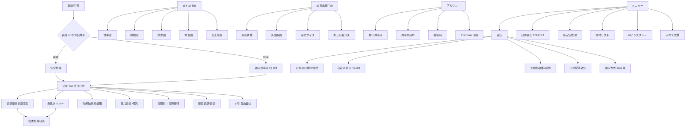

# PiyoLog 克隆产品 PRD（Android APK）

> 文档目的：基于公开一手信息（应用商店、官网、官方帮助/博客、官方社媒、隐私政策等）复盘 **PiyoLog（ぴよログ / Piyo日志 / 育儿记录-ぴよログ）** 的产品能力与 UI，供 Android 克隆 APK 落地实现。  
> 撰写语言：中文主体；关键术语保留日/英对照。  
> 标注约定：
> - 带 URL 的 markdown 链接 = 可核验的一手或近一手来源
> - **[推断]** = 从截图描述/用户反馈合理推断，但官方未明文确认
> - **[未确认]** = 公开资料不足，实现时需再验证
> - 二手博客（如 kosodate-update）仅作交互细节补充，并尽量与官方交叉验证

---

## 1. 产品概述

### 1.1 产品定位

PiyoLog 是一款面向新生儿/婴幼儿家庭的 **一站式育儿记录（母子手账）App**，核心是：

1. **极低摩擦的日常记录**（哺乳、奶粉、尿布、睡眠等一手操作完成）
2. **家庭实时共享**（夫妻、祖父母、看护者同一份数据）
3. **自动汇总可视化**（日汇总时间条、周图、成长曲线）
4. **可长期留存**（PDF 电子书/制本、文本导出）

官方定位文案（摘录）：
- 中文 Google Play：「夫妻可以即时分享资讯的育儿记录 App『Piyo日志』… 透过一只手的简易操作，即可替喂牛奶、换尿布及睡眠等事项做记录」([Google Play zh](https://play.google.com/store/apps/details?id=jp.co.sakabou.piyolog&hl=zh))
- 日文官网：「ぴよログは記録をリアルタイムに共有できる育児記録アプリ」([piyolog.com](https://www.piyolog.com/))
- 英文 App Store：「childcare record-keeping app that can be shared by a couple in real time… nursing timer, summary function, growth curve」([App Store US](https://apps.apple.com/us/app/piyolog-baby-feeding-tracker/id1252857347))

### 1.2 目标用户

| 用户角色 | 需求 |
|---------|------|
| 新手父母（主用户） | 夜喂/换尿布时快速记录；看上次喂奶/睡眠间隔 |
| 伴侣/共同照护者 | 实时同步，减少口头交接 |
| 祖父母/保姆/托育 | 临时照护时写入与查看（完整数据共享，不可部分隐藏）([官方 FAQ](https://piyolog-official.blogspot.com/2020/12/q.html)) |
| 多胎/多孩家庭 | 多宝宝切换、主题色区分、双胞胎复制等 |

### 1.3 核心价值

| 价值点 | 说明 | 来源 |
|--------|------|------|
| 共享优先 | 输入即时共享，外出也能看到睡眠与奶量 | [Play](https://play.google.com/store/apps/details?id=jp.co.sakabou.piyolog&hl=en) / [官网](https://www.piyolog.com/) |
| 单手/语音 | 哺乳中也能操作；Siri/Alexa/助手语音录入 | [官网](https://www.piyolog.com/) / [BabyTech 访谈](https://babytech.jp/en/2021/04/piyolog/) |
| 时间条 + 自动集计 | 一日概览 + 授乳时间/奶量/睡眠自动合计 | [Play 特色功能](https://play.google.com/store/apps/details?id=jp.co.sakabou.piyolog&hl=ja) |
| 成长可见 | 周图 + 成长曲线 + 修正月龄 | [官网](https://www.piyolog.com/) / [FAQ](https://piyolog-official.blogspot.com/2020/12/q.html) |
| 回忆留存 | PDF 电子书、可制本 | [官网](https://www.piyolog.com/) / [PDF 指南](https://piyolog-official.blogspot.com/2021/01/pdf.html) |

### 1.4 竞品语境

同类：Baby Tracker (Sprout)、Glow Baby、Huckleberry、Baby Daybook、Wachanga 等。PiyoLog 差异点在日系 UI（小鸡主题）、**家庭共享为免费核心能力**、时间条（タイムバー）日视图、以及 PDF 制本文化场景。([Play 相似应用区](https://play.google.com/store/apps/details?id=jp.co.sakabou.piyolog&hl=en)；[BabyTech](https://babytech.jp/en/2021/04/piyolog/))

### 1.5 官方基本信息

| 字段 | 内容 | 来源 |
|------|------|------|
| 产品名 | 日：育児記録 -ぴよログ- / 英：PiyoLog: Newborn Baby Tracker / 中：育儿记录 - Piyo日志 | [Play ja/en/zh](https://play.google.com/store/apps/details?id=jp.co.sakabou.piyolog) |
| 开发者 | PiyoLog Inc.（株式会社ぴよログ） | [Play](https://play.google.com/store/apps/details?id=jp.co.sakabou.piyolog&hl=en) |
| 包名 (Android) | `jp.co.sakabou.piyolog` | [Play](https://play.google.com/store/apps/details?id=jp.co.sakabou.piyolog) |
| iOS App ID | `id1252857347` | [App Store](https://apps.apple.com/us/app/piyolog-baby-feeding-tracker/id1252857347) |
| 官网 | https://www.piyolog.com/ （亦见 sakabou.co.jp） | [官网](https://www.piyolog.com/) |
| 支持邮箱 | info@sakabou.co.jp / info@piyolog.com | [Play](https://play.google.com/store/apps/details?id=jp.co.sakabou.piyolog&hl=en) |
| 地址 | 日本 爱知县半田市 | [Play 开发者信息](https://play.google.com/store/apps/details?id=jp.co.sakabou.piyolog&hl=ja) |
| 平台 | iOS / Android；另支持 Apple Watch、Wear OS | [App Store](https://apps.apple.com/us/app/piyolog-baby-feeding-tracker/id1252857347) / [Play](https://play.google.com/store/apps/details?id=jp.co.sakabou.piyolog&hl=en) |
| 评分 / 体量 | Play 约 4.9★ / 1M+ 下载 / 2.7万+ 评价；官方 X 自称 500 万下载突破 | [Play](https://play.google.com/store/apps/details?id=jp.co.sakabou.piyolog&hl=en)；[@piyolog_app](https://x.com/piyolog_app) |
| 定价模型 | **免费 + 广告 + 应用内购（Premium 订阅）** | [Play](https://play.google.com/store/apps/details?id=jp.co.sakabou.piyolog&hl=en) / [App Store Premium](https://apps.apple.com/us/app/piyolog-baby-feeding-tracker/id1252857347) |
| 数据安全（Play 声明） | 可能收集个人/健康等；传输加密；可请求删除 | [Play Data safety](https://play.google.com/store/apps/details?id=jp.co.sakabou.piyolog&hl=en) |
| 隐私政策 | https://www.sakabou.co.jp/app/piyolog/privacy_en.html | [Privacy](https://www.sakabou.co.jp/app/piyolog/privacy_en.html) |
| 利用规约 | https://www.sakabou.co.jp/app/piyolog/eula_en.html | [EULA](https://www.sakabou.co.jp/app/piyolog/eula_en.html) |
| 姐妹 App | ぴよログ予防接種；陣痛タイマー by ぴよログ | [官网](https://www.piyolog.com/) / [Play 更多](https://play.google.com/store/apps/details?id=jp.co.sakabou.piyolog&hl=ja) |
| 中文应用商店 | 主要通过 Google Play 分发「Piyo日志」；**[未确认]** 应用宝/小米/华为是否有官方上架 | 检索未找到独立中国商店官方包页 |

### 1.6 定价 / Premium（付费）

App Store 列出：**PiyoLog Premium Annual Plan — Ad Removal, More theme, and so on. Free Trial** ([App Store](https://apps.apple.com/us/app/piyolog-baby-feeding-tracker/id1252857347))。

结合用户指南与历史官方推文，Premium 能力大致为：

| 能力 | 免费 | Premium | 来源可信度 |
|------|------|---------|------------|
| 基础记录 / 图 / 共享 / 语音 / Watch | ✓ | ✓ | 官方商店 + 二手对照 [kosodate-update 对比](https://kosodate-update.com/piyolog-premium/) |
| 去广告 | × | ✓ | [App Store 订阅描述](https://apps.apple.com/us/app/piyolog-baby-feeding-tracker/id1252857347) |
| 更多主题色 | 部分 | 扩展（二手称 +14 种至共约 26 种） | **[推断/二手]** [premium 文](https://kosodate-update.com/piyolog-premium/)；历史推文称合计 16 色 [X 2019](https://x.com/piyolog_app/status/1197048616050782213) |
| 更多图标风格 | 部分 | 扩展 | **[二手]** |
| 照片高画质 | 压缩（官方：日记照片长边约 1200px） | 更高画质 | [App Store 日文：照片 1200px](https://apps.apple.com/jp/app/id1252857347) / [premium 文](https://kosodate-update.com/piyolog-premium/) |
| 视频上传 | ×（二手） | ✓（二手，约 1 分钟内） | **[二手/未完全官方确认]** |
| 优先支持 | × | ✓（二手） | **[二手]** |
| 一人订阅全家共享者可用 | — | 历史官方推文称加入者全体可用 | [X 2019](https://x.com/piyolog_app/status/1197048616050782213) |

**价格（二手用户评测交叉，非应用内最新价）**：

| 计划 | 约价（日本区二手） | 试用 | 来源 |
|------|-------------------|------|------|
| 月付 | 约 ¥400 | 约 2 周 | [kosodateeell 评测表](https://kosodateeell.com/apppiyoreview/) |
| 年付 | 约 ¥3,800 | 约 1 个月 | 同上 / [mogurabit 指南](https://mogurabit.com/piyolog-guide/) |

**Premium 权益表（二手评测汇总，实现以可配置 IAP 为准）** ([kosodateeell](https://kosodateeell.com/apppiyoreview/))：

| 能力 | 免费 | Premium |
|------|------|---------|
| 应用内广告 | 有 | 无 |
| 图标风格 | 约 2 种 | 约 4 种 |
| 主题色 | 约 6 种 | 约 10 种（他文称更多） |
| 视频 | — | 约 1 分钟内 |
| 照片上传 | 长边约 1200px | 长边约 4000px |

**[未确认最新官方表价]** 表内数字可能过时，**克隆产品实现时应做成可配置 IAP，不硬编码原价。**

**重要**：官方强调 **共享、图、记录等核心功能免费可用**——付费主要是舒适度与媒体质量，而非锁死记录能力。([Play](https://play.google.com/store/apps/details?id=jp.co.sakabou.piyolog&hl=en)；[premium 文](https://kosodate-update.com/piyolog-premium/))

---

## 2. 信息架构 & 导航

### 2.1 底部主导航（Tab）

根据使用视频字幕、设置路径与版本说明，底部/主导航大致包括（名称可能随版本微调）：

| Tab | 日文 | 作用 |
|-----|------|------|
| 记录 | 記録 | 今日时间轴 + 快速添加图标 + 时间条/日汇总 |
| 汇总 | まとめ | 周视图：食事/睡眠/排泄/体温等图 |
| 成长曲线 | 成長曲線 | 身高体重等百分位曲线 |
| 账户 | アカウント | 共享码、用户、机种变更继承 |
| 菜单/设置 | メニュー / 設定 | 输出 PDF、主题、通知、宝宝编辑等 |
| 育儿支援 | 子育て支援 | v9.1.0 新增：制度信息浏览、收藏、分类过滤 | [App Store 更新说明](https://apps.apple.com/jp/app/id1252857347) |

YouTube 使用介绍中明确提到：底部可改宝宝信息与设置的 **菜单 Tab**；**まとめ Tab** 看食事/睡眠/排泄/体温；**成長曲線 Tab** 看身高体重是否在曲线上。([YouTube 字幕摘录](https://www.youtube.com/watch?v=etxVu_afBFI))

共享流程文写「下部メニューから『アカウント』タブ」([共有ガイド](https://kosodate-update.com/app-piyolog-share-data/))。

### 2.2 页面地图（Sitemap）



### 2.3 全局入口

| 入口 | 行为 | 来源 |
|------|------|------|
| 主屏 Widget | 上半：最近食事/睡眠/排泄；下半：可配置快速记录图标 | [官方博客 Widget](https://piyolog-official.blogspot.com/2021/02/blog-post.html) |
| 记录屏顶部日期 | 打开日历，跳历史日；まとめ则跳该周 | [官方博客 日历](https://piyolog-official.blogspot.com/2020/07/blog-post_30.html) |
| 授乳タイマー区域 | 今日：开计时；非今日：「今日へ戻る」 | 同上 |
| 搜索 🔍 | 记录/日记检索；结果可 PDF | [官方 X 搜索介绍](https://x.com/piyolog_app) |
| 昵称长按 | 跳转到哥哥/姐姐「相同生后天数」那天的记录 | [官方 X](https://x.com/piyolog_app) |
| Wear OS / Apple Watch | 记录、最近记录、授乳计时；Tile/Complication | [Play](https://play.google.com/store/apps/details?id=jp.co.sakabou.piyolog&hl=en) / [官方 AW 文](https://piyolog-official.blogspot.com/2021/01/apple-watch.html) |

---

## 3. 功能清单（完整）

### 3.1 通用记录机制

**用户故事**：作为照护者，我要在 1～2 次点击内完成最常用记录，并在需要时补细节。

**交互共性**（综合官方与高赞评价）：
1. 记录 Tab 展示 **图标网格**（可排序、可隐藏）
2. 点图标 → 以 **当前时间** 生成一条时间轴记录（多数类型可一键）
3. 再点时间轴条目 → 打开编辑页改时间/量/备注/照片
4. 每条可附 **メモ**；部分类型有专用字段
5. **メモ 输入候选**：曾输入的文本会变成可点选 Tab，便于重复输入（药名、散步地点、辅食菜单等）([设计复盘 note](https://note.com/sziaoreo/n/n0f4c5eb08c86))
6. 时间轴显示「距上次该类型多久前」**[推断/用户评价]** ([App Store 日文评价](https://apps.apple.com/jp/app/id1252857347)；[note 设计文](https://note.com/sziaoreo/n/n0f4c5eb08c86))
7. 顶部 **日汇总**：睡眠时长、尿/便次数、奶量等自动合计 ([Play](https://play.google.com/store/apps/details?id=jp.co.sakabou.piyolog&hl=ja)；[App Store 评价](https://apps.apple.com/jp/app/id1252857347))
8. **タイムバー（时间条）**：一日活动横向概览 ([Play 特色](https://play.google.com/store/apps/details?id=jp.co.sakabou.piyolog&hl=ja))
9. 编辑/删除：点条目编辑；删除路径 **[未确认 UI 细节]**（长按/编辑页删除为合理实现）
10. 下拉刷新同步共享数据 ([共有ガイド](https://kosodate-update.com/app-piyolog-share-data/))
11. **全量数据删除**需多次确认（设计文称约 5 次点击 + 弹窗）——防误删 ([note 设计文](https://note.com/sziaoreo/n/n0f4c5eb08c86))

**官方列出的记录类型**（商店完整列表，中日英一致大意）：

> 母乳・ミルク・搾母乳・離乳食・おやつ・うんち・おしっこ・睡眠・体温・身長・体重・お風呂・さんぽ・せき・発疹・嘔吐・けが・くすり・病院・その他自由記述・育児日記（写真付き）  
> 英：Nursing, Formula, Pumped breast milk, Baby food, Snacks, Poop, Pee, Sleep, Temperature, Height, Weight, Baths, Walks, Coughing, Rashes, Vomiting, Injuries, Medicine, Hospitals, other free text, childcare diary (with photos)  
> 来源：[Play en](https://play.google.com/store/apps/details?id=jp.co.sakabou.piyolog&hl=en) / [App Store JP](https://apps.apple.com/jp/app/id1252857347) / [Play zh](https://play.google.com/store/apps/details?id=jp.co.sakabou.piyolog&hl=zh)

**扩展类型（官方/近官方补充）**：
- のみもの（饮料，独立于ミルク；可进まとめ显示配置）([FAQ](https://piyolog-official.blogspot.com/2020/12/q.html))
- 搾乳 vs 搾母乳（挤出 vs 喂挤出乳；用户评价区分）([App Store 评价](https://apps.apple.com/jp/app/id1252857347))
- 頭囲・胸囲（成长记录）([使用指南](https://kosodate-update.com/app-piyolog-howtouse-summary/)；[官方 X 成长](https://x.com/piyolog_app))
- 足のサイズ（v9.2.0 新增）([App Store What's New](https://apps.apple.com/us/app/piyolog-baby-feeding-tracker/id1252857347))
- 予防接種（记录 + 姐妹 App 联动）([官网](https://www.piyolog.com/))
- メモ（自由备注，可带照片；ぴよサポ 共享时日记隐藏仍可用）([官方 X メモ](https://x.com/piyolog_app))
- カスタム項目：最多约 **10** 个，改名称，**图标不可改** ([FAQ](https://piyolog-official.blogspot.com/2020/12/q.html)；[共有文](https://kosodate-update.com/app-piyolog-share-data/))

---

### 3.2 哺乳 / 母乳（Nursing）+ 授乳タイマー

**描述**：记录母乳喂养；支持左右侧时长计时与顺序。

**交互**：
1. **一键母乳图标**：直接记一条（可后补左右分钟、量、顺序）
2. **授乳タイマー**（主路径）：
   - 左右分别开始/停止
   - 显示「◀最後▶」提示上次停在哪侧 ([FAQ](https://piyolog-official.blogspot.com/2020/12/q.html))
   - 关闭 App 仍可运行，到点提醒 ([官网](https://www.piyolog.com/)；[BabyTech](https://babytech.jp/en/2021/04/piyolog/))
   - 完成后生成记录；可设记录时刻为 **开始时间 or 结束时间** ([FAQ 授乳記録時間](https://piyolog-official.blogspot.com/2020/12/q.html))
   - 设置可关：关则图标消失 ([FAQ](https://piyolog-official.blogspot.com/2020/12/q.html))
   - 计时中可切换页面；按钮热区大（用户评价）([App Store 评价](https://apps.apple.com/jp/app/id1252857347))
3. 可选 **母乳量**（后编辑输入）([使用指南](https://kosodate-update.com/app-piyolog-howtouse-summary/))
4. **下次授乳通知**：设定间隔（如 3h），记录后确认下次通知；可手动改下次时间；也适用于ミルク ([官方通知文](https://piyolog-official.blogspot.com/2020/08/blog-post_24.html)；[FAQ](https://piyolog-official.blogspot.com/2020/12/q.html))
5. **注意**：下次授乳通知主要给 **设定者本机** 显示；共享方不自动推送「对方刚记录」([FAQ：记录时无伴侣通知](https://piyolog-official.blogspot.com/2020/12/q.html)；[App Store 用户期望](https://apps.apple.com/jp/app/id1252857347))
6. 计时器内可选 **分段闹钟**（用户评测：1/3/5/7/10 分钟可选到点提示，防夜喂睡着）([kosodateeell](https://kosodateeell.com/apppiyoreview/))
7. **App 内声控计时器**（2021 PR）：「左」「右」「ストップ」等短语操作计时；设置中开启麦克风操作；与 Siri 快捷指令不同通道 ([PR TIMES 声で操作](https://prtimes.jp/main/html/rd/p/000000013.000019025.html)；[设定文](https://kosodate-update.com/app-piyolog-howtouse/))
8. 通知铃声为 **「ピヨピヨ」小鸡叫声**（品牌记忆点 + 低刺激）([note 设计文](https://note.com/sziaoreo/n/n0f4c5eb08c86)；[kosodateeell](https://kosodateeell.com/apppiyoreview/))

**数据字段建议**：
- `side_left_minutes`, `side_right_minutes`
- `order`（左右先后）
- `amount_ml`（可选）
- `timestamp`（开始或结束，按设置）
- `duration_total`
- `note`, `photos[]`
- `next_feed_notify_at`（本机）

**边界**：
- 只记一侧；中途切换侧；计时跨日
- **Siri/Alexa 快捷指令不可替代完整计时器流程**（FAQ 时期表述）；App 内麦克风声控为独立能力 ([FAQ](https://piyolog-official.blogspot.com/2020/12/q.html)；[PR TIMES](https://prtimes.jp/main/html/rd/p/000000013.000019025.html))

---

### 3.3 奶瓶 / 配方奶（ミルク / Formula）

**交互**：点图标 → 选/输 ml → 保存。可选制作量、饮用耗时（用户实践建议）。

**输入方式**：
- **选择式**：候选量（如步进）；上次量居中便于一键 ([设定文](https://kosodate-update.com/app-piyolog-howtouse/))
- **テンキー**：手输数字 ([FAQ](https://piyolog-official.blogspot.com/2020/12/q.html))
- 用户反馈默认常 **10ml 步进**，希望 5ml/手输——实现应支持步进配置 ([Play 评价](https://play.google.com/store/apps/details?id=jp.co.sakabou.piyolog&hl=ja))

**字段**：`amount_ml`, `prepared_ml?`, `duration_min?`, `timestamp`, `note`, `photos?`

**边界**：部分喝完、吐奶关联（吐奶为独立类型 嘔吐）

---

### 3.4 挤奶 / 喂挤出乳（搾乳 / 搾母乳 / Pumping）

官方商店明确 **Pumped breast milk / 搾母乳**；用户与教程区分：
- **搾乳**：挤出量库存类记录 **[推断字段]**
- **搾母乳**：瓶喂挤出乳（计入食事量图，与ミルク、授乳同属量图三件）([FAQ 食事量图](https://piyolog-official.blogspot.com/2020/12/q.html))

**字段**：`amount_ml`, `side?`, `timestamp`, `note`  
**[未确认]**：库存余额管理是否存在——商店未写库存，默认 **无库存系统，仅事件日志**。

---

### 3.5 睡眠（睡眠）

**交互**：
- 「寝る」「起きる」两个图标/状态切换
- 自动计算区间时长
- 异常配对显示 **(!)** 警示（漏记起床/入睡）([使用指南](https://kosodate-update.com/app-piyolog-howtouse-summary/))
- **软校验哲学**：连续两次「寝る」等异常 **不阻断录入**，先写入再在列表标 (!)，避免夜喂慌乱被弹窗卡住 ([note 设计文](https://note.com/sziaoreo/n/n0f4c5eb08c86))
- まとめ：睡眠条状图，可有每小时虚线辅助 ([App Store 评价](https://apps.apple.com/jp/app/id1252857347))
- 官方支持 **昼寝显示**：设定昼寝时段后以不同颜色（橙）显示午睡；可显示平均 ([官方 X 昼寝](https://x.com/piyolog_app))

**字段**：`sleep_start`, `sleep_end`, `duration`, `is_nap?`, `note`, `anomaly_flag`

**边界**：跨夜睡眠；仅开始未结束；连续两次「寝る」

---

### 3.6 尿布 / 排泄（おしっこ・うんち・両方）

**交互**：
- 三种一键：尿 / 便 / 两者
- 便便可记 **颜色、硬度**（用户建议；是否有结构化选项 **[未确认完整枚举]**，至少 memo）([使用指南](https://kosodate-update.com/app-piyolog-howtouse-summary/))
- 日汇总显示次数

**字段**：`kind: pee|poop|both`, `stool_color?`, `stool_consistency?`, `timestamp`, `note`, `photos?`

---

### 3.7 体温（体温）

**交互**：
- 手输 ℃
- **音波通信体温计**：欧姆龙 MC-6800B「けんおんくん」贴近手机接收读数 ([官方博客](https://piyolog-official.blogspot.com/2021/06/blog-post.html))
- 快捷方式/Android 长按 App 图标可达接收屏 ([官方](https://piyolog-official.blogspot.com/2021/06/blog-post_10.html))
- 周体温图
- **健康提示**：生后 **3 个月未满** 且记录 **≥38℃** 时，显示建议就医文案，并说明显示基准（减焦虑）([note 设计文](https://note.com/sziaoreo/n/n0f4c5eb08c86))

**字段**：`celsius`, `source: manual|sound_wave`, `timestamp`, `note`  
**单位**：默认 ℃；℉ **[未确认 UI 是否有]**——克隆应支持双单位。

---

### 3.8 身高体重 / 成长测量

**字段**：身高、体重、头围、胸围；v9.2+ **足长** ([What's New](https://apps.apple.com/us/app/piyolog-baby-feeding-tracker/id1252857347))  
**输入**：选择式 or テンキー；体重 g/kg 可选（用户评价）([App Store 评价](https://apps.apple.com/jp/app/id1252857347))  
**曲线**：自动点图；年龄段切换 1/2/4/12 岁 **[官方 X 提及]**；修正月龄需登记预产期 ([FAQ](https://piyolog-official.blogspot.com/2020/12/q.html))  
**标准曲线**：日本母子保健常用百分位 **[推断采用厚生劳动省类曲线，未在商店逐条写死标准名]**

---

### 3.9 辅食 / 离乳食 / 零食 / 食材リスト

**离乳食・おやつ**：时间轴事件 + 备注/照片。

**食材リスト**（2021 起，官方 PR）：
- 约 **250** 种食材
- 按离乳阶段 ○ / △ / × 适宜性
- 搜索：关键词、类别、筛选
- 记录「吃过」；详情记 **好き / ふつう / 苦手 / アレルギー**
- 注意点、给予方法文案
- 可进 PDF ([PR TIMES](https://prtimes.jp/main/html/rd/p/000000012.000019025.html)；[官方博客](https://piyolog-official.blogspot.com/2021/08/blog-post.html))

**字段**：`meal_type: baby_food|snack`, `ingredients[]`, `reaction`, `note`, `photos`

---

### 3.10 用药 / 疫苗 / 医院 / 症状

| 类型 | 说明 |
|------|------|
| くすり / Medicine | 服药记录 + 备注 |
| 予防接種 | 疫苗记录；深链路姐妹 App「ぴよログ予防接種」([官网](https://www.piyolog.com/)) |
| 病院 | 就诊 |
| せき / 発疹 / 嘔吐 / けが | 症状/意外 |
| お風呂 / さんぽ | 护理活动；さんぽ用户希望時間条带状显示 **[需求反馈，非已实装确认]** ([Play 评价](https://play.google.com/store/apps/details?id=jp.co.sakabou.piyolog&hl=ja)) |

---

### 3.11 备注 / 其他 / 育儿日记

- **その他 / 自由記述**：通用事件  
- **メモ**：轻量自由备注（官方重点推广）([官方 X](https://x.com/piyolog_app))  
- **育児日記**：长文 + 照片（时间轴内展示，2021 设计改版把日记移入时间轴变宽）([PR TIMES](https://prtimes.jp/main/html/rd/p/000000012.000019025.html))  
- 免费照片长边约 **1200px** 缩放 ([App Store JP](https://apps.apple.com/jp/app/id1252857347))

---

### 3.12 时间轴 / 时间条 / 日汇总

| 组件 | 行为 |
|------|------|
| 时间轴 | 按时间倒序/正序列表 **[默认方向未确认，多为时间序]**；条目含图标、时刻、摘要、相对时间 |
| 时间条 タイムバー | 一日横条色块概览喂养/睡眠等 ([Play](https://play.google.com/store/apps/details?id=jp.co.sakabou.piyolog&hl=ja)) |
| 日集计 | 授乳总分钟、ミルク ml、睡眠时长、排泄次数等自动显示 ([Play](https://play.google.com/store/apps/details?id=jp.co.sakabou.piyolog&hl=ja)) |
| 顶栏信息 | 昵称、生后天数、主题色；可多宝宝切换 |

**生后天数**：默认 **満日数**（生日=0 日）；可切 **数え日数**（生日=1 日）([官方博客](https://piyolog-official.blogspot.com/2020/07/blog-post_31.html))

---

### 3.13 图表 / 周汇总（まとめ）

- 食事（时间/量堆积图；量图默认 **授乳+ミルク+搾母乳**；のみもの可显示次数与 ml 于上方）([FAQ](https://piyolog-official.blogspot.com/2020/12/q.html))
- 睡眠周对比
- 排泄
- 体温
- 可配置「食事まとめの表示内容」：时间项、量汇总项（最多 4）、图堆积项 ([设定文](https://kosodate-update.com/app-piyolog-howtouse/))
- 日期点选切换周 ([日历文](https://piyolog-official.blogspot.com/2020/07/blog-post_30.html))
- **先週との比較**：本周まとめ相对上周的量/体温等变化提示（可设置开关；仅对本周页、且需有上周数据）([设定文](https://kosodate-update.com/app-piyolog-howtouse/))
- **週のはじまり**：周日/周一起始可配置，影响まとめ周切分 ([设定文](https://kosodate-update.com/app-piyolog-howtouse/))

---

### 3.14 提醒 / 通知

| 通知 | 说明 |
|------|------|
| 下次授乳/ミルク | 间隔设定 + 记录后确认 ([官方](https://piyolog-official.blogspot.com/2020/08/blog-post_24.html)) |
| 计时器到点 | 关闭 App 仍提示 ([官网](https://www.piyolog.com/)) |
| 伴侣新记录 | **无** ([FAQ](https://piyolog-official.blogspot.com/2020/12/q.html)) |
| 暗色/夜间 | 菜单月亮图标暗色；可按时段自动暗色 ([BabyTech](https://babytech.jp/en/2021/04/piyolog/)) |

商店文案亦写「贴心通知您下一次的哺乳时间」([Play zh](https://play.google.com/store/apps/details?id=jp.co.sakabou.piyolog&hl=zh))

---

### 3.15 多人同步 / 家庭共享

**模型**：
1. 主用户发行 **ぴよログ ID + 共有用コード**（或 QR）
2. 对方首次启动选「パートナーと共有」输入
3. 码有时效（二手称 **24h**）([共有ガイド](https://kosodate-update.com/app-piyolog-share-data/))
4. 实时同步；可下拉刷新
5. 人数官方称 **无上限**（实用家庭规模）([BabyTech](https://babytech.jp/en/2021/04/piyolog/)；[FAQ](https://piyolog-official.blogspot.com/2020/12/q.html))
6. 可共享给祖父母等；**不可跨「别世帯」合并两套宝宝日志** ([FAQ](https://piyolog-official.blogspot.com/2020/12/q.html))
7. **不可部分字段隐藏共享**——全量 ([FAQ](https://piyolog-official.blogspot.com/2020/12/q.html))
8. 解除：メニュー > アカウント > 共有中のユーザー > 停止 ([FAQ](https://piyolog-official.blogspot.com/2020/12/q.html))

**共享内容 vs 不共享**（二手与 FAQ 交叉）：

| 共享 | 不共享（各设备独立） |
|------|----------------------|
| 全部育儿记录、自定义项、输入候选/suggest | 主题色、图标风格、项目显隐排序、暗色/ナイトモード、下次授乳通知、Widget、时间制 |

([共有ガイド](https://kosodate-update.com/app-piyolog-share-data/)；[FAQ](https://piyolog-official.blogspot.com/2020/12/q.html)；[kosodateeell 共有](https://kosodateeell.com/piyologshare/))

**共享人数**：无硬性人数上限，祖父母等多方可加入 ([kosodateeell](https://kosodateeell.com/piyologshare/)；[BabyTech](https://babytech.jp/en/2021/04/piyolog/))

**权限**（二手细化，实现建议对齐）：
- 管理者：全数据编辑删除、增删共享用户、移交管理权
- 参与者：主要编辑自己输入的数据  
([共有ガイド](https://kosodate-update.com/app-piyolog-share-data/)) **[细节以实机为准]**

**机种变更**：アカウント发行 **引き継ぎ用コード** 到新机 ([FAQ](https://piyolog-official.blogspot.com/2020/12/q.html))

**ぴよサポ**：面向保姆/保育的共享形态；可能隐藏育儿日记——用メモ代替 ([官方 X メモ](https://x.com/piyolog_app)) **[完整规则未公开]**

---

### 3.16 导出 / 备份

| 方式 | 说明 | 来源 |
|------|------|------|
| 电子书 PDF | 封面/记录/まとめ/成长曲线/离乳食/封底可选；页数估算；保存到本地（App 内不存 PDF） | [PDF 文](https://piyolog-official.blogspot.com/2021/01/pdf.html) / [制本指南](http://www.sakabou.co.jp/app/piyolog/service/print/) |
| PDF 照片过滤 | 可按记录类型隐藏某类照片（如隐藏便便图） | [官方 X](https://x.com/piyolog_app) |
| 搜索结果 PDF | 支持 | [官方 X 搜索](https://x.com/piyolog_app) |
| 文本导出 TXT | 如 1 个月导出 | [FAQ](https://piyolog-official.blogspot.com/2020/12/q.html)；[zenn 操作路径](https://zenn.dev/syu_tan/articles/e20a5904c7429c) |
| 制本 | 推荐 A5，经 製本直送.com 等 | [制本指南](http://www.sakabou.co.jp/app/piyolog/service/print/) |
| Android PDF 絵文字 | 不支持 | [FAQ](https://piyolog-official.blogspot.com/2020/12/q.html) |

路径：メニュー > 記録の出力 > 電子書籍(PDF) / テキスト ([制本](http://www.sakabou.co.jp/app/piyolog/service/print/)；[zenn](https://zenn.dev/syu_tan/articles/e20a5904c7429c))

---

### 3.17 设置、主题、语言、锁定

**设定类（汇总官方路径名）**：
- 记录项目排序 / 显示隐藏（按宝宝；可复制另一宝宝设置）([FAQ](https://piyolog-official.blogspot.com/2020/12/q.html)；[设定文](https://kosodate-update.com/app-piyolog-howtouse/))
- 自定义项目编辑
- 飲み物 / 身长体重 **输入方式**
- 授乳タイマー ON/OFF、记录时间起/止、音、设计 classic/simple、麦克风操作 **[部分二手]**
- **アクションボタンの設定**：记录屏授乳计时器/搜索等入口可单独显隐 ([设定文](https://kosodate-update.com/app-piyolog-howtouse/))
- 下次授乳间隔与下次时刻
- 食事まとめ显示内容
- 先週との比較 ON
- 週のはじまり（日/月等）
- 修正月龄图 ON
- 生后日数 満/数え
- 主题色（每宝宝）、图标风格、暗色模式
- AI 助手：Siri 快捷指令、Alexa、Google 助手 **[Android 侧 Google 助手在 PR 提及]** ([PR TIMES](https://prtimes.jp/main/html/rd/p/000000012.000019025.html)；[Siri 页](https://www.sakabou.co.jp/app/piyolog/siri/))
- 时间步进 1 分/5 分（iOS 双击切换记载于 FAQ）([FAQ](https://piyolog-official.blogspot.com/2020/12/q.html))
- 授乳/ミルク记录「飲み始め / 飲み終わり」设定（用户评价）([App Store 评价](https://apps.apple.com/jp/app/id1252857347))

**语言**：商店有日/英/中文案 → App 内至少日英，中文 UI **[未确认完整本地化程度]**；克隆目标 **日/中/英**。

**锁定（PIN/生物识别）**：**[未确认]** 公开资料未强调应用锁；隐私敏感，克隆 **建议实现** 但勿写成原版必有。

---

### 3.18 多宝宝

- 支持多个宝宝注册 ([官网](https://www.piyolog.com/))
- 主题色区分防记错 ([Play 评价](https://play.google.com/store/apps/details?id=jp.co.sakabou.piyolog&hl=ja))
- 双胞胎：一键复制、成长曲线等用户高度评价 ([App Store 评价](https://apps.apple.com/jp/app/id1252857347))
- Widget 可按宝宝分别放置 ([FAQ](https://piyolog-official.blogspot.com/2020/12/q.html))

---

### 3.19 语音 / 智能助手 / 外部设备

| 渠道 | 能力 |
|------|------|
| Siri Shortcuts | 「おしっこしたよ」「ミルクを飲んだよ」等短语录入；需选宝宝与动作 ([官方 Siri 文](https://piyolog-official.blogspot.com/2021/01/hey-siri.html)) |
| Amazon Alexa | 语音记录 ([Play en](https://play.google.com/store/apps/details?id=jp.co.sakabou.piyolog&hl=en)；[官网](https://www.piyolog.com/)) |
| Google アシスタント | PR 列举 ([PR TIMES](https://prtimes.jp/main/html/rd/p/000000012.000019025.html)) |
| 音波体温计 | 欧姆龙 MC-6800B ([官方](https://piyolog-official.blogspot.com/2021/06/blog-post.html)) |
| Wear OS | 记录、最近、授乳计时、Tile ([Play](https://play.google.com/store/apps/details?id=jp.co.sakabou.piyolog&hl=en)) |

语音 **不能** 操作授乳计时器 ([FAQ](https://piyolog-official.blogspot.com/2020/12/q.html))

---

### 3.20 搜索

- 记录 + 日记全文/条件搜索
- 入口：记录屏放大镜或菜单
- 结果可导出 PDF ([官方 X](https://x.com/piyolog_app))

---

### 3.21 日历

- 历史：点日期打开月历跳转（长期存在）([官方 2020](https://piyolog-official.blogspot.com/2020/07/blog-post_30.html))
- v9.0.0 **Add Calendar** 增强日历功能 ([App Store](https://apps.apple.com/us/app/piyolog-baby-feeding-tracker/id1252857347)) **[UI 细节未完全公开]**

---

### 3.22 育儿支援 Tab（v9.1+）

- 浏览子育て支援制度信息
- 分类过滤、收藏、详情页 ([App Store 更新日志](https://apps.apple.com/jp/app/id1252857347))  
**[未确认]** 是否仅日本地区内容；克隆可做成可插拔 CMS。

---

### 3.23 引导 / Onboarding

- 首次：「はじめる」注册宝宝（名、性别、生日）或「パートナーと共有」
- 主题等基础设定 + 账户链接引导
- 教程（2021 前后加强）([使用指南](https://kosodate-update.com/app-piyolog-howtouse-summary/)；[BabyTech](https://babytech.jp/en/2021/04/piyolog/))

宝宝档案隐私字段：昵称、性别、生日、其他育儿信息 ([Privacy](https://www.sakabou.co.jp/app/piyolog/privacy_en.html))；另需 **预产期** 以启用修正月龄 ([FAQ](https://piyolog-official.blogspot.com/2020/12/q.html))

---

## 4. 页面设计元素

### 4.1 整体视觉风格

| 要素 | 描述 | 来源 |
|------|------|------|
| 主题吉祥物 | 黄色小鸡（ぴよ）、可爱卡通图标 | 品牌名 + 用户「cartoon-y」评价 ([App Store](https://apps.apple.com/us/app/piyolog-baby-feeding-tracker/id1252857347)) |
| 主题色 | 每宝宝可选多种背景/强调色；Premium 更多 | [BabyTech](https://babytech.jp/en/2021/04/piyolog/) / Premium |
| 图标风格 | 可爱套 + 后加简洁套 | [BabyTech](https://babytech.jp/en/2021/04/piyolog/) |
| 广告 | 免费版小条广告，不挡主操作（用户与访谈称特意调小） | [BabyTech](https://babytech.jp/en/2021/04/piyolog/) |
| 暗色模式 | 夜喂友好；可预约时段 | [BabyTech](https://babytech.jp/en/2021/04/piyolog/) / [官网 Dark Mode](https://www.piyolog.com/) |
| 布局原则 | **单手优先**、大热区、少层级 | [Play](https://play.google.com/store/apps/details?id=jp.co.sakabou.piyolog&hl=en) |

### 4.2 首页 / 今日日志（記録）

**目的**：完成 90% 日常录入与回顾。

**布局结构（自上而下）**：
1. 顶栏：宝宝昵称（可切换）· 月龄/生后天数 · 可选主题色条
2. **日汇总条**：睡眠合计、尿/便次数、奶量等 chips
3. **タイムバー**：24h 色带
4. **授乳タイマー入口** / 搜索 / （非今日时「今日へ戻る」）
5. **时间轴列表**（含日记卡片、照片大图）
6. **底部记录图标横滑/网格**（可排序）
7. 免费版广告条
8. 底 Tab

**状态**：
- 空状态：今日无记录时友好插画 + 引导点图标 **[推断]**
- 加载/同步：下拉刷新指示
- 睡眠异常：(!) 标记

**手势**：
- 点图标快速加
- 点条目编辑
- 点日期 → 日历
- 长按昵称 → 兄姐同日龄 **[官方]**
- 图标区滚到末尾 →「並び替え」([官方 X](https://x.com/piyolog_app))

**文案示例**：

| 中 | 日 | 英 |
|----|----|-----|
| 记录 | 記録 | Log / Records |
| 今天 | 今日 | Today |
| 返回今天 | 今日へ戻る | Back to today |
| 睡觉 / 醒来 | 寝る / 起きる | Sleep / Wake |
| 母乳 / 配方奶 | 母乳 / ミルク | Nursing / Formula |

### 4.3 快速添加 / 记录图标区

- 大图标 + 短标签
- 不常用隐藏后网格更疏
- 自定义项固定图标样式（不可换图）

### 4.4 各类型记录编辑页

**通用结构**：
- 标题 = 类型名 + 图标
- 日期时间选择器（1/5 分步进）
- 类型专用控件（左右计时、ml 选择条、体温数字…）
- メモ 文本框
- 照片添加
- 保存 / 取消 / 删除

**授乳タイマー页**（独立全屏）：
- 左右两大圆钮 + 中间上次侧提示
- 运行中高亮；可经典/简洁皮肤 **[二手设定项]**
- 完成 → 预览记录 → 确认

### 4.5 统计 / まとめ页

- 顶：周切换 / 日历
- 分段：食事 · 睡眠 · 排泄 · 体温 ·（可能还有日记摘要）
- 食事量：堆叠柱/条 + 顶部次数与 ml
- 睡眠：横条时间带 + 虚线网格

### 4.6 成长曲线页

- 切换指标：身高/体重/头围/胸围/足长
- 年龄范围切换
- 百分位背景曲线 + 实测点
- 修正月龄开关（需预产期）

### 4.7 日历 / 历史

- 月历选日 → 记录 Tab 定位该日
- v9 日历增强 **[未确认是否独立 Tab 或全屏页]**

### 4.8 设置 / 菜单页

- 分组列表：宝宝、记录项目、显示、通知、AI、输出、Premium、关于/隐私
- 月亮图标快捷暗色 ([BabyTech](https://babytech.jp/en/2021/04/piyolog/))

### 4.9 家庭 / 同步（账户）

- 显示ぴよログ ID
- 发行共享码 / QR / 邮件分享
- 共享中用户列表 · 停止 · 管理权移交
- 继承码

### 4.10 Onboarding

- 插画小鸡欢迎
- 二选一：开始记录 / 与伴侣共享
- 宝宝三要素表单
- 可选教程气泡指向图标与时间条

### 4.11 Widget

- 上：食事 | 睡眠 | 排泄 最近一条时间
- 下：可配置 3～N 个快捷图标
- 多宝宝多实例 ([官方 Widget 文](https://piyolog-official.blogspot.com/2021/02/blog-post.html))

---

## 5. 数据模型（落地用）

### 5.1 实体建议

```text
UserAccount
  id, piyolog_id, role(owner|member), device_id, created_at

Baby
  id, family_id, nickname, sex, birthday, due_date?,
  theme_color, icon_style?, sort_order, deleted_at

ShareLink
  family_id, code, qr_payload, expires_at, created_by

LogEntry
  id, baby_id, type, timestamp, end_timestamp?,
  created_by_user_id, note, client_uuid, updated_at, deleted_at

-- 按 type 扩展表或 JSON payload --
NursingDetail: left_min, right_min, order, amount_ml, record_at_mode
FormulaDetail: amount_ml, prepared_ml, duration_min
PumpDetail: amount_ml, pump_kind(express|feed_expressed)
SleepDetail: start, end, anomaly
DiaperDetail: kind, stool_color, stool_consistency
TempDetail: celsius, source
GrowthDetail: height_cm, weight_g, head_cm, chest_cm, foot_mm
FoodDetail: subtype(baby_food|snack|drink), amount_ml?, ingredients[]
MedicineDetail: name, dose
VaccineDetail: name, dose_number, clinic
HospitalDetail: name, reason
SymptomDetail: symptom_enum
ActivityDetail: bath|walk|custom_id
DiaryDetail: body_markdown, photos[]
MemoDetail: body, photos[]

CustomItemDef: id, family_id, slot_index(0-9), name, visible

FoodIngredientMaster: id, name, stage_flags, caution_text, category
FoodIntake: baby_id, ingredient_id, reaction, first_at, note

DailyAggregate: baby_id, date, nursing_min, formula_ml, sleep_min, pee_count, poop_count, ...

SettingsLocal: user_id, item_order_json, hidden_items, input_modes,
  nursing_interval, dark_mode_schedule, units, day_count_mode, ...

MediaAsset: id, entry_id, local_uri, remote_uri, width, height, is_video, quality_tier

Subscription: user_id, plan, valid_until, trial_used
```

### 5.2 本地 vs 云

| 层级 | 建议 |
|------|------|
| 本地优先 | Room/SQLite 立即写入时间轴；离线可记 |
| 同步 | 有网时推送/拉取；冲突：`updated_at` + `client_uuid` 幂等 |
| 共享 | 以 `family_id` 为同步域；管理员删除级联策略需定义 |
| 媒体 | 先本地缩略图；后台上传；免费压缩长边≤1200 |
| 继承 | 导出加密恢复包或服务端 code 绑定 |

原版：认证信息自动上传；儿童昵称/性别/生日及用户输入育儿信息 ([Privacy](https://www.sakabou.co.jp/app/piyolog/privacy_en.html))

### 5.3 单位

| 量 | 主单位 | 可选 |
|----|--------|------|
| 奶量 | ml | oz |
| 体温 | ℃ | ℉ |
| 身长 | cm | in |
| 体重 | g / kg | lb |
| 足长 | mm/cm | in |
| 时间 | 24h | 12h（设备/设置） |

---

## 6. Android 技术落地建议

### 6.1 推荐技术栈

| 层 | 建议 |
|----|------|
| 语言 UI | Kotlin + Jetpack Compose + Material 3（自定义小鸡主题） |
| 架构 | 多模块 + UDF（ViewModel + StateFlow） |
| 本地 DB | Room + DataStore（设置） |
| 异步 | Coroutines + WorkManager（同步、压缩、导出） |
| 同步后端 | **[自建]** Firebase/Supabase/自研；需端到端加密评估（健康数据） |
| 图表 | Vico / Compose Canvas 自绘时间条与百分位曲线 |
| PDF | PdfDocument / iText 类库 |
| 通知 | NotificationCompat + AlarmManager/exact 视机型 |
| Widget | Glance App Widget |
| Wear | Wear OS 独立 data layer 可选 Phase 2 |
| 计时器 | 前台服务 + 持久状态，避免被杀 |
| IAP | Play Billing 5+ |
| 分析/广告 | 可选；注意儿童隐私合规 |

### 6.2 模块划分

```text
:app
:core:model
:core:database
:core:datastore
:core:common
:feature:log          # 时间轴、快速添加、编辑
:feature:timer        # 授乳计时
:feature:summary      # まとめ
:feature:growth
:feature:share
:feature:export
:feature:settings
:feature:onboarding
:feature:foodlist
:feature:widget
:sync
:designsystem         # 颜色、图标、组件
```

### 6.3 MVP vs 分期

| 阶段 | 范围 |
|------|------|
| **MVP** | 单宝宝；母乳(含简易左右计时)/配方奶/尿布三态/睡眠起止/体温/备注；时间轴+日汇总+时间条；本地存储；基础设置（排序显隐） |
| **v1** | 多宝宝；共享同步；まとめ四周图；成长曲线（身长体重）；通知间隔；Widget；中日英；TXT 导出 |
| **v2** | 离乳食材库；PDF 电子书；自定义项；暗色/主题；搜索；日历增强；Premium 去广告 |
| **v3** | Wear、语音助手、音波体温计、视频、育儿支援 CMS、姐妹疫苗深度整合 |

### 6.4 权限

| 权限 | 用途 |
|------|------|
| `POST_NOTIFICATIONS` | 授乳提醒、计时器 |
| `FOREGROUND_SERVICE` / 特殊计时类型 | 后台计时 |
| `CAMERA` / 相册读 | 日记照片（按需） |
| `RECORD_AUDIO` | 音波体温计、可选语音 **[可选]** |
| 网络 | 同步 |
| `SCHEDULE_EXACT_ALARM` | 精确提醒（按政策申请） |
| 存储/媒体 | 导出 PDF 到 Downloads |

### 6.5 离线优先

1. 所有写操作先 Room  
2. Outbox 表排队同步  
3. 共享只读缓存过期策略  
4. 冲突合并：同 `client_uuid` 去重；不同记录并存  
5. 计时器状态 SharedPreferences/DB 崩溃恢复  

---

## 7. 非功能需求

### 7.1 性能与交互

- 冷启动后 **1 秒内** 可点图标记账 **[目标]**  
- 时间轴日数据 <100ms 渲染（分页/按日加载）  
- 单手：主要 CTA 在下半屏  
- 夜喂：大按钮、暗色、低亮度友好  

### 7.2 无障碍与国际化

- 内容描述 contentDescription 全覆盖图标  
- 字体随系统缩放  
- 字符串 i18n：`values-ja` / `values-zh` / `values`  
- RTL **[低优先]**  

### 7.3 隐私

- 婴儿健康数据最小化采集  
- 传输 TLS；静态加密（SQLCipher 可选）  
- 明确隐私政策与删除账号/数据  
- 广告与分析遵守地区法规；默认少追踪  
- 共享前告知「全量共享不可部分隐藏」  

### 7.4 电池

- 计时器用高效前台服务，屏可关  
- 同步指数退避，避免频繁唤醒  
- Widget 更新节流  

---

## 8. 验收标准 & 里程碑

### 8.1 MVP 勾选

- [ ] 安装 APK 后可完成 onboarding 并创建宝宝  
- [ ] 可记录：母乳（左右分钟）、配方奶 ml、尿/便/两者、睡眠起止、体温、备注  
- [ ] 时间轴展示、编辑、删除  
- [ ] 日汇总数字正确  
- [ ] 时间条可视化当日睡眠与喂养  
- [ ] 授乳计时器后台可跑并生成记录  
- [ ] 本地杀进程后数据仍在  
- [ ] 中文 UI 可用  

### 8.2 v1 勾选

- [ ] 双设备共享码加入，60s 内互相同步新记录  
- [ ] まとめ：食事量/睡眠/排泄/体温周图  
- [ ] 成长曲线点录与展示  
- [ ] 下次喂养通知  
- [ ] 桌面 Widget 快捷记账  
- [ ] TXT 导出至少 1 个月  

### 8.3 v2 勾选

- [ ] PDF 含封面+日志+图  
- [ ] 自定义项目 ≤10  
- [ ] 主题色/暗色  
- [ ] 搜索  
- [ ] 去广告 IAP 通路  

### 8.4 可安装 APK 交付定义

1. `app-release.apk`（或 AAB+内测 APK）可在 Android 8.0+ 安装  
2. 无需登录即可本地使用 MVP 功能  
3. 附 `README`：构建命令、测试账号（若有后端）、已知限制  
4. 通过冒烟用例：记 10 条混合类型 → 重启 → 汇总一致  
5. 无崩溃率门槛：核心路径 monkey 稳定 **[项目自定]**  

---

## 9. 参考来源

### 9.1 官方 / 商店（一手）

1. Google Play（EN）：https://play.google.com/store/apps/details?id=jp.co.sakabou.piyolog&hl=en  
2. Google Play（JA）：https://play.google.com/store/apps/details?id=jp.co.sakabou.piyolog&hl=ja  
3. Google Play（ZH）：https://play.google.com/store/apps/details?id=jp.co.sakabou.piyolog&hl=zh  
4. App Store（US）：https://apps.apple.com/us/app/piyolog-baby-feeding-tracker/id1252857347  
5. App Store（JP）：https://apps.apple.com/jp/app/id1252857347  
6. 官网：https://www.piyolog.com/  
7. 服务/姐妹应用：https://www.piyolog.com/service.html  
8. 隐私政策（EN）：https://www.sakabou.co.jp/app/piyolog/privacy_en.html  
9. 隐私政策（JA）：https://www.sakabou.co.jp/app/piyolog/privacy.html  
10. 利用规约（EN）：https://www.sakabou.co.jp/app/piyolog/eula_en.html  
11. 利用规约（JA）：https://www.sakabou.co.jp/app/piyolog/eula.html  
12. Siri 设置：https://www.sakabou.co.jp/app/piyolog/siri/  
13. PDF 制本指南：http://www.sakabou.co.jp/app/piyolog/service/print/  
14. 官方功能博客索引：https://piyolog-official.blogspot.com/  
15. FAQ：https://piyolog-official.blogspot.com/2020/12/q.html  
16. 下次授乳通知：https://piyolog-official.blogspot.com/2020/08/blog-post_24.html  
17. 日历跳转：https://piyolog-official.blogspot.com/2020/07/blog-post_30.html  
18. 生后日数：https://piyolog-official.blogspot.com/2020/07/blog-post_31.html  
19. 记录项目排序：https://piyolog-official.blogspot.com/2020/09/blog-post.html  
20. Widget：https://piyolog-official.blogspot.com/2021/02/blog-post.html  
21. Siri 语音：https://piyolog-official.blogspot.com/2021/01/hey-siri.html  
22. PDF：https://piyolog-official.blogspot.com/2021/01/pdf.html  
23. Apple Watch：https://piyolog-official.blogspot.com/2021/01/apple-watch.html  
24. 音波体温计：https://piyolog-official.blogspot.com/2021/06/blog-post.html  
25. 食材リスト：https://piyolog-official.blogspot.com/2021/08/blog-post.html  
26. PR TIMES 食材与改版：https://prtimes.jp/main/html/rd/p/000000012.000019025.html  
27. 官方 X：https://x.com/piyolog_app  
28. Premium 历史说明推文：https://x.com/piyolog_app/status/1197048616050782213  

### 9.2 近一手访谈 / 报道

29. BabyTech 访谈：https://babytech.jp/en/2021/04/piyolog/  

### 9.3 二手操作详解（需与官方交叉；标注推断用）

30. 使い方まとめ：https://kosodate-update.com/app-piyolog-howtouse-summary/  
31. 自定义设定：https://kosodate-update.com/app-piyolog-howtouse/  
32. 共享指南：https://kosodate-update.com/app-piyolog-share-data/  
33. Premium 对比：https://kosodate-update.com/piyolog-premium/  
34. TXT 导出路径笔记：https://zenn.dev/syu_tan/articles/e20a5904c7429c  
35. 使用演示视频：https://www.youtube.com/watch?v=etxVu_afBFI  
36. 照片评测（UI/Premium/Widget）：https://kosodateeell.com/apppiyoreview/  
37. 共有人数与共享边界：https://kosodateeell.com/piyologshare/  
38. 沟通设计复盘（软校验/メモ Tab/发热提示）：https://note.com/sziaoreo/n/n0f4c5eb08c86  
39. 完全指南：https://mogurabit.com/piyolog-guide/  
40. 声控授乳计时 PR：https://prtimes.jp/main/html/rd/p/000000013.000019025.html  

### 9.4 研究缺口（Gaps）

| 缺口 | 说明 |
|------|------|
| 实机截图像素级 UI | 商店截图未逐帧 OCR；布局为结构复盘 |
| 最新 Premium 精确价与权益表 | 以应用内为准；二手价可能过时 |
| 成长曲线具体百分位数据源版本 | 未在商店写死 |
| 时间轴排序方向、删除手势 | 未官方逐步说明 |
| 中国安卓商店独立包 | 未找到官方应用宝/华为页 |
| ぴよサポ 完整权限矩阵 | 仅碎片提及 |
| 锁定/密码 | 未确认原版有无 |
| 配方奶步进默认值、便便颜色枚举 | 用户侧信息为主 |
| Google 助手中文指令集 | 未公开完整列表 |
| v9 日历「新增」相对旧日历的差异 | What's New 仅一句 |

---

## 附录 A：记录类型实现清单（克隆对照表）

| # | 类型 key | 一键? | 关键字段 | 进日汇总 | 进まとめ图 | MVP |
|---|----------|-------|----------|----------|------------|-----|
| 1 | nursing | ✓/计时 | L/R min, order, ml? | ✓ | 食事 | ✓ |
| 2 | formula | ✓ | ml | ✓ | 食事 | ✓ |
| 3 | pumped_feed | ✓ | ml | ✓ | 食事 | v1 |
| 4 | pump_express | ✓ | ml | ○ | ○ | v1 |
| 5 | baby_food | ✓ | text/ingredients | ○ | 食事时间 | v2 |
| 6 | snack | ✓ | text | ○ | 食事时间 | v2 |
| 7 | drink | ✓ | ml | ○ | 回数/ml | v1 |
| 8 | pee | ✓ | — | ✓ | 排泄 | ✓ |
| 9 | poop | ✓ | color/consistency? | ✓ | 排泄 | ✓ |
| 10 | both_diaper | ✓ | — | ✓ | 排泄 | ✓ |
| 11 | sleep_start/end | ✓ | interval | ✓ | 睡眠 | ✓ |
| 12 | temperature | 表单 | ℃ | ○ | 体温 | ✓ |
| 13 | height | 表单 | cm | — | 成长 | v1 |
| 14 | weight | 表单 | g/kg | — | 成长 | v1 |
| 15 | head/chest | 表单 | cm | — | 成长 | v2 |
| 16 | foot_size | 表单 | mm | — | 成长 | v2 |
| 17 | bath | ✓ | — | ○ | — | v1 |
| 18 | walk | ✓ | duration? | ○ | — | v1 |
| 19 | cough/rash/vomit/injury | ✓ | note | ○ | — | v1 |
| 20 | medicine | 表单 | name/dose | ○ | — | v1 |
| 21 | hospital | 表单 | name | ○ | — | v1 |
| 22 | vaccine | 表单 | name | ○ | — | v2 |
| 23 | memo | 表单 | text/photo | ○ | — | ✓ |
| 24 | diary | 表单 | text/photos | ○ | ○ | v1 |
| 25 | other | 表单 | text | ○ | — | v1 |
| 26 | custom_0..9 | ✓ | name 配置 | ○ | — | v2 |

---

## 附录 B：克隆产品差异化注意

1. **不要使用** 原包名 `jp.co.sakabou.piyolog`、原商标小鸡素材与「ぴよログ/PiyoLog」品牌（本 PRD 仅作需求调研）。  
2. 食材库与日本制度支援内容有版权与地域性，需自建或授权。  
3. 欧姆龙音波协议为设备厂商能力，克隆默认只做手动体温。  
4. 以 **离线可用 + 可选家庭同步** 为产品底线，付费勿锁死记录。

---

---

## 附录 C：Android APK 落地最小交付包（工程 checklist）

面向「能装到真机跑起来」的克隆，建议仓库/交付物结构：

```text
app/
  src/main/…          # Kotlin + Compose
docs/research/
  piyolog-prd.md      # 本文
README.md             # 构建：./gradlew assembleRelease
releases/
  app-debug.apk
  app-release.apk     # 签名说明
```

**构建基线建议**：
- minSdk 26（Android 8.0）/ targetSdk 34+
- 签名：debug 可直接装；release 使用本地 keystore（勿提交密钥）
- 无后端时：`SYNC_ENABLED=false` 仅本地 Room，共享功能在设置中灰显并说明
- 冒烟脚本：安装 → 建宝宝 → 记 6 类各 1 条 → 杀进程 → 汇总数字一致

**品牌合规（再强调）**：交付物使用自有应用名/包名/图标；本文仅作需求调研，不复制原商标与美术资产。

---

*文档生成基于 2026-07 公开网页抓取；若原 App 后续改版，请以最新商店与官网为准并回写本文。*
