# PiyoLog 克隆产品 PRD（Android APK）

> **元信息**  
> - 调研日：2026-07-22  
> - 产出：Agent 团队综合（A 功能 / B UI / C Android 技术 / D 缺口收敛）  
> - 文档性质：**需求调研克隆 PRD**——仅指导自有品牌 Android 育儿记录产品；**禁止**使用原商标「ぴよログ / PiyoLog / Piyo日志」、包名 `jp.co.sakabou.piyolog`、小鸡吉祥物与官方美术资产  
> - 原则：以一手源（商店/官网/FAQ/官方 X/隐私与 EULA/PR）为准；二手补充必须标注；关键 claim 保留 markdown 链接  
> - **标注约定**：
>   - **[官方 / 原版已确认]** = 商店、官网、FAQ、官方博客、官方 PR、官方 X 可核验  
>   - **[近官方]** = 对官方人员访谈、商店订阅列表价（非应用内实时截图）  
>   - **[二手]** = 第三方评测/设定指南；不作为硬确认  
>   - **[工程建议]** = 克隆实现选型，非原版技术栈声明  
>   - **[推断]** = 合理推断，实现前再验证  
>   - **[仍未确认 / 开放]** = 公开资料不足

---

## 0. 文档说明与 Agent 贡献

### 0.1 本文用途

| 读者 | 用途 |
|------|------|
| 产品 | 完整能力清单、分期、验收、差异化边界 |
| 设计 | 信息架构、设计系统、主屏布局/组件/交互/空状态 |
| Android 工程 | 数据模型、模块、同步、权限、APK 交付定义 |
| 合规 | 商标禁区、健康数据、IAP 可配置原则 |

### 0.2 Agent 分册与合并规则

| Agent | 输入文件 | 贡献域 |
|-------|----------|--------|
| A | [`_agent_a_features.md`](./_agent_a_features.md) | 一手功能全景、记录类型枚举、Premium 官方权益、商店基本信息 |
| B | [`_agent_b_ui.md`](./_agent_b_ui.md) | Sitemap、设计系统、15+ 主屏 UI 规格、中日英文案 |
| C | [`_agent_c_android.md`](./_agent_c_android.md) | Kotlin/Compose 栈、模块、ER、同步、权限、分期验收 |
| D | [`_agent_d_gaps.md`](./_agent_d_gaps.md) | 缺口收敛：**便便官方记法、Premium 日美价、成长曲线数据源、ぴよサポ、v9 日历、中国商店负向确认** 等 |

**冲突处理**：一手源 > Agent D 本轮关闭结论 > Agent A/B/C 详述 > 旧版 `piyolog-prd.md`。旧版中已被 D 关闭的 **[未确认]** 不再保留为开放项。

### 0.3 本轮相对旧 PRD 的关键关闭项（摘要）

| 主题 | 旧状态 | 终版状态 |
|------|--------|----------|
| 便便量/硬/色 | 未确认完整枚举 | **已关闭**：官方记法量 1–4 / 硬 1–4 / 色 0–7 |
| Premium 日美价 | 二手约价 / 未确认官方表价 | **近官方商店列表**：JP ¥400/月·¥3,800/年；US $3.49/$34.99 |
| 成长曲线数据源 | 未写死标准名 | **已确认**：日本(2023)/令和5 + WHO 等（官方 X） |
| ぴよサポ | 碎片提及 | **部分关闭**：官网权限三档 + 日记隐藏 |
| v9 Add Calendar | What's New 一句 | **部分关闭**：予定/リマインダー + 共享 + 动作按钮入口 |
| 中国安卓独立包 | 未确认 | **负向确认**：应用宝等无官方本包；主路径 Google Play |

---

## 1. 产品概述

### 1.1 产品定位

PiyoLog（ぴよログ / Piyo日志）是面向新生儿/婴幼儿家庭的 **一站式育儿记录 App**，官方定位强调：

1. **极低摩擦的日常记录**（哺乳、配方奶、尿布、睡眠等 1–2 次点击）  
2. **家庭实时共享**（夫妻、祖父母、看护者同一份数据）  
3. **自动汇总可视化**（日汇总、タイムバー、周图、成长曲线）  
4. **可长期留存**（PDF 电子书/制本、TXT 导出）

官方文案摘录：

- 日文官网：「ぴよログは記録をリアルタイムに共有できる育児記録アプリ」([官网](https://www.piyolog.com/))  
- 中文 Google Play：「夫妻可以即时分享资讯的育儿记录 App… 透过一只手的简易操作，即可替喂牛奶、换尿布及睡眠等事项做记录」([Play zh](https://play.google.com/store/apps/details?id=jp.co.sakabou.piyolog&hl=zh))  
- 英文 App Store：「childcare record-keeping app that can be shared by a couple in real time… nursing timer, summary function, growth curve」([App Store US](https://apps.apple.com/us/app/piyolog-baby-feeding-tracker/id1252857347))

**克隆产品定位（实现目标）**：同等能力集合的 **离线优先 Android 育儿记录 + 可选家庭同步**，自有品牌与视觉，核心记录永不锁死于付费墙。

### 1.2 目标用户

| 用户角色 | 核心需求 |
|---------|----------|
| 新手父母（主用户） | 夜喂/换尿布快速记；看上次喂奶/睡眠间隔 |
| 伴侣/共同照护者 | 实时同步，减少口头交接 |
| 祖父母/保姆/托育 | 临时写入与查看；保育场景可用「サポ」式角色（见 §3.11） |
| 多胎/多孩家庭 | 多宝宝切换、主题色区分、同日龄对比 |

### 1.3 核心价值

| 价值点 | 说明 | 来源 |
|--------|------|------|
| 共享优先 | 输入即时共享；外出可见睡眠与奶量 | [Play](https://play.google.com/store/apps/details?id=jp.co.sakabou.piyolog&hl=en) / [官网](https://www.piyolog.com/) |
| 单手/大热区 | 哺乳中可操作；授乳圆钮刻意做大 | [Play](https://play.google.com/store/apps/details?id=jp.co.sakabou.piyolog&hl=en) / 用户评价 |
| 时间条 + 自动集计 | 一日概览 + 授乳/奶量/睡眠合计 | [Play ja 特色](https://play.google.com/store/apps/details?id=jp.co.sakabou.piyolog&hl=ja) |
| 成长可见 | 周图 + 百分位曲线 + 修正月龄 | [官网](https://www.piyolog.com/) / [FAQ](https://piyolog-official.blogspot.com/2020/12/q.html) |
| 回忆留存 | PDF 电子书、可制本 | [PDF 指南](https://piyolog-official.blogspot.com/2021/01/pdf.html) |
| 先写入、后提示 | 睡眠异常等软校验，不阻断慌乱录入 | **[二手·设计复盘]** [note](https://note.com/sziaoreo/n/n0f4c5eb08c86) |

### 1.4 竞品语境

同类：Baby Tracker (Sprout)、Glow Baby、Huckleberry、Baby Daybook、Wachanga 等。  
PiyoLog 差异点：日系亲和 UI、**家庭共享为免费核心**、タイムバー日视图、PDF 制本文化场景。([Play 相似区](https://play.google.com/store/apps/details?id=jp.co.sakabou.piyolog&hl=en)；[BabyTech](https://babytech.jp/en/2021/04/piyolog/))

### 1.5 官方基本信息（调研对照，非克隆包信息）

| 字段 | 内容 | 来源 |
|------|------|------|
| 日文名 | 育児記録 -ぴよログ- 夫婦で子育ての記録を共有できるアプリ | [Play ja](https://play.google.com/store/apps/details?id=jp.co.sakabou.piyolog&hl=ja) |
| 英文名 | PiyoLog: Newborn Baby Tracker / PiyoLog Baby Feeding Tracker | [Play en](https://play.google.com/store/apps/details?id=jp.co.sakabou.piyolog&hl=en) / [App Store US](https://apps.apple.com/us/app/piyolog-baby-feeding-tracker/id1252857347) |
| 中文名 | 育儿记录 - Piyo日志 | [Play zh](https://play.google.com/store/apps/details?id=jp.co.sakabou.piyolog&hl=zh) |
| 开发者 | PiyoLog Inc. / 株式会社ぴよログ | 同上 |
| 代表 | 榊原 洋平（PR 关联） | [PR TIMES](https://prtimes.jp/main/html/rd/p/000000013.000019025.html) |
| Android 包名 | `jp.co.sakabou.piyolog`（**克隆禁用**） | [Play](https://play.google.com/store/apps/details?id=jp.co.sakabou.piyolog) |
| iOS App ID | `id1252857347` | [App Store](https://apps.apple.com/us/app/piyolog-baby-feeding-tracker/id1252857347) |
| 官网 | https://www.piyolog.com/ | [官网](https://www.piyolog.com/) |
| 支持邮箱 | info@sakabou.co.jp / info@piyolog.com | [Play en](https://play.google.com/store/apps/details?id=jp.co.sakabou.piyolog&hl=en) |
| 地址 | 日本 〒475-0857 爱知县半田市 | Play 开发者信息 |
| 平台 | iOS / iPadOS / Android；Apple Watch；Wear OS | App Store / Play |
| iOS 兼容（核验时） | iOS 16.0+；watchOS 10.0+；iPadOS 16.0+ | [App Store JP](https://apps.apple.com/jp/app/id1252857347) |
| 语言 | 日/英/简中/繁中/韩/德/法/西/意/葡 等（JP 页「日本語とその他9言語」） | App Store JP |
| Play 评分体量 | **4.9★**；约 **2.78 万** 评价；**100 万+** 下载 | [Play en](https://play.google.com/store/apps/details?id=jp.co.sakabou.piyolog&hl=en) |
| App Store 评分 | JP **4.8**（约 12 万）；US **4.9**（约 2.7K） | App Store JP/US |
| 累计下载（官方自称） | **500 万下载突破** | [官方 X bio](https://x.com/piyolog_app)；[PR TIMES](https://prtimes.jp/main/html/rd/p/000000021.000019025.html) |
| 日活（官方 PR） | 约 **70 万人/日**（2025-11 共同研究稿） | [PR TIMES](https://prtimes.jp/main/html/rd/p/000000021.000019025.html) |
| 定价模型 | **免费 + 广告 + Premium 订阅** | Play「Contains ads / In-app purchases」 |
| 隐私政策 | https://www.sakabou.co.jp/app/piyolog/privacy_en.html | [Privacy EN](https://www.sakabou.co.jp/app/piyolog/privacy_en.html) |
| 利用规约 | https://www.sakabou.co.jp/app/piyolog/eula_en.html | [EULA EN](https://www.sakabou.co.jp/app/piyolog/eula_en.html) |
| 官方 FAQ/博客 | https://piyolog-official.blogspot.com/ | [FAQ](https://piyolog-official.blogspot.com/2020/12/q.html) |
| 官方 X | [@piyolog_app](https://x.com/piyolog_app) | |
| 姐妹 App | ぴよログ予防接種；陣痛タイマー by ぴよログ；**ぴよサポ** | [官网](https://www.piyolog.com/) |
| 最近版本（核验时） | iOS 约 **9.2.7**（2026-07 附近）；Play 同期更新 | App Store / Play |
| **中国大陆分发** | 主路径 **Google Play**「Piyo日志」；**中国安卓商店（应用宝/华为/小米等）未找到官方独立包** | [Play zh](https://play.google.com/store/apps/details?id=jp.co.sakabou.piyolog&hl=zh)；应用宝 `sj.qq.com/appdetail/jp.co.sakabou.piyolog` 仅相关推荐 **[负向确认·Agent D]** |

### 1.6 Premium 权益与价格（日美商店列表）

#### 1.6.1 官方可确认权益

App Store 订阅描述：

- EN：**「Ad Removal, More theme, and so on. Free Trial」** ([App Store US](https://apps.apple.com/us/app/piyolog-baby-feeding-tracker/id1252857347))  
- JP：**広告非表示、アイコンテーマやテーマカラーの追加などのサービス** + 免费试用 ([App Store JP](https://apps.apple.com/jp/app/id1252857347))

| 能力 | 免费 | Premium | 证据级别 |
|------|------|---------|----------|
| 基础记录 / まとめ / 成长曲线 / 共享 / 语音 / Watch / Widget / PDF | ✓ | ✓ | **官方**：商店与官网未锁核心 |
| 广告 | 有（小横幅） | **去除** | **官方** 订阅描述 |
| 更多主题色 | 部分 | **增加** | **官方**「More theme / テーマカラーの追加」 |
| 更多图标主题 | 部分 | **增加** | **官方**「アイコンテーマ…追加」 |
| 照片更高清 | 长边约 **1200px** 压缩 | 更高（二手约 4000px） | 免费 **官方**；Premium 分辨率 **二手** |
| 视频上传 | 默认无 **[二手]** | 约 1 分钟内 **[二手]** | 隐私含 Photos/Videos，**≠** 官方写死权益 |
| 优先支持 | × | ✓ **[二手 + 2019 官方推文]** | [X 2019](https://x.com/piyolog_app/status/1197048616050782213) |
| 一人订阅全家可用 | — | 历史推文称加入者全体可用 | **[仍开放是否仍有效]** |

**重要**：官方强调舒适度与外观扩展，**未**把「记录本身」写成 Premium 独占。克隆 **禁止** 用付费墙锁死记账/共享/基础图。

#### 1.6.2 价格（近官方商店列表 · 2026-07）

| 区域 | 计划 | 商店列表价 | 可信度 |
|------|------|------------|--------|
| **日本 App Store** | 月间 | **¥400** | **[近官方·商店页]** |
| **日本 App Store** | 年间 | **¥3,800** | 同上 |
| **美国 App Store** | Monthly | **$3.49** | **[近官方·商店页]** |
| **美国 App Store** | Annual | **$34.99** | 同上 |
| 试用 | 月约 2 周 / 年约 1 个月 | **[二手]** 多源；商店仅写 Free Trial |

来源：

- JP：https://apps.apple.com/jp/app/id1252857347  
- US：https://apps.apple.com/us/app/piyolog-baby-feeding-tracker/id1252857347  

**克隆实现硬规则**：IAP **完全可配置**；展示可写「参考：JP 约 ¥400/月、¥3,800/年；US 约 $3.49/$34.99」；**不硬编码** 原价、色数、试用天数。Play 各地区现价与试用精确天 **[仍开放]**。

#### 1.6.3 主题色/图标数量（勿写死）

- 历史官方（v5.5.0）：合计 **16 色** + 去广告 + 高画质 + 优先支持 ([X 2019](https://x.com/piyolog_app/status/1197048616050782213))  
- 二手：免费约 6 或 12 色、Premium 扩到约 10～26 等，**互相不一致**  
- **工程**：免费 N 色 + 付费扩展资源包，远程/配置表管理

---

## 2. 信息架构与导航

### 2.1 Sitemap（mermaid）

```mermaid
flowchart TB
  subgraph Onboard[启动 / Onboarding]
    Splash[启动/品牌屏]
    Choice{新建 or 共享}
    Splash --> Choice
    Choice -->|はじめる / 开始| BabyForm[宝宝档案：名/性别/生日]
    Choice -->|パートナーと共有| ShareJoin[输入账户ID + 共享码]
    BabyForm --> Basics[主题色·基础设定]
    Basics --> Tutorial[可选教程气泡]
    ShareJoin --> Home
    Tutorial --> Home
  end

  subgraph Tabs[底部主导航]
    Home[記録 / 记录]
    Summary[まとめ / 汇总]
    Growth[成長曲線]
    Support[子育て支援 v9.1+]
    Account[アカウント]
    Menu[メニュー / 设定]
  end

  Home --> DateBar[顶部日期栏]
  DateBar --> CalendarJump[月历跳转历史日]
  Home --> DaySummary[日汇总 chips]
  Home --> TimeBar[タイムバー 24h]
  Home --> ActionBtns[授乳タイマー / 搜索 / 日历 / 食材 / 日记]
  Home --> Timeline[时间轴列表]
  Home --> IconGrid[记录图标网格]
  Home --> AdBanner[广告条 免费版]

  ActionBtns --> TimerFS[授乳タイマー全屏]
  ActionBtns --> Search[搜索页]
  ActionBtns --> CalPlan[v9 予定/リマインダー日历]
  IconGrid --> Edit[记录编辑页]
  Timeline --> Edit
  Timeline --> Diary[育儿日记+照片]

  Summary --> MealG[食事图]
  Summary --> SleepG[睡眠图]
  Summary --> PoopG[排泄图]
  Summary --> TempG[体温图]
  Summary --> WeekNav[周切换 / 日历]

  Growth --> Metric[身高/体重/头围/胸围/足サイズ]
  Growth --> AgeRange[年龄段]
  Growth --> Corrected[修正月龄]
  Growth --> CurveSrc[曲线数据源 JP2023/WHO]

  Support --> RegionSet[地域·年龄]
  Support --> FavList[お気に入り]
  Support --> InfoCat[届出/健诊/接种/金援…]

  Account --> ShareOut[发行共享码/QR]
  Account --> SharedUsers[共享中用户]
  Account --> Transfer[继承码]
  Account --> Premium[Premium]
  Account --> CareRole[保育/サポ 角色设定 v2+]

  Menu --> Settings[设定分组]
  Menu --> Export[PDF/TXT 输出]
  Menu --> Babies[多宝宝管理]
  Menu --> FoodList[食材リスト]
  Menu --> AIAssist[AI アシスタント]
  Menu --> DarkQuick[月亮图标暗色]

  Settings --> ItemOrder[项目排序/显隐]
  Settings --> CustomItems[自定义 ×10]
  Settings --> ThemeSet[主题色/图标]
  Settings --> NotifySet[下次授乳通知]
  Settings --> ActionSet[动作按钮 5 类]
  Settings --> SupportTabVis[支援 Tab 显隐]

  Widget[系统 Widget] --> Home
  Wear[Wear OS] --> TimerFS
```



### 2.2 底部 Tab 对照

| Tab | 日文 | 中文 | 英文 | 来源 |
|-----|------|------|------|------|
| 记录 | 記録 | 记录 | Log / Records | [Play zh](https://play.google.com/store/apps/details?id=jp.co.sakabou.piyolog&hl=zh) |
| 汇总 | まとめ | 汇总 | Summary | [官网](https://www.piyolog.com/) |
| 成长曲线 | 成長曲線 | 成长曲线 | Growth curve | 同上 |
| 育儿支援 | 子育て支援 | 育儿支援 | Childcare support | v9.1+ [官方 X](https://x.com/piyolog_app/status/2044596770471334261)；可设定显隐 |
| 账户 | アカウント | 账户 | Account | [FAQ](https://piyolog-official.blogspot.com/2020/12/q.html) |
| 菜单 | メニュー | 菜单/设置 | Menu / Settings | FAQ / 官方博客 |

**说明**：Tab 名称与顺序可能随版本微调；账户/菜单是否独立 Tab 像素级布局 **[版本差·以实机为准]**，但路径「メニュー > アカウント / 设定」在 FAQ 中稳定。  
多宝宝：**长按底部 Tab（記録/まとめ/成長曲線）** 快捷切换孩子 ([官方 X](https://x.com/piyolog_app/status/2052209953776259495))。

### 2.3 全局入口

| 入口 | 行为 | 来源 |
|------|------|------|
| 主屏 Widget | 上半：最近食事/睡眠/排泄（类型固定）；下半：可配置快速图标 | [官方 Widget](https://piyolog-official.blogspot.com/2021/02/blog-post.html) |
| 记录屏顶部日期 | 月历跳历史日；まとめ则跳该周 | [官方日历](https://piyolog-official.blogspot.com/2020/07/blog-post_30.html) |
| 授乳タイマー区 | 今日：开计时；非今日：「今日へ戻る」 | 同上 |
| 动作按钮（5 类可配） | 授乳タイマー / 検索 / 食材リスト / 日記を書く / **カレンダー** | [官方 X](https://x.com/piyolog_app/status/1991326127558914346) |
| 搜索 🔍 | 记录/日记；结果可 PDF | [官方 X](https://x.com/piyolog_app/status/2072500987244519679) |
| 昵称点按 / 长按 | 切换宝宝 / 兄姐**同生后天数**日 | [官方 X 切换](https://x.com/piyolog_app/status/2052209953776259495)；[官方 X 兄姐](https://x.com/piyolog_app/status/2026839706416328835) |
| 菜单月マーク | 一键暗色 | [BabyTech](https://babytech.jp/en/2021/04/piyolog/) / [暗色博客](https://piyolog-official.blogspot.com/2020/08/blog-post_6.html) |
| Wear OS / AW | 记录、最近、授乳计时；Tile/Complication | [Play](https://play.google.com/store/apps/details?id=jp.co.sakabou.piyolog&hl=en) / [AW 文](https://piyolog-official.blogspot.com/2021/01/apple-watch.html) |

---

## 3. 功能规格

### 3.1 通用记录机制

**用户故事**：作为照护者，我要在 1～2 次点击内完成最常用记录，并在需要时补细节。

**交互共性**：

1. 记录 Tab **图标网格**（可排序、可隐藏；末尾「並び替え」入口）([FAQ](https://piyolog-official.blogspot.com/2020/12/q.html)；[官方 X 並び替え](https://x.com/piyolog_app/status/2039523385135509606))  
2. 点图标 → 以 **当前时间** 生成时间轴记录（多数一键）  
3. 点时间轴条目 → 编辑时间/量/备注/照片  
4. 每条可附 **メモ**；部分类型有专用字段  
5. **メモ 输入候选 Tab**：历史文案可点选（药名、散步地点等）**[二手·设计复盘]**；候选 **随共享同步** **[二手交叉]**  
6. 时间轴显示相对时间「N 時間前」**[用户评价/设计文]**  
7. 顶部 **日汇总** 自动合计 ([Play](https://play.google.com/store/apps/details?id=jp.co.sakabou.piyolog&hl=ja))  
8. **タイムバー** 一日横向概览 ([Play 特色](https://play.google.com/store/apps/details?id=jp.co.sakabou.piyolog&hl=ja))  
9. **删除**：点击进编辑页 → 删除确认为克隆默认路径；侧滑/长按 **[仍未确认]**；照片删除：タップ → ゴミ箱 ([官方 X](https://x.com/piyolog_app/status/1825675015796470032))  
10. **全量数据删除**：约 5 次点击 + 弹窗 **[二手·设计复盘]**  
11. 下拉刷新同步 **[二手共享指南]**  
12. 自定义项目：最多 **10**；可改名；**图标不可改**；改名改历史显示名 ([FAQ](https://piyolog-official.blogspot.com/2020/12/q.html)；[官方 X max10](https://x.com/piyolog_app/status/2031913217799438551))  
13. 输入方式：数值类可「选择式」↔「テンキー」([FAQ](https://piyolog-official.blogspot.com/2020/12/q.html))  
14. 时间精度：iOS 双击 5 分/1 分切换 ([FAQ](https://piyolog-official.blogspot.com/2020/12/q.html))；Android 克隆提供设置步进  
15. 记录显示尺寸含「特大」（v8.3.0）([App Store JP](https://apps.apple.com/jp/app/id1252857347))  
16. 照片免费长边约 **1200px** ([App Store JP](https://apps.apple.com/jp/app/id1252857347))  
17. 生后天数：默认 **満日数**（生日=0）；可切 **数え日数**（生日=1）([官方博客](https://piyolog-official.blogspot.com/2020/07/blog-post_31.html))

### 3.2 记录类型完整枚举

#### 3.2.1 商店明文列表（权威基线）

| # | 日文 | 中文 | English | 分期建议 |
|---|------|------|---------|----------|
| 1 | 母乳 | 母乳 | Nursing | MVP |
| 2 | ミルク | 配方奶/牛奶 | Formula | MVP |
| 3 | 搾母乳 | 预挤母乳/瓶喂 | Pumped breast milk | v1 |
| 4 | 離乳食 | 辅食 | Baby food | v2 |
| 5 | おやつ | 点心 | Snacks | v2 |
| 6 | うんち | 便便 | Poop | MVP |
| 7 | おしっこ | 尿尿 | Pee | MVP |
| 8 | 睡眠 | 睡眠 | Sleep | MVP |
| 9 | 体温 | 体温 | Temperature | MVP |
| 10 | 身長 | 身高 | Height | v1 |
| 11 | 体重 | 体重 | Weight | v1 |
| 12 | お風呂 | 洗澡 | Baths | v1 |
| 13 | さんぽ | 散步 | Walks | v1 |
| 14 | せき | 咳嗽 | Coughing | v1 |
| 15 | 発疹 | 发疹 | Rashes | v1 |
| 16 | 嘔吐 | 呕吐 | Vomiting | v1 |
| 17 | けが | 受伤 | Injuries | v1 |
| 18 | くすり | 服药 | Medicine | v1 |
| 19 | 病院 | 医院 | Hospitals | v1 |
| 20 | その他自由記述 | 其他 | free text | v1 |
| 21 | 育児日記（写真付き） | 育儿日记 | childcare diary | v1 |

来源：[Play en](https://play.google.com/store/apps/details?id=jp.co.sakabou.piyolog&hl=en) / [App Store JP](https://apps.apple.com/jp/app/id1252857347) / [Play zh](https://play.google.com/store/apps/details?id=jp.co.sakabou.piyolog&hl=zh)

#### 3.2.2 官方补充类型

| # | 日文 | 中文 | 说明 | 来源 |
|---|------|------|------|------|
| 22 | のみもの | 饮料 | 可进食事まとめ次数/ml | [FAQ](https://piyolog-official.blogspot.com/2020/12/q.html) |
| 23 | メモ | 备注 | 可照片；サポ 时日记隐藏仍可用 | [官方 X](https://x.com/piyolog_app/status/2077574193559048294) |
| 24 | 頭囲 | 头围 | PDF/成长 | [PDF 文](https://piyolog-official.blogspot.com/2021/01/pdf.html) |
| 25 | 胸囲 | 胸围 | 同上；JP2023 曲线源可能无胸围百分位 | [官方 X](https://x.com/piyolog_app/status/1938138097377808482) |
| 26 | 足のサイズ | 足长 | v9.2+ | [App Store What's New](https://apps.apple.com/us/app/piyolog-baby-feeding-tracker/id1252857347) |
| 27 | 予防接種 | 预防接种 | 可与姐妹 App 联动 | [官网](https://www.piyolog.com/) |
| 28 | カスタム項目 | 自定义 ×10 | FAQ + 官方 X | 见上 |
| 29 | 搾乳 | 挤奶产出 | 与搾母乳区分；**仅事件日志，无库存系统证据** | Agent D 收敛 |

Play ja 商店段较短，以 App Store JP + Play en/zh 完整列表为准。

---

### 3.3 哺乳 / 授乳タイマー

**交互**：

1. **一键母乳图标**：直接记一条，后补左右分钟/量/顺序  
2. **授乳タイマー**（主路径）：  
   - 左右分别开始/停止  
   - 「◀最後▶」提示上次侧 ([FAQ](https://piyolog-official.blogspot.com/2020/12/q.html))  
   - **关闭 App 仍可计时**，到点通知 ([官网](https://www.piyolog.com/))  
   - 记录时刻可选 **开始 or 结束** ([FAQ](https://piyolog-official.blogspot.com/2020/12/q.html))  
   - 设定可关 → 图标隐藏 ([FAQ](https://piyolog-official.blogspot.com/2020/12/q.html))  
   - 右下 **后台显示** 标记 ([官方 X](https://x.com/piyolog_app/status/2008759643565421037))  
3. **下次授乳通知**：间隔（如 3h）；记授乳/ミルク后确认下次；可手动改；**仅设定者本机**，不随共享同步 ([官方通知文](https://piyolog-official.blogspot.com/2020/08/blog-post_24.html)；[FAQ](https://piyolog-official.blogspot.com/2020/12/q.html))  
4. **伴侣新记录无推送** ([FAQ](https://piyolog-official.blogspot.com/2020/12/q.html))——克隆默认对齐；若做「伴侣通知」须标自有增强  
5. 分段闹钟 1/3/5/7/10 分 **[二手评测]**  
6. 通知音品牌「ピヨピヨ」**[二手]** → 克隆用自有提示音  
7. **App 内声控计时**（「左/右/ストップ」）：**仅 iOS**；**Android 不可用**（PR 明文）([PR TIMES](https://prtimes.jp/main/html/rd/p/000000013.000019025.html))  
8. **语音助手不能操作计时器** ([FAQ](https://piyolog-official.blogspot.com/2020/12/q.html))——与 App 内麦克风是不同通道  

**字段**：`left_min`, `right_min`, `order`, `amount_ml?`, `timestamp`（起/止模式）, `note`, `photos[]`；本机 `next_feed_notify_at`

---

### 3.4 配方奶（ミルク）

- 点图标 → 选/输 ml → 保存  
- **选择式**：上次量居中，便于同量一键 **[二手设定文]**  
- **テンキー** 手输 ([FAQ](https://piyolog-official.blogspot.com/2020/12/q.html))  
- 默认步进用户侧常见 **10ml**；设置可否改步进 **[仍未确认]** → 克隆：**默认 10ml + 设置 5/10/自定义 + テンキー**  
- 可选 `prepared_ml`, `duration_min`  
- 亦触发下次授乳通知（与母乳同）

---

### 3.5 挤奶 / 搾母乳

- **搾母乳**：瓶喂挤出乳；食事量图与授乳・ミルク并列 ([FAQ](https://piyolog-official.blogspot.com/2020/12/q.html))  
- **搾乳**（产出）：事件型 ml；**无官方库存/冷凍余额系统证据**（商店/FAQ/记法均未写）→ 克隆 MVP **仅事件**；库存若做须标差异化  

---

### 3.6 睡眠

- 「寝る」「起きる」；自动区间时长  
- 异常配对列表标 **(!)**，**不阻断录入** **[二手·设计复盘 + 使用指南]**  
- まとめ：横条 + 1h 虚线辅助；**昼寝** 橙色区分 + 平均睡眠（含昼寝平均）([官方 X 昼寝](https://x.com/piyolog_app/status/2067427190648766545)；[官方 X 平均睡眠](https://x.com/piyolog_app/status/2047133466899407192))  
- 字段：`start`, `end`, `duration`, `is_nap?`, `anomaly_flag`, `note`

---

### 3.7 排泄（おしっこ・うんち・両方）— 官方记法（本轮关闭）

官方「育児記録の記法」完整枚举：  
https://www.piyolog.com/app/piyolog/notation_specifications.html  

| 字段 | 代码 | 标签 |
|------|------|------|
| **量** | 1 | ちょこっと |
| | 2 | 少なめ |
| | 3 | ふつう |
| | 4 | 多め |
| **かたさ** | 1 | 下痢 |
| | 2 | やわらかめ（记法页或作「やわからめ」） |
| | 3 | ふつう |
| | 4 | かため |
| **色** | 0 | 色なし |
| | 1 | 白 |
| | 2 | 黄色 |
| | 3 | 橙 |
| | 4 | 茶 |
| | 5 | 緑 |
| | 6 | 赤 |
| | 7 | 黒 |

规则：**可省略**；若写则 **三者全写**。示例 `K 2 2 3` → 少なめ・やわらかめ・橙。  
UI：量/硬选择屏下部加「色」([官方 X 2024-04-18](https://x.com/piyolog_app/status/1780795923163120022))。

**交互**：

- 三种一键：尿 / 便 / 两者  
- 便：可选 `stool_amount` / `stool_consistency` / `stool_color` + メモ + 照片  
- 日汇总显示次数  

**克隆**：MVP 对齐上述枚举；不强制 1:1 文案/色卡插画。

---

### 3.8 体温

- 手输 ℃（记法 0.1℃ 精度语境）  
- **音波体温计**：欧姆龙 MC-6800B ([官方](https://piyolog-official.blogspot.com/2021/06/blog-post.html)) → 克隆默认 **仅手动**  
- Android 长按图标可进接收屏 **[原版]**；克隆可不做  
- 周体温图  
- **发热提示** **[近一手·设计复盘，现网未复验]**：生后 **3 个月未满** 且 **≥38℃** → 建议就医文案 + 显示基准说明；可配置 + 医学免责  
- 单位：℃/℉ 克隆应双单位（℉ UI 原版 **[仍开放]**）

---

### 3.9 成长测量与成长曲线

**测量字段**：身高、体重、头围、胸围、足长（v9.2+）  
**输入**：选择式/テンキー；g/kg 等  

**曲线能力**：

| 项 | 结论 | 来源 |
|----|------|------|
| 百分位曲线 + 实测点 | 有 | 官网 / Play |
| 年龄至 18 岁 | v8.3.0 | App Store JP |
| **数据源可选** | **日本(2023)** = 令和5年度乳幼児身体発育调查；另有 **WHO** | [官方 X](https://x.com/piyolog_app/status/1938099989210927174) |
| 胸围 | 令和5 起健诊废除胸围测定 → **该数据源无胸围曲线** | [官方 X](https://x.com/piyolog_app/status/1938138097377808482) |
| 多胎图 | 依赖日本数据源；WHO 时不显示 | [官方 X](https://x.com/piyolog_app/status/1886958190010753326) |
| **修正月龄** | 设定 ON；须登记 **出産予定日**；过预产日后以 **橙虚线/点线** 显示 | [FAQ](https://piyolog-official.blogspot.com/2020/12/q.html)；[官方 X](https://x.com/piyolog_app/status/1854709931343331727) |

**克隆**：可插拔曲线包（JP2023 / WHO / 自定义）；标注数据出处与免责；勿伪造厚生劳动省官方背书。

---

### 3.10 辅食 / 食材リスト

- 離乳食・おやつ：时间轴 + 备注/照片  
- **食材リスト** ~250 种：阶段 ○/△/×、给予方法、注意；反应 好き/ふつう/苦手/アレルギー；搜索/筛选；可进 PDF  
  ([官方博客](https://piyolog-official.blogspot.com/2021/08/blog-post.html)；[PR TIMES](https://prtimes.jp/main/html/rd/p/000000012.000019025.html))  
- **克隆**：自建或授权内容，**勿爬原版库**

| 标记 | 含义 |
|------|------|
| ○ | 与えても良い |
| △ | 注意が必要 |
| × | 与えない方がいい |

---

### 3.11 共享 / 账户 / 多宝宝 / ぴよサポ

#### 3.11.1 家庭共享（主 App）

**流程**：

1. 主用户发行 **账户 ID + 共有用コード**（或 QR/邮件）  
2. 对方初启选「パートナーと共有」输入  
3. 码时效约 **24h**、约 **8 位** **[二手·交叉]**；官方确认流程存在，位数/TTL 未在静态 FAQ 写死 → 克隆默认 8 位 + 24h 可配  
4. 实时同步；可下拉刷新  
5. **人数无硬上限** ([BabyTech](https://babytech.jp/en/2021/04/piyolog/)；FAQ 可与祖父母共享)  
6. **不可**部分字段隐藏共享；**不可**跨「别世帯」合并两套日志 ([FAQ](https://piyolog-official.blogspot.com/2020/12/q.html))  
7. 解除：メニュー > アカウント > 共有中のユーザー > 共有を停止 ([FAQ](https://piyolog-official.blogspot.com/2020/12/q.html))  
8. 已有本地数据再加入：二手称常需重装后加入 → 工程需明确「空库加入 / 覆盖确认」  

**共享边界**：

| 共享（Family 域） | 不共享（本机） |
|------------------|----------------|
| 全部育儿记录、自定义项、メモ候选、媒体元数据、日历予定等 | 主题色、图标风格、项目显隐排序、暗色、下次授乳通知、Widget、时间制 |

**权限（二手细化；官方仅核验解除/全量/不可跨世帯）**：

| 能力 | 管理者 | 参与者 |
|------|--------|--------|
| 编辑/删除数据 | 全部 | 主要自己写入 |
| 增删共享用户 | ✓ | × |
| 移交管理权 | ✓ | × |
| 解除共享 | 可停对方 | 可只解除自己侧 |

#### 3.11.2 机种继承

アカウント发行 **引き継ぎ用コード** → 新机输入 ([FAQ](https://piyolog-official.blogspot.com/2020/12/q.html))。  
EULA：3 年以上未访问公司可删账户 ([EULA](https://www.sakabou.co.jp/app/piyolog/eula_en.html))。

#### 3.11.3 多宝宝

- 多个宝宝注册 ([官网](https://www.piyolog.com/))  
- 主题色区分；点昵称切换；长按 Tab；长按昵称 → 兄姐同日龄日  
- Widget 多实例绑宝宝 ([FAQ Widget](https://piyolog-official.blogspot.com/2020/12/q.html))  
- 双胞胎复制等用户高评 **[二手/评价]**，官方页未逐步说明

#### 3.11.4 ぴよサポ（保育共享端）— 官网关闭部分

官网：https://www.piyolog.com/app/piyosup/piyosup.html  

| 规则 | 说明 | 可信度 |
|------|------|--------|
| 对象 | 保姆・保育園等与家庭主 App 共享 | **[官方]** |
| 多家庭 | 可连多户；**人数制限なし** | **[官方]** |
| 日记 | **育児日記は完全非表示** | **[官方]** |
| 过去记录 | 可设 **过去记录非表示** | **[官方]** |
| 只读 | 可设 **记录不可・只看** | **[官方]** |
| 设定侧 | 由保护者在主 App 侧设定 | **[官方]** |
| 连接 | サポーター ID + 確認コード | **[官方]** |
| 用途 | 連絡帳代替；评论；食事/睡眠图汇总 | **[官方]** |

类型级可写白名单完整矩阵 **[仍开放]**。  
**克隆**：B2B/保育 = 独立 client 或角色；默认隐藏日记；可配只读/隐藏历史/可写类型白名单。

---

### 3.12 まとめ（周汇总）

- 模块：食事 · 睡眠 · 排泄 · 体温  
- 食事量图默认 **授乳・ミルク・搾母乳**；のみもの可显示次数/ml ([FAQ](https://piyolog-official.blogspot.com/2020/12/q.html))  
- 食事まとめ：时间/量/图可分别配置（二手称量最多 4 项堆积等）  
- **先週との比較**：仅本周页且有上周数据 **[二手设定文]**  
- **週のはじまり**：日/月等可配；影响图/日历 ([官方 X](https://x.com/piyolog_app/status/1986252501226823947))  
- 平均睡眠 / 昼寝显示：见 §3.6  

---

### 3.13 导出 / 搜索 / 日历

#### 导出

| 方式 | 说明 | 来源 |
|------|------|------|
| PDF 电子书 | 表紙/記録/まとめ/成长/離乳食/裏表紙可选；页数估算；**App 内不持久存 PDF** | [PDF 文](https://piyolog-official.blogspot.com/2021/01/pdf.html) |
| TXT | 电子书籍化 + txt 导出 | [FAQ](https://piyolog-official.blogspot.com/2020/12/q.html) |
| 搜索结果 PDF | 医院场景 | [官方 X](https://x.com/piyolog_app/status/2072500987244519679) |
| Android PDF 絵文字 | 非対応 | [FAQ](https://piyolog-official.blogspot.com/2020/12/q.html) |
| 製本 | 可对接印刷商（例：製本直送.COM） | 官方 PDF 文 |

路径：メニュー > 記録の出力  

#### 搜索

- 记录 + 日记；首次做某事、症状/辅食メモ等  
- 入口：虫眼镜或菜单；动作按钮可显隐  

#### 日历（两层能力）

| 层 | 能力 | 来源 |
|----|------|------|
| **日期跳转（旧）** | 点记录/まとめ顶部日期 → 月历 → 跳日/周；非今日时タイマー位变「今日へ戻る」 | [官方 2020](https://piyolog-official.blogspot.com/2020/07/blog-post_30.html)；[官方 X](https://x.com/piyolog_app/status/2021766298590753089) |
| **v9 予定日历（新）** | 按孩子创建 **予定・リマインダー**；日历查看；**记录画面当日也能看予定**；**支持家庭共享**；入口为动作按钮「カレンダー」 | [官方 X 2025-10-30](https://x.com/piyolog_app/status/1983715629061525549)；App Store What's New Add Calendar |

**克隆**：MVP/v1 = 日期跳转 + 简易日视图；v2 = 予定/提醒 + 共享模块。

---

### 3.14 语音 / Watch / Widget

| 渠道 | 能力 | 分期 |
|------|------|------|
| Siri 快捷 | 短语录入记录（非完整计时） | 原 iOS；克隆 Android 不做 Siri |
| Google アシスタント | 例：おしっこ记录等（历史 PR） | v3 可选；中文指令集 **[开放]** |
| Amazon Alexa | 语音录入（历史 PR） | v3 可选 |
| Apple Watch | 记录/计时/Complication | 非 Android 范围 |
| Wear OS | 记录、最近、授乳タイマー、Tile | v3 |
| Widget | 上：食事/睡眠/排泄最近；下：快捷图标；多宝宝多实例 | v1 Glance |

---

### 3.15 育儿支援 Tab（v9.1+）

- 按孩子年龄与居住地区浏览日本自治体等制度信息  
- 分类：届出 / 健诊 / 预防接种 / 金銭的支援 / 育児サポート / 施設·サービス / 保育 ([官方 X](https://x.com/piyolog_app/status/2044596770471334261))  
- お気に入り；设定中可隐藏本 Tab  
- 地域是否仅日本 **[仍开放]** → 克隆可插拔 CMS / 按地区开关  
- **MVP 不做**

---

### 3.16 Onboarding

1. 品牌欢迎 → **はじめる** 或 **パートナーと共有**  
2. 新建：昵称 / 性别 / 生日（隐私政策字段）；预产期可后补（修正月龄）  
3. 主题色等基础设定  
4. 可选教程气泡（2021+，[BabyTech](https://babytech.jp/en/2021/04/piyolog/)）  
5. 无强制登录即可本地使用（克隆 MVP 硬需求）

---

### 3.17 设置清单（实现对照）

| 分组 | 项 |
|------|-----|
| 记录项目 | 並び替え、显隐、カスタム×10、入力方式、アクションボタン 5 类 |
| まとめ | 食事表示内容、先週比較、平均睡眠、昼寝表示 |
| 成长 | 修正月龄图、**曲线数据源** JP2023/WHO |
| 授乳 | タイマー ON/OFF、记录起/止、通知间隔、音、皮肤、麦克风(iOS) |
| 基本 | 生后日数 満/数え、週始、ダーク、子育て支援 Tab 显隐、单位 ml/oz ℃/℉ |
| デザイン | テーマカラー、アイコン、App 图标 |
| AI | 助手连接（v3） |
| 其他 | Premium、隐私、导出入口 |

**应用锁 PIN/生物识别**：公开资料 **未强调** App 内锁（多为锁屏 Widget）；克隆 **可选隐私增强**，**勿写「原版有」**。

---

## 4. 页面与 UI 设计元素

### 4.1 设计原则（交付用）

1. **单手大按钮**：主 CTA 与记录图标靠下半屏；授乳热区极大  
2. **先写入、后提示**：睡眠 `(!)` 等软提示，不阻断  
3. **三层信息**：タイムバー（一眼节奏）/ 日汇总（合计）/ 时间轴（明细）  
4. **可定制降噪**：图标显隐排序、动作按钮、关计时器（纯配方奶心理安全）  
5. **共享优先但不打扰**：全量实时数据，**不**推送每条伴侣记录  
6. **广告不挡流**：矮横幅，非插屏强制  
7. **暗色护眼**：月标一键；夜喂低眩光  
8. **多宝宝防误记**：主题色 + 长按捷径 + Widget 绑宝宝  
9. **判断辅助就近**：相对时间、食材 ○△×、发热说明、平均睡眠  
10. **记录→回忆**：PDF 制本、日记照片  

（综合 Play/官网/BabyTech + **[二手]** note 设计原则）

### 4.2 设计系统 Token（可落地摘要）

| Token | 结论 | 备注 |
|-------|------|------|
| Brand primary | 用户主题色覆盖顶栏/强调/选中；原版小鸡黄为品牌 | 克隆自有色板 |
| Surface light/dark | 浅底列表；暗色全局深灰 | [暗色官方](https://piyolog-official.blogspot.com/2020/08/blog-post_6.html) |
| Semantic | `(!)`、○/△/×、发热文案 | 软提示优先 |
| Time-bar | 喂养/睡眠分段色；昼寝橙 | 官方 X |
| CTA | 下半屏大热区；授乳巨型圆钮 | 用户评价 |
| Radius | 大圆 CTA / 圆图标 / 中圆角 cell | **[推断 px]** 实机测 |
| Ad slot | 矮横幅 | BabyTech |
| Media | 免费 1200px；Premium 更高 | 官方/二手 |
| 触控 | ≥48dp；计时器更大 | **[工程建议]** |

**克隆视觉**：自有吉祥物与图标体系；**禁止**原小鸡资产与「ピヨピヨ」品牌音复制。

### 4.3 组件模式库

| 组件 | 屏 | 行为要点 |
|------|-----|----------|
| 日期栏 `‹ 日期 ›` | 記録/まとめ | 点日期→月历；非今日→「今日へ戻る」 |
| 日汇总 chips | 記録 | 睡眠/尿/便/奶量等 |
| タイムバー | 記録 | 0–24h 色带 |
| 时间轴 cell | 記録/搜索 | 图标·时刻·摘要·相对时间·メモ/图·`(!)` |
| 图标网格 | 記録/Widget | 一点快记；排序/显隐 |
| 巨型左右圆钮 | 授乳タイマー | 开始/停止；◀最後▶ |
| 月マーク | メニュー | 一键暗色 |
| 色板 | 设定/Onboarding | 每宝宝主题 |
| 周导航+图 | まとめ | 四类模块 |
| 百分位图 | 成長 | 指标/数据源/修正月龄 |
| 共享码/QR | アカウント | 发行·复制·停共享 |
| 广告横幅 | 記録免费 | 矮条 |

### 4.4 主屏规格摘要

#### 4.4.1 Onboarding

- 布局：插画 → 二选一 CTA → 宝宝表单 → 主题色 → 教程 → 記録  
- 空状态：无宝宝无法进主记录；共享需 ID+码  
- 文案：はじめる / パートナーと共有 / 名前 / 性別 / 誕生日  

#### 4.4.2 记录首页（核心）

```
┌─────────────────────────────────────┐
│ [昵称▾]  生後N日 / Nか月N日   主题色 │
│ ‹  2026/07/22(水)  ›                 │
├─────────────────────────────────────┤
│ 睡眠 8h · 尿 5 · 便 2 · ミルク 600ml │
├─────────────────────────────────────┤
│ ████░░░░██░░████  タイムバー         │
├─────────────────────────────────────┤
│ [⏱授乳] [🔍] [📅] 或 [今日へ戻る]    │
├─────────────────────────────────────┤
│ 时间轴 cells…                        │
│ [广告 免费版]                         │
├─────────────────────────────────────┤
│ 图标网格 … [並び替え]                 │
├─────────────────────────────────────┤
│ 記録 | まとめ | 成長 | 支援 | … | ☰  │
└─────────────────────────────────────┘
```

**手势**：点图标快记；点 cell 编辑；点日期月历；‹› 逐日；点/长按昵称；长按 Tab；下拉同步 **[推断]**。  
**空状态**：无记录引导点图标 **[推断]**。  
**时间轴默认序**：**[仍未确认]** → 克隆默认 **新→旧**，设置可切。

#### 4.4.3 授乳计时全屏

- 左右两大圆 + 中间上次侧 + 分段闹钟 **[二手]** + 完了/記録 + 右下后台标  
- 关计时入口则图标消失  

#### 4.4.4 记录编辑

- 通用：类型标题 · 时间 picker · 特化控件 · メモ 候选 · 照片 · 保存/取消/删除  
- **便便特化**：量 1–4 · 硬 1–4 · 色 0–7（官方记法）  
- ミルク：前回居中步进 / テンキー  

#### 4.4.5 まとめ / 成长 / 账户 / 菜单 / 食材 / 搜索 / Widget / 支援 / Premium

详见 Agent B 对应屏；终版要点：

| 屏 | 布局要点 | 空状态 |
|----|----------|--------|
| まとめ | 周标签+四模块图；先週比較；平均睡眠 | 无数据空图 |
| 成長 | 指标切换；数据源；修正月龄橙线；足サイズ | 引导录入 |
| 账户 | ID、发码/QR、用户列表、继承、Premium | 引导发码 |
| 菜单 | 分组列表+月标；PDF/TXT；设定 | — |
| 食材 | 列表 ○△×；详情反应四选 | 筛选无结果 |
| 搜索 | 框+结果+PDF | 无结果 |
| Widget | 上三态固定+下可配图标 | 无记录显示占位 |
| 支援 | 地域+分类+收藏 | 地域无配信 |
| Premium | 权益+年月 Plan+试用 CTA | — |

### 4.5 中日英高频文案

| 中 | 日 | 英 |
|----|----|-----|
| 记录 | 記録 | Log / Records |
| 汇总 | まとめ | Summary |
| 成长曲线 | 成長曲線 | Growth curve |
| 育儿支援 | 子育て支援 | Childcare support |
| 账户 | アカウント | Account |
| 菜单/设置 | メニュー / 設定 | Menu / Settings |
| 返回今天 | 今日へ戻る | Back to today |
| 授乳计时器 | 授乳タイマー | Nursing timer |
| 搜索 | 検索 | Search |
| 共享码 | 共有用コード | Sharing code |
| 停止共享 | 共有を停止する | Stop sharing |
| 继承码 | 引き継ぎ用コード | Transfer code |
| 暗色模式 | ダークモード | Dark Mode |
| 记录输出 | 記録の出力 | Export records |
| 电子书(PDF) | 電子書籍（PDF） | Create e-book (PDF) |
| 食材列表 | 食材リスト | Ingredient list |
| 修正月龄 | 修正月齢 | Corrected age |
| 平均睡眠 | 平均睡眠時間 | Average sleep time |
| 上周比较 | 先週との比較 | Compare with last week |
| 备注 | メモ | Memo / Note |
| 保存/取消/删除 | 保存 / キャンセル / 削除 | Save / Cancel / Delete |

### 4.6 软校验 vs 硬确认

| 场景 | 温度 | 来源 |
|------|------|------|
| 睡眠重复寝る | 写入 + `(!)` | 设计复盘 **[二手]** |
| 全数据删除 | ~5 次确认 | 同上 |
| ≥38℃ 且 <3 月 | 就医建议文案 | 同上 **[现网开放]** |
| 停止共享 | 明确确认 | FAQ |

---

## 5. 数据模型

### 5.1 ER 关系（工程建议）

```text
User 1──* Membership *──1 Family
Family 1──* Baby
Family 1──* ShareInvite
Family 1──* CustomItemDef
Family 1──* CalendarEvent（v2 予定）
Baby 1──* Record (LogEntry)
Record 1──0..1 Payload（JSON 或扩展表）
Record 1──* MediaAsset
Baby 1──* DailyAggregate（可选物化）
User 1──0..1 PremiumEntitlement
User 1──1 SettingsLocal（本机不同步）
Baby 1──* FoodIntake（v2）
FoodIngredientMaster（只读主数据）
CareSupportLink（ぴよサポ式，v2+）
```

### 5.2 核心表字段

#### User

`id`, `display_name?`, `auth_subject?`, `device_id`, `created_at`  
本地 MVP 可匿名 User，开通同步再绑定。

#### Family / Membership

- Family: `id`, `owner_user_id`, `created_at`  
- Membership: `family_id`, `user_id`, `role(owner|member|care_support)`, `can_edit_others`, `status(active|revoked)`, `joined_at`  

#### Baby

`id`, `family_id`, `nickname`, `sex`, `birthday`, `due_date?`, `theme_color`, `sort_order`, `deleted_at`, `client_uuid`, `updated_at`

#### Record

`id`, `client_uuid UNIQUE`, `baby_id`, `type`, `timestamp`, `end_timestamp?`, `note`, `created_by_user_id`, `payload_json`, `updated_at`, `deleted_at`, `schema_version`

**type 枚举**：  
`nursing`, `formula`, `pumped_feed`, `pump_express`, `baby_food`, `snack`, `drink`, `pee`, `poop`, `both_diaper`, `sleep`, `temperature`, `height`, `weight`, `head`, `chest`, `foot_size`, `bath`, `walk`, `cough`, `rash`, `vomit`, `injury`, `medicine`, `hospital`, `vaccine`, `memo`, `diary`, `other`, `custom`

#### Payload 关键字段

| type | payload |
|------|---------|
| nursing | left_min, right_min, order, amount_ml?, record_at_mode |
| formula | amount_ml, prepared_ml?, duration_min? |
| sleep | start, end, anomaly_flag, is_nap? |
| poop / both | stool_amount(1-4)?, stool_consistency(1-4)?, stool_color(0-7)? |
| temperature | celsius, source(manual\|sound_wave) |
| growth | height_cm / weight_g / head_cm / chest_cm / foot_mm |
| food | subtype, amount_ml?, ingredients[] |
| diary/memo | body, photo_ids[] |
| custom | custom_item_id, freeform |

#### ShareInvite / TransferCode

- ShareInvite: `code`, `qr_payload`, `expires_at`（默认 24h 可配）, `max_uses`, `used_count`  
- TransferCode: 继承用，绑定 family 或加密备份  

#### SettingsLocal（**不同步**）

`item_order_json`, `hidden_items`, `action_buttons`, `timer_enabled`, `record_at_start_or_end`, `nursing_interval_min`, `next_feed_at`, `dark_mode`, `day_count_mode`, `week_start`, `units(ml/oz,℃/℉,g/kg,12/24h)`, `amount_step_ml`, `time_step_min`, `curve_dataset(jp2023|who|…)`, `sync_enabled`, `last_pull_at`

#### Premium / Media / Outbox

- Premium: `user_id`, `product_id`, `state`, `valid_until`, `apply_to_family?`  
- MediaAsset: local/remote uri, size, is_video, quality_tier, upload_state  
- Outbox: op, entity_type, entity_id, client_uuid, payload, attempts, next_retry_at  

#### CalendarEvent（v2）

`id`, `baby_id`, `family_id`, `title`, `start_at`, `end_at?`, `remind_at?`, `shared`, `created_by`, `updated_at`

#### CareSupportLink（v2+ ぴよサポ式）

`supporter_id`, `family_id`, `read_only`, `hide_diary`(default true), `hide_history_before?`, `writable_types_json?`

### 5.3 索引

- `Record(baby_id, timestamp)`  
- `Record(client_uuid UNIQUE)`  
- `Record(baby_id, type, timestamp)`  
- `Outbox(next_retry_at)` pending  
- `MediaAsset(entry_id)`  

### 5.4 单位

| 量 | 存储规范 | 展示可选 |
|----|----------|----------|
| 奶量 | ml | oz |
| 体温 | ℃ | ℉ |
| 身长 | cm | in |
| 体重 | g | kg / lb |
| 足长 | mm | cm / in |
| 时间 | epoch ms | 12/24h |

### 5.5 本地 vs 云

| 层级 | 规则 |
|------|------|
| 写路径 | **先 Room** → Outbox → 有网 push |
| 同步域 | Family 内 Baby/Record/自定义/媒体元数据/予定 |
| 本机域 | SettingsLocal、通知时刻、主题、Widget |
| 冲突 | 同 client_uuid 幂等；不同 uuid 并存；同 id LWW `updated_at`；删改 tombstone |
| 实时目标 | 双设备新记录 **≤60s** 可见 **[工程验收]**；原版称实时无公开 SLA |
| 无后端 | `SYNC_ENABLED=false`；共享灰显；可选本地加密备份迁移 |

原版隐私：收集儿童昵称/性别/生日及育儿输入；可基于宝宝信息投广告；共享用户可见特定信息；统计化后可第三方披露。([Privacy](https://www.sakabou.co.jp/app/piyolog/privacy_en.html)；[EULA](https://www.sakabou.co.jp/app/piyolog/eula_en.html))

---

## 6. Android 技术落地

### 6.1 推荐技术栈 **[工程建议]**

| 层 | 选型 | 理由 |
|----|------|------|
| 语言/UI | **Kotlin + Jetpack Compose + Material 3**（自定义主题） | 夜喂热区、Canvas 时间条、FGS 计时、Glance、Wear 集成成本低 |
| 备选 | Flutter | 仅当强制双端同仓且团队更熟；FGS/exact alarm/Widget 体验通常弱于原生 |
| 架构 | 多模块 + UDF（ViewModel + StateFlow） | 可测短路径 |
| DB | Room + DataStore；可选 SQLCipher | 离线优先 |
| 异步 | Coroutines + WorkManager | 同步/压缩/导出 |
| DI | Hilt | 多模块标准 |
| 导航 | Navigation Compose type-safe | |
| 图表 | Canvas 时间条 + Vico 周图 | |
| PDF | PdfDocument / OpenPDF | App 内不存 PDF 文件 |
| 通知 | NotificationCompat + 精确闹钟策略 | |
| Widget | Glance | |
| 计时器 | **前台服务** + 持久状态 | 关 App 仍计时 |
| IAP | Play Billing 6+/7+ | 可配置商品 |
| 后端 | 自建（Supabase / Firebase+业务表 / REST+WS） | **非**原版后端 |
| 测试 | JUnit + Turbine + Compose UI Test | 聚合/合并纯函数单测 |

**构建基线**：minSdk **26**；target/compile **34+**；JDK 17；**自有** applicationId / 应用名 / 图标。

### 6.2 模块划分

```text
:app
:core:model | :core:database | :core:datastore | :core:common | :core:ui
:designsystem
:domain
:sync
:feature:onboarding | log | timer | summary | growth | share
:feature:export | settings | foodlist | search | premium | widget | wear
:feature:calendar   # v2 予定
:feature:care_support  # v2+ 可选
```

依赖方向：`app → feature → domain → core:model`；feature 互不依赖；timer 状态落 core，避免 log↔timer 环。

### 6.3 同步架构要点

```text
UI/Widget → Room → Outbox → WorkManager → Backend(Family)
                ↑ pull/cursor 合并
```

- 幂等键 `client_uuid`  
- 睡眠异常不同步阻断  
- 设置类永不进 Family 冲突域  
- 加入共享：空库优先；已有数据二次确认  

### 6.4 权限清单

| 权限 | 用途 | 分期 |
|------|------|------|
| INTERNET / ACCESS_NETWORK_STATE | 同步、IAP | v1+ |
| POST_NOTIFICATIONS | 授乳提醒、计时 | MVP |
| FOREGROUND_SERVICE (+ 合规 FGS 类型) | 授乳计时 | MVP |
| WAKE_LOCK | 短时计时/闹钟 | MVP |
| SCHEDULE_EXACT_ALARM / USE_EXACT_ALARM | 精确下次喂养 | MVP/v1 按政策 |
| VIBRATE | 通知 | MVP 可选 |
| CAMERA / 相册（分版本 + Photo Picker 优先） | 日记照片 | v1 |
| RECORD_AUDIO | 声控/音波 | **默认不申请** |
| RECEIVE_BOOT_COMPLETED | 重启恢复闹钟/计时 | MVP |
| SAF 写导出 | PDF/TXT | v1/v2 |

拒绝权限后功能降级（无通知仍可记账）。

### 6.5 分期与功能映射

| 阶段 | 范围 |
|------|------|
| **MVP** | 单宝宝；onboarding 新建；母乳(左右计时)/配方奶/尿·便·两者(含量硬色可选)/睡眠起止/体温/备注；时间轴增删改；日汇总；时间条；项目排序显隐；中文 UI；**纯本地 Room**；杀进程数据仍在；计时 FGS |
| **v1** | 多宝宝；共享码+同步≤60s；まとめ 四图；成长身长体重+曲线包至少 1 套；下次喂养通知；Glance Widget；中/日/英；TXT≥1 月；搾母乳/饮料/洗澡散步/症状药医院/日记照片；日期跳转日历 |
| **v2** | PDF 电子书；自定义≤10；主题色/暗色；搜索+结果 PDF；Premium 去广告 IAP；食材库自建；头围胸围足长；曲线 JP2023/WHO 切换；予定日历共享；照片质量门控 |
| **v3** | Wear、语音助手、音波体温、视频、育儿支援 CMS、ぴよサポ式角色、疫苗深度 |

---

## 7. 非功能需求

### 7.1 性能

| 指标 | 目标 |
|------|------|
| 冷启动后可点图标记账 | ≤ **1s** 可交互主路径 |
| 快速添加 | **1–2 tap**，无强制二次弹窗 |
| 当日时间轴 | 按日查询，**<100ms** 量级渲染目标 |
| 列表 | Paging/按日窗口；缩略图异步 |
| 聚合 | 日汇总 SQL；周图按周 |

### 7.2 电池

- 计时：FGS + 持久状态；允许熄屏；避免无意义高频 wake  
- 分段闹钟：有限 alarm，非死循环轮询  
- 同步：指数退避；充电/Wi-Fi 可加速  
- Widget：记录变更时更新，非每分钟刷新  
- 不使用定位  

### 7.3 隐私（婴幼儿/健康）

- 最小化字段；不采通讯录/精确定位  
- 传输 TLS；可选 SQLCipher  
- 加入共享前明示「全量共享、不可部分隐藏」  
- 账号/家庭删除与导出  
- 广告/分析默认最少追踪；评估 Play 家庭与健康数据政策  
- 生产日志禁止打印昵称/健康明细  
- 应用锁：可选 **[工程增强]**  

### 7.4 无障碍

- 图标/按钮 contentDescription 中日英  
- 系统字体缩放不截断主 CTA  
- 触控 ≥48dp；计时器更大  
- 亮/暗对比度达标  
- TalkBack：时间轴「类型、时间、摘要」  
- RTL 低优先  

### 7.5 国际化

- `values` / `values-zh` / `values-ja`  
- 日期数字 `java.time` + 用户单位  
- 原版中文 UI 完整度 **[仍开放]**；**克隆目标完整日/中/英**  

### 7.6 质量门

- 单测：日汇总、睡眠配对、LWW、client_uuid 幂等、便便枚举边界  
- UI：onboarding、记配方奶、删改  
- 计时：杀进程、重启、跨日  

---

## 8. 验收标准与里程碑

### 8.1 MVP 验收（可安装 debug APK）

- [ ] 安装后完成 onboarding 并创建宝宝（昵称/性别/生日）  
- [ ] 1–2 tap：配方奶、尿/便/两者、睡眠起/止、备注  
- [ ] 便便可选量 1–4 / 硬 1–4 / 色 0–7 并正确显示摘要  
- [ ] 母乳：左右分钟计时生成记录；进程清理后状态可恢复或安全结束  
- [ ] 时间轴：展示、编辑时间/量/备注、删除（编辑页确认）  
- [ ] 日汇总：睡眠、奶量、尿/便次数与样例一致  
- [ ] 时间条：当日喂养/睡眠可视化  
- [ ] 杀进程/重启后数据仍在  
- [ ] 中文 UI 主路径可用  
- [ ] 无强制登录  

### 8.2 v1 验收

- [ ] 双设备：A 发码、B 加入，A 新记录 **60s 内** B 可见（可下拉）  
- [ ] まとめ：食事/睡眠/排泄/体温周图可切换周  
- [ ] 成长：录入身长体重并显示曲线点  
- [ ] 下次喂养通知：设定间隔，到点通知  
- [ ] Widget：最近摘要 + ≥1 快捷入口  
- [ ] TXT 导出 ≥1 自然月  
- [ ] 语言 中/日/英  
- [ ] 全量共享告知文案；无「伴侣新记录推送」默认行为  

### 8.3 v2 验收

- [ ] PDF：封面+日志（可选图）；系统分享/保存；App 不持久存 PDF  
- [ ] 自定义项目 ≤10  
- [ ] 主题色多套 + 暗色  
- [ ] 搜索关键字  
- [ ] Play Billing 沙盒：订阅后去广告  
- [ ] 成长数据源可切换（至少 JP2023 或 WHO 之一可加载）  
- [ ] 予定/提醒日历基础 + 可选共享  

### 8.4 「可安装 APK」交付定义

1. 产出 `app-debug.apk` 与 `app-release.apk`（或 AAB + 内测 APK）  
2. **Android 8.0+** 真机/模拟器可安装启动  
3. 包名、应用名、图标为**自有**  
4. README：`./gradlew assembleDebug` / `assembleRelease`、keystore 说明（密钥不入库）、`SYNC_ENABLED`、已知限制  
5. 冒烟：记 ≥10 条混合类型 → force-stop → 再开 → 汇总与时间轴一致  
6. 核心路径无必现崩溃  
7. 隐私说明草稿（上架前完备）  

---

## 9. 研究缺口

### 9.1 本轮已关闭 / 显著升级（摘要）

| # | 主题 | 结论 |
|---|------|------|
| 1 | 便便量/硬/色 | 官方记法完整枚举（§3.7） |
| 2 | Premium 日美价 | 商店列表 JP ¥400/¥3800；US $3.49/$34.99 |
| 3 | 成长曲线数据源 | 日本(2023)/WHO；胸围与多胎约束 |
| 4 | ぴよサポ | 官网：日记隐藏/过去隐藏/只读/多家庭无上限 |
| 5 | v9 日历 | 予定/リマインダー + 共享 + 动作按钮入口 |
| 6 | 中国安卓商店 | 无官方独立包；主路径 Play |
| 7 | 共享人数 | 官方访谈无硬上限 |
| 8 | 共享边界 | FAQ 全量 + 本机设置不共享（交叉二手） |
| 9 | 挤奶库存 | 倾向无；仅事件 |
| 10 | 应用锁 | 倾向原版无；克隆可选 |

### 9.2 仍开放（实现默认建议）

| # | 缺口 | 克隆默认 |
|---|------|----------|
| O1 | 各地区 Play IAP 精确价/试用天 | 远程配置；参考日美表 |
| O2 | Premium 现网色数/图标数 | 可配置资源包 |
| O3 | 视频权益官方文案与时长 | Premium 可选短视频默认 60s 可配 |
| O4 | 单条删除手势 | 编辑页删除；可选侧滑 |
| O5 | 时间轴默认排序方向 | 默认新→旧，设置可切 |
| O6 | 应用内锁是否现网存在 | 文档不写原版有；克隆可选 |
| O7 | 奶量步进是否可设置改 | 默认 10ml + 设置可改 |
| O8 | 管理者权限官方全文 | 对齐二手表 + 双账号验收 |
| O9 | ぴよサポ 类型级矩阵 | 日记隐藏 + 只读 + 白名单 |
| O10 | 共享码 24h/8 位是否仍现网 | 默认 8 位+24h 可配 |
| O11 | 发热 38℃ 提示是否现网 | 实现可关 + 免责 |
| O12 | ℉/oz 等 UI | 设置双单位 |
| O13 | 中文 UI 完整度原版 | 克隆完整三语文案 |
| O14 | Google 助手中文指令 | 自建短语文档 |
| O15 | 育儿支援地域范围 | 可插拔 CMS |
| O16 | 像素级 UI token | 实机测量 |
| O17 | 原版客户端技术栈/同步协议 | 全部工程建议，不声称复刻 |

### 9.3 像素级 UI / 实机清单

主题 hex、圆角字号、搜索筛选全控件、Onboarding 精确英译等仍待实机截图。商店截图 OCR 未逐帧完成。

---

## 10. 参考来源索引

### 10.1 应用商店

1. https://play.google.com/store/apps/details?id=jp.co.sakabou.piyolog&hl=en  
2. https://play.google.com/store/apps/details?id=jp.co.sakabou.piyolog&hl=ja  
3. https://play.google.com/store/apps/details?id=jp.co.sakabou.piyolog&hl=zh  
4. https://apps.apple.com/jp/app/id1252857347  
5. https://apps.apple.com/us/app/piyolog-baby-feeding-tracker/id1252857347  

### 10.2 官网 / 法务 / 记法

6. https://www.piyolog.com/  
7. https://www.piyolog.com/app/piyolog/notation_specifications.html ← **便便记法**  
8. https://www.piyolog.com/app/piyosup/piyosup.html ← **ぴよサポ**  
9. https://www.sakabou.co.jp/app/piyolog/privacy_en.html  
10. https://www.sakabou.co.jp/app/piyolog/eula_en.html  

### 10.3 官方 FAQ / 博客

11. https://piyolog-official.blogspot.com/2020/12/q.html  
12. https://piyolog-official.blogspot.com/2021/01/pdf.html  
13. https://piyolog-official.blogspot.com/2021/02/blog-post.html  
14. https://piyolog-official.blogspot.com/2021/01/apple-watch.html  
15. https://piyolog-official.blogspot.com/2020/08/blog-post_24.html  
16. https://piyolog-official.blogspot.com/2020/07/blog-post_30.html  
17. https://piyolog-official.blogspot.com/2020/07/blog-post_31.html  
18. https://piyolog-official.blogspot.com/2020/09/blog-post.html  
19. https://piyolog-official.blogspot.com/2021/01/hey-siri.html  
20. https://piyolog-official.blogspot.com/2021/06/blog-post.html  
21. https://piyolog-official.blogspot.com/2021/08/blog-post.html  
22. https://piyolog-official.blogspot.com/2020/08/blog-post_6.html  

### 10.4 PR / 访谈 / 官方 X（节选）

23. https://prtimes.jp/main/html/rd/p/000000013.000019025.html ← 声控计时 iOS only  
24. https://prtimes.jp/main/html/rd/p/000000012.000019025.html  
25. https://prtimes.jp/main/html/rd/p/000000021.000019025.html  
26. https://babytech.jp/en/2021/04/piyolog/  
27. https://x.com/piyolog_app  
28. https://x.com/piyolog_app/status/1780795923163120022 ← うんち色  
29. https://x.com/piyolog_app/status/1938099989210927174 ← 成长曲线 日本(2023)  
30. https://x.com/piyolog_app/status/1938138097377808482 ← 令和5 无胸围  
31. https://x.com/piyolog_app/status/1886958190010753326 ← 多胎/WHO  
32. https://x.com/piyolog_app/status/1854709931343331727 ← 修正月龄  
33. https://x.com/piyolog_app/status/1983715629061525549 ← v9 日历  
34. https://x.com/piyolog_app/status/1991326127558914346 ← 动作按钮  
35. https://x.com/piyolog_app/status/2052209953776259495 ← 多宝宝  
36. https://x.com/piyolog_app/status/2072500987244519679 ← 搜索 PDF  
37. https://x.com/piyolog_app/status/1197048616050782213 ← Premium 历史  

### 10.5 二手（交叉用，非硬确认）

38. https://kosodate-update.com/app-piyolog-share-data/  
39. https://kosodate-update.com/app-piyolog-howtouse/  
40. https://kosodate-update.com/app-piyolog-howtouse-summary/  
41. https://kosodate-update.com/piyolog-premium/  
42. https://kosodateeell.com/apppiyoreview/  
43. https://kosodateeell.com/piyologshare/  
44. https://note.com/sziaoreo/n/n0f4c5eb08c86  
45. https://sj.qq.com/appdetail/jp.co.sakabou.piyolog ← 应用宝无本包（负向）  

---

## 附录 A 记录类型对照表

| # | type key | 中文 | 一键? | 关键字段 | 日汇总 | まとめ | 分期 |
|---|----------|------|-------|----------|--------|--------|------|
| 1 | nursing | 母乳 | ✓/计时 | L/R min, order, ml? | ✓ | 食事 | MVP |
| 2 | formula | 配方奶 | ✓ | ml | ✓ | 食事 | MVP |
| 3 | pumped_feed | 搾母乳 | ✓ | ml | ✓ | 食事 | v1 |
| 4 | pump_express | 搾乳产出 | ✓ | ml | ○ | ○ | v1 |
| 5 | baby_food | 辅食 | ✓ | text/ingredients | ○ | 食事时间 | v2 |
| 6 | snack | 点心 | ✓ | text | ○ | 食事时间 | v2 |
| 7 | drink | 饮料 | ✓ | ml | ○ | 回数/ml | v1 |
| 8 | pee | 尿 | ✓ | — | ✓ | 排泄 | MVP |
| 9 | poop | 便 | ✓ | amount1-4, consistency1-4, color0-7 | ✓ | 排泄 | MVP |
| 10 | both_diaper | 两者 | ✓ | 同上可选 | ✓ | 排泄 | MVP |
| 11 | sleep | 睡眠 | ✓ | start/end, anomaly | ✓ | 睡眠 | MVP |
| 12 | temperature | 体温 | 表单 | ℃ | ○ | 体温 | MVP |
| 13 | height | 身高 | 表单 | cm | — | 成长 | v1 |
| 14 | weight | 体重 | 表单 | g/kg | — | 成长 | v1 |
| 15 | head | 头围 | 表单 | cm | — | 成长 | v2 |
| 16 | chest | 胸围 | 表单 | cm | — | 成长 | v2 |
| 17 | foot_size | 足长 | 表单 | mm | — | 成长 | v2 |
| 18 | bath | 洗澡 | ✓ | — | ○ | — | v1 |
| 19 | walk | 散步 | ✓ | duration? | ○ | — | v1 |
| 20 | cough/rash/vomit/injury | 症状 | ✓ | note | ○ | — | v1 |
| 21 | medicine | 服药 | 表单 | name/dose | ○ | — | v1 |
| 22 | hospital | 医院 | 表单 | name | ○ | — | v1 |
| 23 | vaccine | 疫苗 | 表单 | name | ○ | — | v2 |
| 24 | memo | 备注 | 表单 | text/photo | ○ | — | MVP |
| 25 | diary | 日记 | 表单 | text/photos | ○ | ○ | v1 |
| 26 | other | 其他 | 表单 | text | ○ | — | v1 |
| 27 | custom_0..9 | 自定义 | ✓ | name 配置 | ○ | — | v2 |

---

## 附录 B 合规与差异化

### B.1 商标与品牌（强制）

| 禁止 | 要求 |
|------|------|
| 应用名用「ぴよログ / PiyoLog / Piyo日志」 | **自有名称** |
| 包名 `jp.co.sakabou.piyolog` | **自有** applicationId |
| 原小鸡吉祥物、官方图标/启动图/商店截图素材 | **自有**视觉 |
| 复制「ピヨピヨ」品牌通知音 | 自有提示音 |
| 宣传「官方/联名」误导 | 独立产品表述 |

`docs/research/*` **仅需求调研**，不构成商标或代码许可。

### B.2 内容版权

- 食材リスト ~250 种文案：**自建或授权**，勿爬原版  
- 子育て支援：地域与版权敏感；CMS 或不上线  
- 成长百分位：可授权公开数据或自建并标注出处  

### B.3 设备与第三方

- 欧姆龙音波：MVP/v1 **仅手动体温**  
- Siri/Alexa/Google：Android 克隆 v3 再评估  
- 制本第三方：可不集成，仅 PDF  

### B.4 合法差异化建议

- 自有视觉体系  
- 可选应用锁、端侧加密备份  
- 可选「伴侣新记录通知」（原版明确无——须标自有增强）  
- 挤奶库存若做：勿声称原版有  

### B.5 商店合规

- Play Data safety / 健康数据 / 权限与实际一致 / 订阅政策  
- 评估 Families Policy（儿童相关数据）  
- 勿搬运原版截图与评价  

---

## 附录 C 工程 checklist

### C.1 仓库骨架

```text
app/
  src/main/AndroidManifest.xml
  src/main/java/.../MainActivity.kt
  build.gradle.kts
core/...
feature/...
gradle/libs.versions.toml
README.md
docs/research/          # 调研不进入 APK
releases/               # 可选；勿提交 keystore
```

### C.2 必做项

- [ ] `./gradlew :app:assembleDebug` 一次通过  
- [ ] `./gradlew :app:assembleRelease` 可签名（密钥 gitignore）  
- [ ] 自有 ApplicationId / namespace  
- [ ] Room schema + exportSchema + Migration 策略  
- [ ] Debug 清空数据 / seed  
- [ ] `SYNC_ENABLED`；false 时共享灰显  
- [ ] 通知渠道：授乳提醒、计时器  
- [ ] FGS 类型与 targetSdk 声明  
- [ ] R8 keep（Room、Serialization、Billing）  
- [ ] versionCode / versionName 规范  
- [ ] 网络安全 config 仅 https  
- [ ] CI：lint + unit test + assembleDebug  
- [ ] README：构建、`adb install`、冒烟、限制  
- [ ] 隐私政策与 OSS 清单（上架前）  
- [ ] 便便枚举常量与 UI 选择器单测  

### C.3 构建命令示例

```bash
./gradlew :app:assembleDebug
./gradlew :app:assembleRelease
# 输出：app/build/outputs/apk/
```

### C.4 冒烟（人工/adb）

1. 安装 debug APK  
2. 创建宝宝  
3. 记：母乳、配方奶、尿、便（含色）、睡、醒、体温、备注 各 ≥1  
4. 断言日汇总  
5. `adb shell am force-stop <package>` → 冷启 → 数据仍在  
6. （v1）第二设备加入 → 新记一条 → 下拉同步  

---

## 附录 D Agent 分册索引

| 分册 | 路径 | 职责 |
|------|------|------|
| A 一手功能 | [`docs/research/_agent_a_features.md`](./_agent_a_features.md) | 商店/官网/FAQ 功能核验、类型枚举、Premium 官方权益、来源表 |
| B UI | [`docs/research/_agent_b_ui.md`](./_agent_b_ui.md) | Sitemap、设计系统、15+ 屏布局组件交互、中日英文案 |
| C Android | [`docs/research/_agent_c_android.md`](./_agent_c_android.md) | 栈/模块/ER/同步/权限/分期/工程 checklist |
| D 缺口 | [`docs/research/_agent_d_gaps.md`](./_agent_d_gaps.md) | 便便记法、日美价、曲线源、ぴよサポ、v9 日历、中国商店、开放项 O1–O16 |
| 终版 PRD | **本文** `docs/research/piyolog-prd.md` | 合并交付 |

---

## 变更记录

| 日期 | 说明 |
|------|------|
| 2026-07-22 | 旧版调研 PRD（约 1000 行） |
| 2026-07-22 | **终版**：四 Agent 合并；覆盖 D 关闭项；完整 IA/功能/UI/数据/Android/验收/缺口/附录 |

---

*文档用途：指导自有品牌育儿记录 Android APK 开发。不授权复制 PiyoLog 商标、美术与专有数据。若原 App 改版，以最新官方信息回写本文。*  
*综合主编合并 · 2026-07-22 · 一手优先 · 二手必标 · 克隆禁用原商标包名与小鸡资产。*
